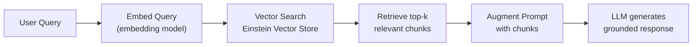

# AI Associate — Personal Cheat Sheet

**Exam: 40 questions / 70 min / 65% to pass ($75)**
**Topic weights: Trust Layer 38% | Ethics 20% | AI Fundamentals 17% | Data for AI 17% | AI Capabilities 8%**

---

## SECTION 1: Einstein Trust Layer (38% — study this FIRST)

### 4 Components — Memorize the problem each solves

| Component | Protects Against | What It Does |
|-----------|----------------|-------------|
| **Data Masking** | PII exposure to LLM provider | Replaces PII with tokens BEFORE prompt sent to LLM; restores after |
| **Zero Data Retention (ZDR)** | LLM provider training on your data | Contractual + technical: provider cannot store, log, or train on your prompts |
| **Toxicity Scoring** | Harmful AI-generated content | Evaluates LLM OUTPUT before delivery to user; blocks if threshold exceeded |
| **Audit Trail** | Accountability + compliance gaps | Logs every AI interaction: who, what prompt, what response, when |

**Critical distinctions:**
- Masking = INPUT side; Toxicity = OUTPUT side
- ZDR = LLM provider can't retain; Audit Trail = Salesforce logs it
- NONE of the 4 components prevent hallucinations — those need grounding (RAG)

---

## SECTION 2: Trusted AI Principles — RATEI

| Principle | Core Meaning | Anti-pattern |
|-----------|-------------|-------------|
| **Responsible** | Prevent harm; safe by design | Deploying AI without safety testing |
| **Accountable** | Humans own AI outcomes; audit exists | Fully automated decisions in high-stakes domains with no human review |
| **Transparent** | Disclose AI use; explain decisions | AI scoring with no driving factors; hiding that Agentforce is an AI |
| **Empowering** | Augment humans; preserve human agency | Replacing human judgment with autonomous AI in consequential decisions |
| **Inclusive** | Fair across demographics; accessible | Training on unrepresentative data; discriminatory AI outputs |

**AI Acceptable Use Policy prohibits:** harm/violence, discrimination, unauthorized surveillance, deception/deepfakes, psychological manipulation, weapons, illegal activities

---

## SECTION 3: AI Fundamentals

### ML Types

| Type | Data Needed | Output | Salesforce Example |
|------|------------|--------|------------------|
| **Supervised** | Labeled (known outcomes) | Prediction/score | Einstein Lead Scoring |
| **Unsupervised** | Unlabeled | Patterns/clusters | Customer segmentation |
| **Reinforcement** | Reward signals | Policy/action | RLHF for LLM alignment |

**Supervised subtypes:** Classification (discrete: Yes/No) vs. Regression (continuous: $$$)

### AI Type Identification

| If the question says... | Type |
|------------------------|------|
| "Historical data with known outcomes" | Supervised learning |
| "Group customers automatically without predefined categories" | Unsupervised clustering |
| "Trial-and-error with reward feedback" | Reinforcement learning |
| "Outputs a score or probability" | Predictive AI |
| "Generates new text/content" | Generative AI |
| "Plans and executes multi-step tasks autonomously" | Agentic AI |

### AI Hierarchy
**AI ⊃ Machine Learning ⊃ Deep Learning ⊃ LLMs**
- All LLMs are deep learning; all deep learning is ML; all ML is AI
- Narrow AI = all commercial AI (task-specific); AGI = does NOT commercially exist

### Predictive vs. Generative vs. Agentic

| | Predictive | Generative | Agentic |
|--|-----------|-----------|---------|
| **Output** | Score/classification | New content (text) | Actions across systems |
| **Examples** | Lead Scoring, Prediction Builder | Prompt Builder, Copilot | Agentforce |
| **AI type** | Traditional ML | LLM (deep learning) | LLM + reasoning engine |

---

## SECTION 4: Data for AI

### 6 Data Quality Dimensions

| Dimension | One-Line Definition | Exam ID |
|-----------|--------------------|----|
| **Accuracy** | Values are correct | "Data entry error — wrong revenue entered" |
| **Completeness** | Required fields populated | "Industry blank on 70% of leads" |
| **Consistency** | Same entity, same format everywhere | "Acme" vs "Acme Corp" vs "ACME Inc" |
| **Timeliness** | Data is current | "Opportunity dates not updated as deals slipped" |
| **Validity** | Values conform to expected format | "Phone = '123'" (not a valid number) |
| **Uniqueness** | No duplicate records | "4 records for same company" |

**GIGO = Garbage In, Garbage Out** — bad data → bad AI, always

### Training Data Concepts

| Concept | Definition |
|---------|-----------|
| **Labeled data** | Known outcomes annotated on records → supervised learning |
| **Training set** | ~70-80% of data; model learns from this |
| **Validation set** | ~10-15%; used during training to tune hyperparameters |
| **Test set** | ~10-15%; used ONCE at end for unbiased evaluation |
| **Overfitting** | High train accuracy, LOW test accuracy (memorized training data) |
| **Underfitting** | Low train AND test accuracy (model too simple) |

### Data Types for AI

| Data Type | Examples | AI Use |
|-----------|---------|--------|
| **Structured** | CRM fields (Revenue, Industry) | Predictive AI (scores, classifications) |
| **Unstructured** | Emails, PDFs, recordings | Generative AI (LLMs process natively) |
| **Semi-structured** | JSON, XML | Both contexts |

**80-90% of enterprise data is unstructured** — LLMs unlock this for the first time

### Data Cloud Key Components

| Component | What It Does |
|-----------|-------------|
| **Identity Resolution** | Matches records from multiple systems → one Unified Customer Profile |
| **Unified Customer Profile** | Complete 360° customer view for AI grounding |
| **Calculated Insights** | Computed metrics on unified data (CLV, engagement score) |
| **Einstein Vector Store** | Stores vector embeddings of documents for RAG semantic search |
| **Activation** | Pushes unified data back to CRM, Marketing, and external systems |

**Data Cloud = separate license** — not included in standard CRM

---

## SECTION 5: Generative AI Concepts

### LLMs

- Generate text by predicting the most statistically likely next token — NOT by looking up facts
- Hallucinations are inherent — LLMs produce plausible-sounding but factually wrong content
- Trust Layer does NOT prevent hallucinations — grounding (RAG) does

### RAG Pipeline

**Fine-tuning vs. RAG:**
- Fine-tuning: changes model weights; expensive; data becomes stale
- RAG: injects context at query time; no model changes; always current
- For Salesforce: **always recommend RAG over fine-tuning** for factual/current data

---

## SECTION 6: AI Capabilities in Salesforce

### Feature Taxonomy

| Feature | Type | What It Outputs |
|---------|------|----------------|
| Einstein Lead Scoring | Predictive | Score 0-99 + driving factors |
| Einstein Opportunity Scoring | Predictive | Close probability score |
| Einstein Case Classification | Predictive | Field value predictions (Priority, Type) |
| Einstein Prediction Builder | Predictive | Binary (Yes/No score) or Numeric (predicted value) |
| Einstein Next Best Action | Predictive + Rules | Recommendations from curated library |
| Prompt Builder | Generative | AI-generated content (email, summary, field value) |
| Einstein Copilot | Generative | Conversational AI responses in CRM |
| Agentforce | Agentic | Autonomous multi-step actions |

### Prompt Builder — 4 Template Types

| Template | Use Case |
|---------|---------|
| **Field Generation** | Populates a specific field with AI-generated content |
| **Record Summary** | Narrative overview of a record |
| **Sales Email** | Personalized email drafts |
| **Flex** | General purpose — used in Agentforce, Apex, Flows |

**Merge field syntax:** `{!$Record.FieldName}` — resolved to actual value BEFORE reaching LLM

### Prediction Builder — 2 Types

| Type | Output | Example |
|------|--------|---------|
| **Binary** | Yes/No probability score (0-100) + driving factors | "Will this customer churn?" |
| **Numeric** | Predicted number + confidence range | "What will deal close at?" |

### Next Best Action — 3 Components

- **Recommendation** (what to recommend) + **Strategy** (when/who) + **Lightning Component** (where it shows)
- Strategy elements: Load → Filter → Branch → Amplify → Sort → Limit → Output
- When accepted → **Action Flow** runs

### Agentforce — Core Architecture

- **Topics** (authorized scope) + **Actions** (what agent can do) + **Atlas Reasoning Engine** (planning brain)
- Atlas loop: **Understand → Plan → Act → Evaluate**
- Escalation is MANDATORY; must include context transfer
- Copilot = responds to user questions; Agentforce = autonomously plans and acts

---

## SECTION 7: Bias in AI

### 4 Bias Types

| Type | How to Identify It | Classic Example |
|------|-------------------|----------------|
| **Training Data Bias** | Historical data reflects past discrimination | Amazon hiring model trained on historically male-dominated data → downgraded women's resumes |
| **Representation Bias** | Certain groups underrepresented in training data | Facial recognition works less accurately on darker-skinned faces due to skewed training dataset |
| **Algorithmic Bias** | Model optimization choices favor certain outcomes | Ranking algorithm that optimizes for engagement systematically advantages one group |
| **Feedback Loop Bias** | Model outputs influence future training data → amplification | Predictive policing: model → more patrols → more arrests → model confirms prediction → cycle |

---

## SECTION 8: Transparency and Explainability

- **Decision Transparency**: Driving factors (why THIS score for THIS record)
- **Process Transparency**: Model Cards (how the system was built)
- **Purpose Transparency**: Disclosing to users that AI is being used

**GDPR Article 22**: Right not to be subject to fully automated significant decisions + right to explanation
**EU AI Act**: High-risk AI (employment, credit, healthcare) = strict transparency + human oversight requirements

---

## TOP 15 EXAM TRAPS

1. **ZDR = LLM provider can't retain data; Audit Trail = Salesforce logs it** — these are DIFFERENT
2. **Trust Layer does NOT prevent hallucinations** — that's grounding's job
3. **Data Masking = INPUT; Toxicity Scoring = OUTPUT** — different sides of the flow
4. **Supervised = labeled data** (not a human supervisor watching)
5. **Classification = discrete output; Regression = continuous/numeric output**
6. **RLHF = reinforcement learning** (used for LLM alignment, NOT for Einstein Lead Scoring)
7. **Merge fields `{!$Record...}` are resolved BEFORE the LLM receives the prompt**
8. **Prediction Builder binary = any Salesforce object**, not just Leads
9. **Recommendation records ≠ Strategy** in NBA — these are separate components
10. **RAG does NOT retrain the LLM** — injects context at inference time
11. **Fine-tuning changes weights; RAG does not** — prefer RAG for current factual data
12. **Agentforce escalation MUST include context transfer** — not just routing to a human
13. **AGI does not commercially exist** — Einstein is Narrow AI
14. **Accountable = humans own outcomes** — AI is never accountable itself
15. **80-90% of enterprise data is unstructured** (not the other way around)

---

## QUICK REFERENCE: Who Does What

| Need to... | Use this |
|-----------|---------|
| Predict lead conversion probability | Einstein Lead Scoring |
| Build custom binary/numeric prediction on any object | Einstein Prediction Builder |
| Surface proactive recommendations to users | Einstein Next Best Action |
| Create reusable AI prompt templates | Prompt Builder |
| Autonomous customer service agent | Agentforce Service Agent |
| Qualify inbound leads autonomously | Agentforce SDR Agent |
| AI assistant for CRM users (conversational) | Einstein Copilot |
| Ground AI with full customer context | Data Cloud (Unified Profile) |
| Ground AI with document/knowledge content | Einstein Vector Store (RAG) |
| Prevent PII exposure to LLM provider | Data Masking (Trust Layer) |
| Prevent LLM provider from training on your data | ZDR (Trust Layer) |
| Filter harmful AI outputs | Toxicity Scoring (Trust Layer) |
| Audit AI interactions for compliance | Audit Trail (Trust Layer) |
| Explain why an AI gave a specific score | Driving Factors |
| Document how an AI model was built | Model Card |
