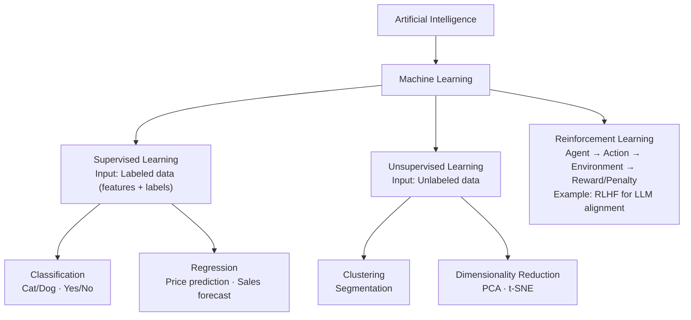
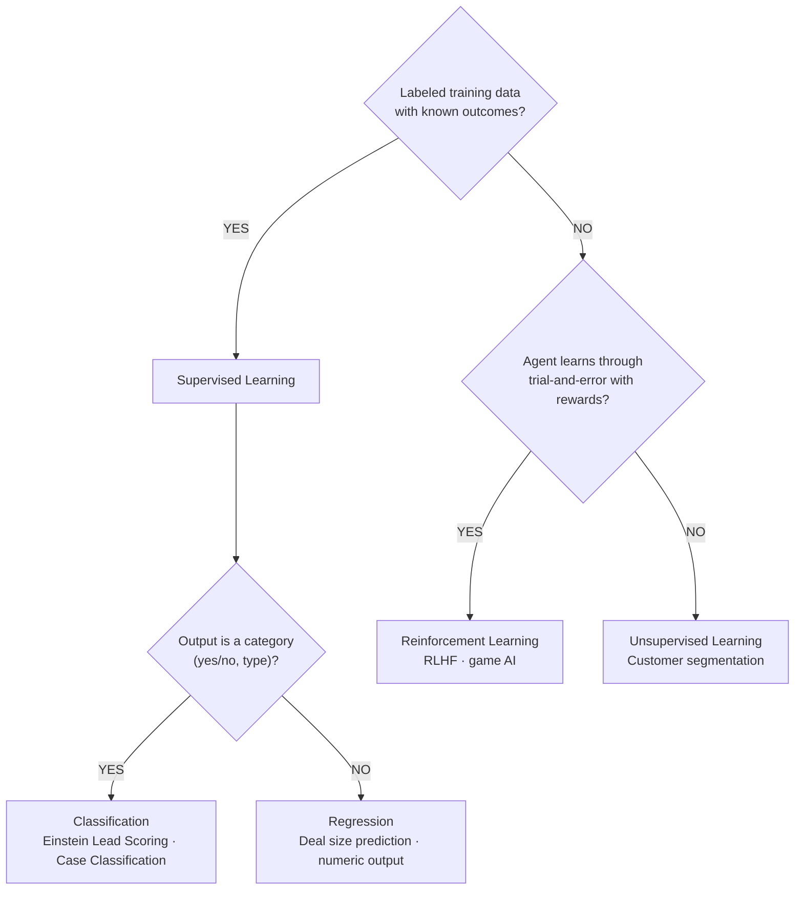

# Machine Learning Types

**Exam Domain:** AI Fundamentals (17%)
**Study Priority:** HIGH — ML type identification is directly tested via scenarios

---

## Core Concepts

Three types of machine learning. Know all three cold — the exam gives you a business scenario and asks you to name the type.

| Type | How It Learns | Label Required? | Salesforce Example |
|------|--------------|-----------------|-------------------|
| **Supervised** | From labeled historical examples with known outcomes | YES | Einstein Lead Scoring, Opportunity Scoring, Case Classification |
| **Unsupervised** | Finds its own patterns in unlabeled data | NO | Customer segmentation, anomaly detection |
| **Reinforcement** | Trial-and-error with reward/penalty signals | NO (uses rewards) | RLHF alignment of LLMs |

**How to identify the type from a scenario:**
- "Historical data with KNOWN outcomes" → **Supervised**
- "Finding GROUPS or PATTERNS without predefined categories" → **Unsupervised**
- "Agent learns through TRIAL AND ERROR with rewards" → **Reinforcement**

**Supervised Learning subtypes** (both tested):

| Subtype | Output | Example |
|---------|--------|---------|
| **Classification** | Discrete category (Yes/No, Low/Medium/High) | Will this lead convert? (Yes/No) |
| **Regression** | Continuous numeric value | What will this deal's final value be? ($$$) |

**The canonical exam example:** Einstein Lead Scoring = supervised learning + classification (predicts binary: convert or not).

---

## PTA / SA Relevance

**Architecture decisions involving ML type:**

- **Supervised**: Requires sufficient historical CRM data with outcome labels. Before recommending Einstein Prediction Builder or Lead Scoring, assess whether the org has enough converted records (Closed Won/Lost Opps, converted leads). New orgs need 6-12 months of history minimum before reliable models can be built.

- **Unsupervised**: Most relevant for Data Cloud segmentation use cases. When a customer asks "can we group our customers automatically based on behavior?" — that's unsupervised clustering, possible via Data Cloud + Tableau CRM.

- **Reinforcement / RLHF**: Relevant in conversations about LLM quality and why Agentforce responses "feel natural." RLHF is how Salesforce and LLM providers tune the underlying models to behave helpfully — not something admins configure, but important for CTO-level AI literacy conversations.

**Common SA mistake in customer engagements:** Recommending Einstein Lead Scoring before verifying data completeness. The model trains on what's in the org. If Industry, Annual Revenue, and Number of Employees are mostly blank, the model outputs near-random scores. Always run a data quality assessment first.

**Enterprise consideration:** For large orgs (50K+ lead records), Einstein trains a more reliable model, but initial training can take hours. Plan for a training window in your implementation timeline.

---

## ML Types Architecture

**Limitations of ML approaches:**
- **Supervised learning**: Requires large volumes of labeled historical data. Biased labels produce biased models (e.g., if past reps only pursued certain lead types, the model learns to score others low). Models degrade over time (model drift) as business patterns change — require periodic retraining.
- **Unsupervised learning**: Cannot guarantee segments are business-meaningful. Clusters may be statistically valid but operationally useless. Requires human interpretation after clustering.
- **Reinforcement learning**: Reward function design is critical — a poorly designed reward can produce unintended behavior. Not used for standard Einstein CRM features (context: RLHF happens at LLM training time, not admin configuration time).

---

## Decision Guide: Which ML Type Is Described?

---

## Key Facts to Memorize

- **Supervised = labeled data** + known outcomes
- **Unsupervised = unlabeled data** + finds own patterns
- **Reinforcement = reward signals** + trial-and-error
- **Classification outputs categories**; **regression outputs numbers**
- **Einstein Lead Scoring = supervised + classification** (canonical exam example)
- **Customer segmentation = unsupervised clustering**
- **RLHF = reinforcement learning** used to align LLMs with human preferences
- Supervised learning requires YOUR org's historical conversion data to train personalized Einstein models

---

## Exam Traps

**Trap 1:** "Unsupervised requires a human supervisor to approve outputs." WRONG. "Supervised" refers to the labeled data, not a human supervisor overseeing the model.

**Trap 2:** Confusing regression and classification. Classification outputs a category (Will this lead convert? Yes or No). Regression outputs a number (What will this deal be worth? $45,000).

**Trap 3:** "Reinforcement learning is used for Einstein Lead Scoring." WRONG. Lead Scoring is supervised learning. Reinforcement learning is used in robotics, games, and RLHF for LLM fine-tuning — not for CRM scoring.

**Trap 4:** Any scenario describing "grouping customers automatically without predefined categories" = unsupervised learning (clustering), NOT supervised classification.

---

## Practice Questions

**Q1: A retail company uses AI to automatically group its 2 million customers into behavioral segments based on purchase history, browsing behavior, and engagement patterns. No predefined segment categories were provided to the AI. Which type of machine learning is this?**

A) Supervised classification
B) Reinforcement learning
C) Unsupervised clustering
D) Supervised regression

**Answer: C** — Unsupervised clustering. No labeled outcomes or predefined categories were provided. The AI found its own structure in the data. Supervised classification requires labels. Regression outputs numbers. Reinforcement learning uses reward signals.

---

**Q2: Einstein Lead Scoring analyzes historical lead records — specifically which leads converted and which didn't — to predict the likelihood that a new lead will convert. This is an example of which ML subtype?**

A) Unsupervised clustering
B) Supervised regression
C) Supervised classification
D) Reinforcement learning

**Answer: C** — Supervised classification. The training data is labeled (converted vs. not converted). The output is a category (will convert / won't convert, expressed as a probability score). This is the canonical supervised classification example in Salesforce.

---

**Q3: A company uses an AI system to optimize its advertising bid strategy. The AI places bids, receives feedback on whether the ad performed well, and adjusts its strategy to maximize click-through rate over time. What type of machine learning does this represent?**

A) Supervised learning
B) Unsupervised learning
C) Reinforcement learning
D) Transfer learning

**Answer: C** — Reinforcement learning. The AI agent (bidding algorithm) takes actions, receives reward signals (ad performance feedback), and learns to maximize cumulative reward. This trial-and-error with feedback structure defines reinforcement learning.
