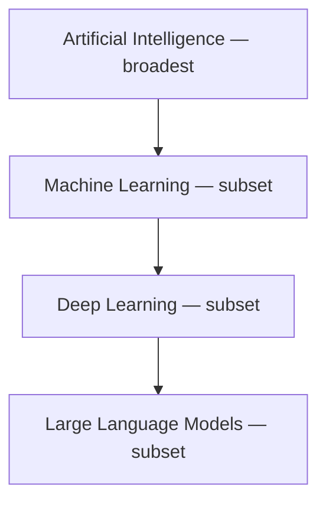
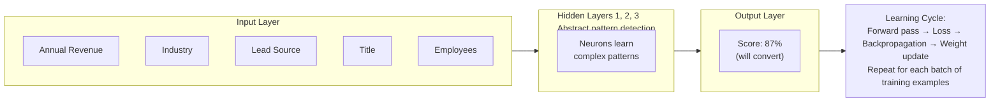

# Neural Networks and Deep Learning

**Exam Domain:** AI Fundamentals (17%)
**Study Priority:** MEDIUM — understand conceptually; no math required

---

## Core Concepts

**Neuron (Perceptron):** The basic unit. Takes inputs, applies weights, passes result through an activation function, produces output.

```
Inputs → [weights] → Σ (sum) → Activation Function → Output
```

**Neural Network:** Multiple neurons connected in layers:
- **Input layer**: receives raw features (e.g., Annual Revenue, Industry, Lead Source)
- **Hidden layers**: find abstract patterns (intermediate computations)
- **Output layer**: produces the final prediction or classification

**How a neural network learns:**
1. **Forward pass**: input flows through layers → prediction produced
2. **Loss calculation**: compare prediction to correct label → measure error
3. **Backpropagation**: error propagated backwards through network → weights adjusted
4. **Repeat** until error is minimized

**Deep Learning = neural network with MANY hidden layers** (typically 3+)

**The AI hierarchy to know for the exam:**



Every LLM is deep learning. Every deep learning system is ML. Every ML system is AI.

---

## PTA / SA Relevance

**Why neural network knowledge matters for a PTA:**

- **Explaining LLM quality**: When customers ask "why does Agentforce sometimes give wrong answers?" — the answer traces to how LLMs work (pattern matching, not truth lookup). Neural networks predict the most likely next token, not the factually correct answer. This is the root cause of hallucinations.

- **Architecture decisions — custom models**: When a customer wants to build a truly custom AI model (not Einstein features), they may ask about TensorFlow, PyTorch, or Bring Your Own Model (BYOM) in Einstein Studio. Knowing the neural network lifecycle (build → train → evaluate → deploy) helps you advise on complexity and cost.

- **Advising on fine-tuning vs. RAG**: Fine-tuning retrains a neural network's weights on new data. RAG adds context at inference time without touching weights. For most Salesforce use cases, RAG (via Data Cloud grounding) is far cheaper and faster than fine-tuning. Understanding the neural net training process helps you explain why.

- **Enterprise scale**: Training large neural networks requires GPU clusters and significant time. For Einstein features, Salesforce handles this — but for custom BYOM scenarios, customers need to factor in training infrastructure cost.

---

## Neural Network Architecture



**Limitations of neural networks:**
- **Black box problem**: Deep networks are not inherently explainable. Einstein addresses this with driving factors (feature importance) — but the underlying model is still a black box. For regulated industries, this may require additional XAI tooling.
- **Data hunger**: Neural networks need large datasets to train well. Shallow models (decision trees, logistic regression) often outperform deep networks on small CRM datasets.
- **Catastrophic forgetting**: When fine-tuning a neural network on new data, it can "forget" previously learned knowledge unless carefully managed.
- **Computational cost**: Training deep networks requires GPU hardware and significant energy. Not a factor for Einstein (Salesforce handles it), but relevant for custom BYOM deployments.
- **No causal reasoning**: Neural networks find correlations, not causes. They cannot reason about causality — only pattern matching.

---

## Deep Learning vs. Traditional ML

| Aspect | Traditional ML | Deep Learning |
|--------|---------------|---------------|
| Feature engineering | Manual (you choose features) | Automatic (learns features) |
| Data needed | Smaller datasets OK | Needs large datasets |
| Interpretability | Higher (decision trees, etc.) | Lower (black box) |
| Performance on complex data | Limited for images/audio/text | Excellent |
| Training cost | Low | High |
| Salesforce use | Einstein Prediction Builder | LLMs behind Agentforce/Copilot |

---

## Key Facts to Memorize

- Neural network = input layer + hidden layers + output layer
- Learning = forward pass → loss calculation → backpropagation → weight update
- Deep learning = many hidden layers → learns complex patterns automatically
- AI ⊃ ML ⊃ Deep Learning ⊃ LLMs (nested hierarchy)
- LLMs are a type of deep learning (specifically: transformer-based neural networks)
- Einstein predictive features (Lead Scoring) may use shallower ML; generative features (Agentforce) use LLM deep learning

---

## Exam Traps

**Trap 1:** "Deep learning is better than traditional ML in all cases." WRONG. Deep learning needs large datasets and is harder to explain. For structured CRM data with limited records, traditional ML often outperforms deep learning.

**Trap 2:** Thinking "backpropagation" means the model goes backward through time. It means the error signal propagates backward through the network's layers to update weights.

**Trap 3:** Confusing "deep learning" and "neural networks." ALL deep learning is neural networks. But not all neural networks are "deep" — a neural net with one hidden layer is not deep learning.

**Trap 4:** "LLMs work by looking up facts from a database." WRONG. LLMs generate text by predicting the most statistically likely next token based on patterns in their training data. They do not look up information.

---

## Practice Questions

**Q1: A large language model generates responses by predicting the most likely next token based on patterns in its training data. This process is part of which broader category of AI technology?**

A) Reinforcement learning
B) Traditional machine learning with decision trees
C) Deep learning using transformer neural networks
D) Expert systems with rule-based logic

**Answer: C** — LLMs are transformer-based deep learning models. They use neural network architectures with many layers. Reinforcement learning is a separate training paradigm. Decision trees are traditional ML. Expert systems are rule-based, not ML.

---

**Q2: Which of the following correctly describes the AI technology hierarchy from broadest to most specific?**

A) Deep Learning ⊃ Machine Learning ⊃ AI ⊃ LLMs
B) AI ⊃ Machine Learning ⊃ Deep Learning ⊃ LLMs
C) LLMs ⊃ Deep Learning ⊃ AI ⊃ Machine Learning
D) Machine Learning ⊃ AI ⊃ Neural Networks ⊃ Deep Learning

**Answer: B** — AI is the broadest category. Machine Learning is a subset of AI. Deep Learning is a subset of ML. LLMs are a specific type of deep learning model.

---

**Q3: During neural network training, the model makes a prediction, compares it to the correct answer, and uses the error to update the model's internal parameters. What is the process of propagating the error backwards through the network called?**

A) Forward pass
B) Feature engineering
C) Backpropagation
D) Inference

**Answer: C** — Backpropagation is the process by which the error/loss is propagated backwards through the neural network layers to adjust each layer's weights. Forward pass is the initial computation. Feature engineering is data prep. Inference is using a trained model to make predictions.
