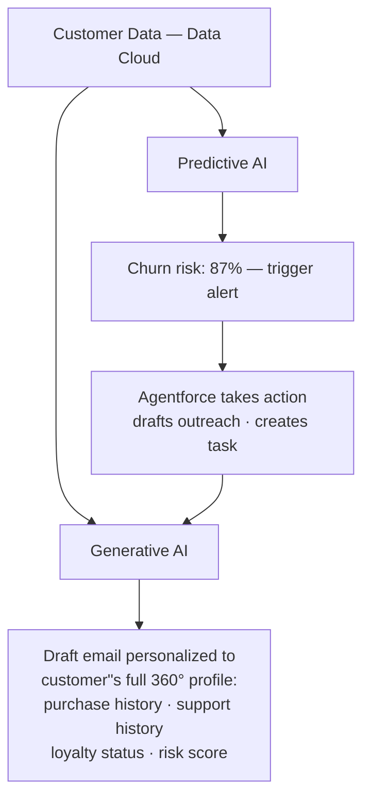

# Predictive AI vs. Generative AI

**Exam Domain:** AI Fundamentals (17%) + AI Capabilities of CRM (8%)
**Study Priority:** HIGH — this distinction is tested directly and in disguised form throughout the exam

---

## Core Concepts

| Dimension | Predictive AI | Generative AI |
|-----------|--------------|---------------|
| **What it does** | Forecasts outcomes from historical patterns | Creates new content that did not previously exist |
| **Output type** | Score, probability, classification, numeric value | Text, image, audio, code |
| **Input data** | Primarily structured (CRM fields) | Primarily unstructured (text, documents) |
| **Underlying tech** | Traditional ML (regression, decision trees, gradient boosting) | Large Language Models (LLMs), transformers, diffusion models |
| **Salesforce examples** | Einstein Lead Scoring, Opportunity Scoring, Case Classification, Prediction Builder | Prompt Builder, Einstein Copilot, Agentforce |
| **Human interaction** | AI produces score; human decides action | Human provides prompt; AI generates content |
| **When it's wrong** | Score is off; rep ignores it | Hallucination; incorrect content generated |

**The third category — Agentic AI** (newest):
- Combines generative AI reasoning with autonomous action-taking
- Decomposes goals into multi-step tasks, uses tools, takes real actions across systems
- Salesforce example: Agentforce (autonomous agents)
- Key differentiator from chatbots: multi-step reasoning + actual system actions, not just text responses

---

## PTA / SA Relevance

**Architecture-level decisions:**
- When a customer asks "should we use predictive or generative AI for this use case?" — the answer depends on whether they need a **decision** (use predictive) or **content/action** (use generative/agentic).
- Predictive AI for: prioritization (which deals to focus on), risk scoring (churn risk), classification (case routing)
- Generative AI for: drafting content (emails, case summaries), answering questions, document analysis

**CTO framing:**
- Predictive AI = "AI that tells you what will happen" (scoring/forecasting)
- Generative AI = "AI that creates on your behalf" (content creation)
- Agentic AI = "AI that acts on your behalf" (autonomous task completion)

**Common customer confusion:** Customers sometimes expect predictive AI (Einstein Lead Scoring) to generate explanations or text. It doesn't — it generates a score and driving factors. For content generation, Prompt Builder or Agentforce is needed.

**Integration pattern at enterprise scale:**
- High-performing orgs combine BOTH: Prediction Builder identifies which customers need attention → Agentforce or Prompt Builder creates personalized outreach
- Data Cloud serves as the connective tissue — unified customer profiles feed BOTH predictive models AND generative prompts

---

## The Salesforce AI Feature Map

**Predictive AI**
- Einstein Lead Scoring — probability score 0-99
- Einstein Opportunity Score — close probability score
- Einstein Case Classification — field value prediction
- Einstein Prediction Builder — custom binary/numeric predictions
- Einstein Next Best Action — rule + ML recommendations

**Generative AI**
- Prompt Builder — reusable prompt templates
- Einstein Copilot — AI assistant in CRM
- Case Summarization — narrative case summaries
- Sales Email Generation — personalized email drafts

**Agentic AI**
- Agentforce — autonomous multi-step task execution
  - Service Agent — resolves service issues
  - SDR Agent — qualifies inbound leads
  - Sales Coach Agent — advises reps (no CRM actions)

**Limitations of this taxonomy:**
- Agentforce agents USE generative AI (LLMs) under the hood for reasoning — they are generative at the model level, agentic at the product level
- "Predictive" Einstein features may use traditional ML OR deep learning depending on the model — the exam doesn't require you to know which
- Einstein Next Best Action spans both categories: rules-based strategy with optional ML model enhancement
- Prompt Builder templates ARE generative AI but require human review before content is used — they are NOT autonomous

---

## Combined Pipeline (Enterprise Pattern)

**Limitations of this combined pattern:**
- Requires Data Cloud license for unified customer context
- Requires proper Agentforce Topics/Actions configuration for autonomous action
- Human review still recommended before sending AI-generated outreach in regulated industries
- Latency: end-to-end pipeline (Data Cloud retrieval + LLM generation) adds 2-5 seconds vs. standard CRM operations

---

## Key Facts to Memorize

- **Predictive AI** outputs scores/probabilities/classifications
- **Generative AI** creates new content (text, images, code)
- **Agentic AI** plans and executes multi-step tasks autonomously
- Einstein Lead Scoring, Opportunity Scoring, Prediction Builder = **predictive**
- Prompt Builder, Copilot, Agentforce = **generative / agentic**
- The output type is the fastest way to identify AI type: number/category = predictive; new content = generative
- Agentic AI ≠ chatbot: chatbots respond; agents ACT across systems

---

## Exam Traps

**Trap 1:** "Einstein Lead Scoring generates email recommendations." WRONG. Lead Scoring generates a probability score (predictive). Email generation = Prompt Builder/Copilot (generative).

**Trap 2:** "Agentforce is just a more advanced chatbot." WRONG. Agentforce can take autonomous actions across Salesforce — create records, run flows, send emails, look up data. Chatbots only produce text responses.

**Trap 3:** "Generative AI is more accurate than predictive AI." These serve different purposes. Generative AI creates content; accuracy is measured differently (hallucination rate, quality). Predictive AI forecasts outcomes; accuracy is measured against historical outcomes.

**Trap 4:** Confusing Predictive AI with "future-telling." Predictive AI identifies patterns from the past and applies them to new data — it does not predict with certainty. It outputs probabilities.

---

## Practice Questions

**Q1: A Salesforce admin wants to automatically write a personalized follow-up email draft for a sales rep, grounded in the specific Opportunity and Account data. Which type of AI and which Salesforce feature best addresses this?**

A) Predictive AI — Einstein Lead Scoring
B) Generative AI — Prompt Builder
C) Predictive AI — Einstein Prediction Builder
D) Agentic AI — Next Best Action

**Answer: B** — Generative AI via Prompt Builder. Writing new content (email draft) grounded in CRM data is generative AI. Prompt Builder creates reusable templates for exactly this use case. Lead Scoring and Prediction Builder output scores (predictive). Next Best Action surfaces recommendations (predictive + rule-based).

---

**Q2: Einstein Opportunity Scoring assigns each open Opportunity a probability score from 0-99 based on historical patterns in your org's closed deals. Which type of AI does this represent?**

A) Generative AI
B) Agentic AI
C) Predictive AI
D) Reinforcement Learning

**Answer: C** — Predictive AI. Opportunity Scoring forecasts an outcome (close likelihood) from historical patterns. It outputs a score (number/probability), not new content. This is the defining characteristic of predictive AI.

---

**Q3: A company deploys an Agentforce Service Agent that can autonomously look up an order, check return eligibility, initiate a refund, and update a case record — all without human intervention for standard returns. How does this differ from a traditional chatbot?**

A) Agentforce uses more computing power but produces the same outputs
B) Agentforce can take multi-step autonomous actions across Salesforce systems; a chatbot only produces text responses
C) Chatbots can also take actions; Agentforce just does it faster
D) There is no meaningful difference — both are generative AI implementations

**Answer: B** — Agentforce can plan and execute multi-step tasks (look up order + check policy + initiate refund + update record) autonomously. A chatbot generates text responses. The key distinction is autonomous action-taking vs. text generation.
