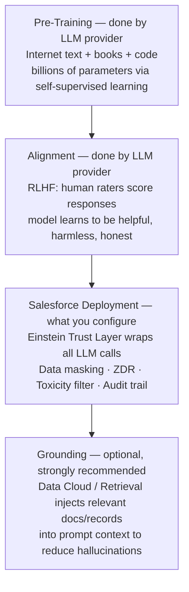

# Large Language Models (LLMs) Explained

**Exam Domain:** AI Fundamentals (17%) + Einstein Trust Layer (38%)
**Study Priority:** HIGH — LLMs are the engine behind all generative AI features tested on this exam

---

## Core Concepts

**Large Language Model (LLM):** A deep learning model trained on massive text datasets that can generate, summarize, translate, and reason about language. "Large" refers to billions of parameters (weights) in the neural network.

**How LLMs work (conceptual):**
1. Trained on massive text corpora (books, websites, code, etc.) — learns statistical patterns of language
2. Given a prompt (input text), the model predicts the most likely next token (word/word-piece)
3. Each predicted token becomes part of the input for predicting the next token (autoregressive generation)
4. Output = a sequence of predicted tokens that forms coherent text

**Key vocabulary:**

| Term | Definition |
|------|-----------|
| **Token** | A word or word-piece (roughly 0.75 words per token on average) |
| **Context window** | The maximum number of tokens the model can "see" at once (input + output) |
| **Parameters** | Weights in the neural network — more parameters = larger model capacity |
| **Temperature** | Controls randomness in output. 0 = deterministic, 1+ = more creative/random |
| **Prompt** | The input text given to the LLM |
| **Completion/Response** | The LLM's generated output |
| **Grounding** | Providing additional context data in the prompt to reduce hallucinations |
| **Fine-tuning** | Retraining a pre-trained LLM on domain-specific data to specialize it |

**Why LLMs hallucinate:**
- LLMs predict statistically likely text, not factually correct text
- They do NOT look up answers from a database or the internet (unless retrieval is explicitly added)
- If the correct answer wasn't prominent in training data, the model generates something plausible-sounding but wrong
- Hallucinations are not bugs — they are inherent to how autoregressive language models work

---

## PTA / SA Relevance

**Customer conversations about LLM quality:**
- "Why does Agentforce sometimes give wrong answers?" → LLMs predict tokens, they don't look things up. The solution is grounding (Data Cloud + RAG) and guardrails (Trust Layer).
- "Can we use our own LLM?" → Yes, via BYOM (Bring Your Own Model) in Einstein Studio. Requires MLflow-compatible model. Added governance complexity and infrastructure cost.
- "Is the LLM learning from our Salesforce data?" → No. ZDR (Zero Data Retention) means the LLM provider cannot retain or train on prompts sent through Salesforce. This is a core Trust Layer guarantee.

**Architecture decision: fine-tuning vs. RAG:**
- Fine-tuning = retraining the model's weights on proprietary data. Expensive, complex, requires ML expertise, model staleness risk (must retrain when data changes).
- RAG = injecting relevant context at query time. No model retraining. Data stays current. Preferred for most Salesforce enterprise use cases.
- As a PTA: almost always recommend RAG (via Data Cloud grounding) over fine-tuning for CRM use cases.

**CTO conversation framing:**
- "Salesforce uses best-of-breed LLMs from OpenAI, Anthropic, and others — but wraps them in the Einstein Trust Layer so your data is never used for training and is masked in transit."
- Position this as enterprise AI with enterprise guardrails — not just a ChatGPT wrapper.

---

## LLM Architecture in Salesforce Context



**Limitations of LLMs:**
- **Context window**: Most LLMs have context windows of 8K-128K tokens. Extremely long documents or conversation histories get truncated — the LLM cannot "see" content beyond its context window.
- **Knowledge cutoff**: Pre-trained LLMs have a training cutoff date. They don't know about events after that date unless grounded with current data.
- **Hallucination rate**: Even best-in-class LLMs hallucinate on specific factual queries. Grounding reduces but does not eliminate hallucinations.
- **Cost**: LLM API calls are priced per token. High-volume customer service deployments can generate significant AI add-on costs. Each Agentforce action that invokes an LLM costs tokens.
- **Latency**: LLM inference takes 1-5+ seconds. Synchronous integrations (user waiting for response) must account for this.
- **No persistent memory**: LLMs are stateless — every conversation is a new context window unless memory mechanisms are built explicitly.

---

## Fine-Tuning vs. RAG vs. Prompt Engineering

```
APPROACH COMPARISON:

Fine-Tuning:
  Input: Proprietary training data
  Process: Retrain model weights
  Cost: HIGH ($$$, GPU clusters)
  Data currency: Stale (must retrain on new data)
  Salesforce fit: BYOM only, specialist use cases
  
RAG (Retrieval-Augmented Generation):
  Input: Query + retrieved context from vector store
  Process: Inject context into prompt, no weight changes
  Cost: LOW-MEDIUM (vector search + LLM tokens)
  Data currency: Real-time (retrieves current data)
  Salesforce fit: RECOMMENDED — Data Cloud grounding

Prompt Engineering:
  Input: Carefully crafted prompt with examples
  Process: No training, optimizes input instructions
  Cost: LOW (just token cost of longer prompts)
  Data currency: As current as your prompt
  Salesforce fit: Prompt Builder templates
```

---

## Key Facts to Memorize

- LLMs generate text by predicting the next most likely token — NOT by looking up facts
- Hallucinations are inherent, not bugs; reduce with grounding and guardrails
- Context window = maximum tokens the model can process at once
- Zero Data Retention (ZDR) = LLM provider cannot train on your org's data
- Fine-tuning changes model weights; RAG injects context without changing weights
- RLHF = how LLMs are aligned to be helpful and avoid harmful outputs
- Salesforce's LLM strategy: best-of-breed LLMs wrapped in Trust Layer (not one proprietary LLM)

---

## Exam Traps

**Trap 1:** "The LLM learns from customer prompts sent through Salesforce." WRONG. ZDR ensures LLM providers cannot retain or train on your data.

**Trap 2:** "Fine-tuning is the best way to give LLMs access to current company information." WRONG. Fine-tuning bakes knowledge into weights at a point in time. For current data, RAG (retrieval) is superior.

**Trap 3:** "Increasing the temperature parameter makes the LLM more accurate." WRONG. Temperature controls randomness/creativity. Higher temperature = more variable outputs, not more accurate ones.

**Trap 4:** "LLMs reason and understand like humans." WRONG. LLMs perform statistical pattern matching on tokens. They do not reason causally or understand language the way humans do.

---

## Practice Questions

**Q1: A Salesforce admin notices that Agentforce sometimes generates account summaries that contain slightly inaccurate information not found in Salesforce. What is the most accurate explanation for this behavior?**

A) The Trust Layer is not enabled properly
B) LLMs generate text by predicting statistically likely tokens, and can produce plausible-sounding but inaccurate content called hallucinations
C) The admin needs to fine-tune the LLM with their Salesforce data
D) Einstein is using an outdated version of the LLM

**Answer: B** — This is hallucination, an inherent characteristic of autoregressive LLMs. The model predicts likely text, not factually verified information. The Trust Layer handles data privacy, not factual accuracy. Fine-tuning and version updates don't eliminate hallucinations.

---

**Q2: An enterprise customer wants to ensure that the LLM powering their Agentforce deployment cannot learn from or retain their proprietary customer data. Which Einstein Trust Layer component addresses this requirement?**

A) Data Masking
B) Toxicity Scoring
C) Zero Data Retention (ZDR)
D) Audit Trail

**Answer: C** — Zero Data Retention (ZDR) is the contractual and technical guarantee that the LLM provider cannot store, log, or train on data from Salesforce prompts. Data Masking protects PII in transit. Toxicity Scoring filters outputs. Audit Trail logs interactions within Salesforce.

---

**Q3: A company wants to ground their Agentforce responses with current product documentation stored in a SharePoint library. They want the AI to answer questions accurately based on the latest docs without retraining the LLM every time content is updated. What approach should they use?**

A) Fine-tune the LLM monthly with new documentation
B) Increase the LLM's temperature setting to allow more creative responses
C) Use RAG (Retrieval-Augmented Generation) to retrieve and inject relevant documentation into prompts at query time
D) Replace the LLM with a rules-based expert system

**Answer: C** — RAG retrieves relevant content from a vector store at query time and injects it into the prompt as context. This allows the LLM to respond accurately to documentation-based questions without expensive retraining. Fine-tuning is costly and becomes stale. Temperature affects creativity, not knowledge. Expert systems don't scale.
