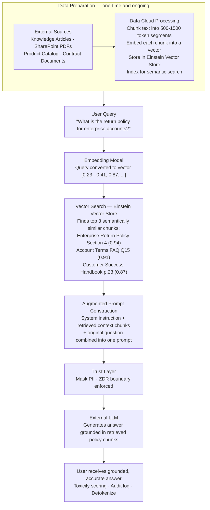

# RAG and Grounding

**Exam Domain:** Einstein Trust Layer (38%) + Data for AI (17%)
**Study Priority:** HIGH — RAG is core to how Agentforce reduces hallucinations; tested architecturally

---

## Core Concepts

**Grounding:** Providing an LLM with relevant, verified context data in the prompt so it generates responses based on that data rather than relying solely on its pre-trained knowledge.

**RAG (Retrieval-Augmented Generation):** A specific grounding technique where relevant context is automatically RETRIEVED from a data store and injected into the prompt before the LLM generates a response.

**Why RAG matters:**
- LLMs have a knowledge cutoff — they don't know current pricing, policies, case history
- LLMs hallucinate when asked about specific, proprietary company data
- RAG allows LLMs to answer accurately from your current data without retraining

---

### RAG Pipeline — Step by Step

1. **User submits a query** to Agentforce or an AI feature
2. **Query is converted to a vector** (numerical representation) using an embedding model
3. **Vector search** is performed against a vector store (Einstein Vector Store in Data Cloud) — finds semantically similar content
4. **Top-k most relevant chunks** (e.g., top 3 relevant knowledge articles, contract sections, account notes) are retrieved
5. **Retrieved context + original query** are combined into an augmented prompt
6. **Augmented prompt sent to LLM** (through Trust Layer)
7. **LLM generates a response grounded in the retrieved context** — not from model memory alone

---

### Vector Embeddings

**Vector embedding:** A technique that converts text (or other unstructured data) into a list of numbers (a vector) that captures semantic meaning.

**Why vectors work for search:** Words with similar meaning have mathematically similar vector representations. "Invoice unpaid" and "outstanding balance" will have closer vectors than "invoice unpaid" and "product color."

**This enables semantic search:** Find documents that are conceptually related to a query, not just ones that share exact keywords.

| Traditional keyword search | Vector/Semantic search |
|---------------------------|----------------------|
| Finds documents containing the exact words | Finds documents with related meaning |
| "invoice" finds only "invoice" results | "invoice" finds "billing," "payment," "receivable" results |
| Fails on synonym/paraphrase queries | Handles synonyms and paraphrases well |

**Salesforce implementation:** Einstein Vector Store (in Data Cloud) stores vector embeddings of your documents, articles, and records for use in RAG-powered Agentforce.

---

### Grounding vs. Fine-Tuning

| Dimension | Grounding (RAG) | Fine-Tuning |
|-----------|----------------|------------|
| **How it works** | Injects context into prompt at query time | Retrains model weights on new data |
| **Data currency** | Real-time (retrieves current data) | Fixed at time of training (gets stale) |
| **Cost** | Low-moderate (embedding + vector search + LLM tokens) | High (GPU compute, ML expertise) |
| **Time to implement** | Days to weeks | Weeks to months |
| **Data updates** | Just re-index new documents | Must retrain model |
| **Best for** | Current factual queries (pricing, policy, case data) | Behavior/tone/style adaptation |
| **Salesforce recommendation** | **Preferred approach** | BYOM scenarios only |

---

## PTA / SA Relevance

**Architecture pattern for enterprise Agentforce deployments:**
- Data Cloud is the standard grounding platform — it provides Einstein Vector Store + Identity Resolution + Unified Customer Profiles
- Documents (PDFs, SharePoint files, knowledge articles) get ingested, chunked, and embedded in Data Cloud
- At query time, Agentforce retrieves top-k relevant chunks, injects into the agent's context
- The result: the agent can answer "What are the terms of contract X?" from actual contract data, not LLM memory

**Customer objections and answers:**
- "We have a 500-page product manual. Can Agentforce answer questions from it?" → Yes, with RAG. Ingest the manual into Data Cloud, embed it, Agentforce retrieves relevant sections.
- "Will Agentforce give consistent answers if we update our pricing?" → Yes, if you update the Data Cloud knowledge base. RAG always retrieves from the current data store.
- "Why does Agentforce give wrong answers about our products?" → It's likely not grounded with your product data. Enabling Data Cloud grounding resolves this for most cases.

**CTO framing:**
- "RAG is how we turn Agentforce from a general-purpose AI assistant into an expert on YOUR business — your products, policies, contracts, and customer history."
- "No data leaves your Salesforce trust boundary unmasked. The vector search and embedding happens inside Salesforce infrastructure."

**Enterprise scale limitations to discuss with architects:**
- Chunking strategy matters: overly large chunks dilute relevance; too-small chunks lose context. Typical optimal chunk size: 500-1500 tokens with overlap.
- Top-k retrieval: retrieving too few chunks (k=1) misses context; too many (k=20) floods the context window. Typical k=3-5.
- Freshness: Data must be re-indexed after updates. Stale indexes cause outdated responses even with RAG.
- Context window: retrieved chunks + query + system prompt + response must all fit within the LLM's context window. Large retrievals can exceed limits.

---

## RAG Architecture (Enterprise Scale)

**Limitations of RAG:**
- Only as good as the documents in the vector store — if the answer isn't in indexed data, hallucination risk remains
- Chunking quality affects retrieval quality significantly — poor chunking creates irrelevant or incomplete retrievals
- Context window limits constrain how many retrieved chunks can be injected (typically 3-10 chunks practical maximum)
- Embedding models have their own quality characteristics — domain-specific vocabulary (medical, legal, financial) may require specialized embedding models for best retrieval
- Re-indexing latency: after knowledge base updates, there's a delay before new content is retrievable (minutes to hours depending on volume)
- Not a substitute for structured data retrieval: for precise lookups (order status, account balance), structured queries are more reliable than vector search

---

## Key Facts to Memorize

- **RAG = Retrieve → Augment → Generate** (query → vector search → inject context → LLM generates)
- **Vector embeddings** convert text to numbers preserving semantic meaning
- **Einstein Vector Store** (in Data Cloud) = where Salesforce stores vectors for RAG
- **Semantic search** finds conceptually related content, not just keyword matches
- **Grounding is preferred over fine-tuning** for current factual data in Salesforce contexts
- RAG reduces hallucinations by giving LLMs verified data to reference
- The Trust Layer wraps all RAG-powered LLM calls — same 4 components apply

---

## Exam Traps

**Trap 1:** "RAG retrains the LLM with new data." WRONG. RAG does not change the model's weights. It retrieves context and injects it into the prompt. The model is unchanged.

**Trap 2:** "Grounding eliminates hallucinations." WRONG. Grounding significantly reduces hallucinations for questions where relevant context is available. For questions outside the grounded context, hallucinations remain possible.

**Trap 3:** "Vector search finds exact keyword matches." WRONG. Vector/semantic search finds semantically similar content. Traditional keyword search finds exact matches.

**Trap 4:** "Data Cloud grounding requires fine-tuning the LLM." WRONG. Data Cloud grounding uses RAG — retrieving from Einstein Vector Store and injecting into the prompt. No model retraining required.

---

## Practice Questions

**Q1: An Agentforce agent needs to answer questions about a company's 200-page product documentation. The documentation is updated weekly. What approach allows the agent to provide accurate, current answers without expensive model retraining?**

A) Fine-tune the LLM with the product documentation monthly
B) Include the full 200-page document in every Prompt Builder template
C) Use RAG with Data Cloud — ingest documentation into Einstein Vector Store, retrieve relevant sections per query
D) Hard-code product answers into Agentforce Topics

**Answer: C** — RAG with Data Cloud retrieves the most relevant documentation sections per query at runtime. This handles 200+ pages (context window can't hold all of it), stays current when re-indexed after weekly updates, and avoids the cost/staleness of fine-tuning. Hard-coded answers don't scale.

---

**Q2: Which of the following correctly describes how vector embeddings enable semantic search?**

A) They compress large documents into smaller files for faster retrieval
B) They convert text into numerical representations that capture semantic meaning, enabling retrieval of conceptually related content
C) They encrypt documents before storing them in Data Cloud
D) They index documents by keyword frequency for faster lookup

**Answer: B** — Vector embeddings are numerical representations that encode semantic meaning. Similar concepts have mathematically similar vectors, enabling semantic search (finding related meaning, not just matching words). They're not compression, encryption, or keyword indexing.

---

**Q3: In a RAG pipeline, what is the correct order of operations?**

A) LLM generation → vector search → augmented prompt → user query
B) User query → LLM generation → vector search → response
C) User query → query embedding → vector search → context retrieval → augmented prompt → LLM generation → response
D) User query → fine-tuning → context injection → LLM generation

**Answer: C** — The correct RAG pipeline: User query → embed the query → search vector store for similar content → retrieve top-k relevant chunks → combine with query into augmented prompt → LLM generates grounded response → response returned to user.
