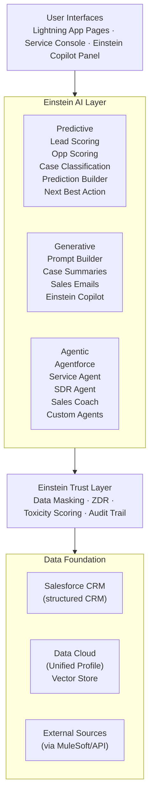

# Einstein Platform Overview

**Exam Domain:** AI Capabilities of CRM (8%)
**Study Priority:** MEDIUM — need feature-to-use-case mapping, not deep technical detail

---

## Core Concepts

**Einstein Platform:** Salesforce's umbrella term for all AI capabilities built into the Salesforce platform — spanning predictive, generative, and agentic AI across all clouds.

**The Einstein portfolio (simplified):**

| Category | Feature | What It Does | CRM Object |
|----------|---------|-------------|------------|
| **Predictive** | Einstein Lead Scoring | Predicts lead conversion likelihood, score 0-99 | Lead |
| **Predictive** | Einstein Opportunity Scoring | Predicts deal close probability | Opportunity |
| **Predictive** | Einstein Case Classification | Predicts field values for new cases (Priority, Type, Owner) | Case |
| **Predictive** | Einstein Prediction Builder | Custom binary or numeric predictions on any object | Any |
| **Predictive** | Einstein Next Best Action | Surfaces AI-powered recommendations to reps | Any |
| **Generative** | Prompt Builder | Reusable LLM prompt templates using CRM merge fields | Any |
| **Generative** | Einstein Copilot / Agentforce | AI assistant / autonomous agents in Salesforce | Any |
| **Generative** | Sales Email | AI-drafted personalized sales emails | Opportunity/Lead |
| **Generative** | Case Summarization | AI-generated case summaries | Case |

---

### Einstein vs. Agentforce — The Current Architecture

The naming has evolved. For this exam:
- **Einstein** = the platform-level AI brand (covers everything)
- **Einstein Copilot** = conversational AI assistant for CRM users (ask questions, get answers, summarize records)
- **Agentforce** = autonomous AI agents that take actions (not just answers)
- The distinction: Copilot responds; Agentforce acts

---

### Key Einstein Features — What to Know for Each

**Einstein Lead Scoring:**
- Trains on YOUR org's historical lead conversion data
- Requires sufficient converted leads to build a reliable model (at least a few hundred)
- Outputs a score 0-99 plus "driving factors" (top positive and negative factors)
- Supervised classification model

**Einstein Prediction Builder:**
- Build custom predictions on ANY Salesforce object
- **Binary prediction**: Will [record] [do something]? → Yes/No + score
- **Numeric prediction**: What will [field value] be? → number
- Step-by-step wizard: choose object → choose outcome → add examples → train → deploy
- No ML expertise required (Salesforce handles the model selection)

**Einstein Next Best Action (NBA):**
- Surfaces proactive recommendations to users ("Offer the customer a renewal discount")
- Built on: **Recommendation objects** (what to recommend) + **Strategy** (when/who) + **Lightning component** (where it shows)
- Strategy uses Strategy Builder visual flow: Load → Filter → Branch → Sort → Limit → Output
- Can incorporate predictive ML models or pure rules

---

## PTA / SA Relevance

**Feature selection at architecture review:**
- Customers frequently confuse these features. Common question: "What's the difference between Next Best Action and Einstein Copilot?"
  - NBA = proactive recommendations surfaced on a record (structured offers/actions)
  - Copilot = reactive AI assistant responding to user questions (conversational)

- "We want AI to help our service reps close cases faster" → Prompt Builder (case summary template) + Einstein Case Classification (auto-fill Priority/Type) + NBA (suggest knowledge articles)

- "We want AI to automate inbound lead qualification" → Agentforce SDR Agent + Einstein Lead Scoring for prioritization

**Enterprise considerations:**
- Einstein predictive features require MINIMUM DATA to train: If an org is new or has incomplete data, these features produce unreliable scores. Always assess data maturity before promising Einstein outcomes.
- Einstein generative features require Einstein AI add-on license (or included in some premium cloud editions) — verify licensing before designing architecture
- Prediction Builder models need retraining as business patterns change (model drift) — build a maintenance cadence into your implementation plan

**CTO-level positioning:**
- "Salesforce AI is layered — you can adopt it incrementally. Start with predictive features that run on existing CRM data (no new infrastructure needed). Then layer in generative AI for content creation. Then Agentforce for autonomous processes."
- This reduces perceived risk and complexity for risk-averse organizations.

---

## Einstein Platform Architecture (Enterprise View)

**Limitations:**
- Einstein features are cloud-specific (Lead Scoring for Sales Cloud, Case Classification for Service Cloud) — not all features available across all clouds
- Predictive Einstein features require org-specific model training; new orgs must accumulate data before reliable predictions are possible
- Agentforce requires separate configuration (Topics, Actions, Agent definition) — not activated by just enabling Einstein
- Not all Einstein features are available in all Salesforce editions — Starter editions have limited AI access

---

## Key Facts to Memorize

- Einstein Lead Scoring = supervised classification, trains on org's historical converted leads
- Prediction Builder = custom predictions (binary or numeric) on any object
- Prompt Builder = reusable LLM templates with CRM merge fields
- Next Best Action = Recommendation records + Strategy + Lightning component
- Agentforce = autonomous agents (Topics + Actions + Atlas Reasoning Engine)
- Einstein Copilot = AI assistant (conversational); Agentforce = AI agents (autonomous actions)
- All generative Einstein features run through the Trust Layer

---

## Exam Traps

**Trap 1:** "Einstein automatically knows everything in Salesforce and provides insights without configuration." WRONG. Each Einstein feature requires explicit setup, sufficient training data (for predictive), or template configuration (for generative).

**Trap 2:** "Agentforce and Einstein Copilot are the same thing." WRONG. Copilot is a conversational assistant that answers questions and helps with tasks. Agentforce agents can autonomously take multi-step actions.

**Trap 3:** "Einstein Prediction Builder can only predict whether a lead will convert." WRONG. Prediction Builder is customizable for ANY Salesforce object and can predict binary OR numeric outcomes for any field.

---

## Practice Questions

**Q1: A service team wants to automatically classify incoming cases by Priority and Case Type so they route to the correct queue without manual triage. Which Einstein feature best addresses this?**

A) Einstein Prediction Builder
B) Einstein Case Classification
C) Next Best Action
D) Prompt Builder

**Answer: B** — Einstein Case Classification predicts field values (Priority, Type, Owner) for new cases using historical case patterns. Prediction Builder is for custom predictions. NBA surfaces recommendations. Prompt Builder generates text content.

---

**Q2: A sales manager wants a system where each Opportunity record shows AI-generated talking points for the next customer conversation, grounded in the deal's history, competitor mentions, and recent activity. Which feature is best suited?**

A) Einstein Lead Scoring
B) Einstein Opportunity Scoring
C) Prompt Builder with Record Summary or Sales Email template
D) Einstein Next Best Action

**Answer: C** — Generating text content (talking points) grounded in CRM record data is a generative AI use case. Prompt Builder with a customized template using merge fields for Opportunity history and activity is the right tool. Lead/Opportunity Scoring outputs scores (predictive). NBA surfaces discrete recommendations.

---

**Q3: Which statement correctly describes the difference between Einstein Copilot and Agentforce?**

A) Einstein Copilot takes autonomous multi-step actions; Agentforce provides conversational answers
B) Einstein Copilot is a conversational AI assistant that helps users with tasks and questions; Agentforce is autonomous agents that take actions across Salesforce
C) They are different names for the same feature in different Salesforce editions
D) Agentforce is only for Service Cloud; Einstein Copilot is for Sales Cloud

**Answer: B** — Einstein Copilot is the conversational AI assistant embedded in Salesforce — users interact with it to get answers and drafts. Agentforce agents are autonomous — they can independently execute multi-step tasks (look up data, create records, send emails) based on goals.
