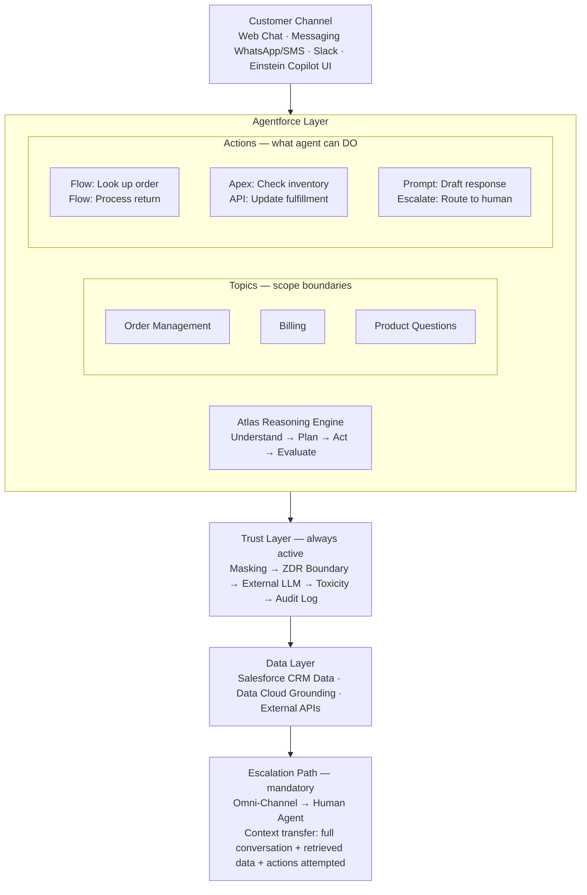

# Einstein Copilot and Agentforce

**Exam Domain:** AI Capabilities of CRM (8%) + Einstein Trust Layer (38%)
**Study Priority:** HIGH — Agentforce architecture is tested; know Topics, Actions, Atlas Reasoning Engine

---

## Core Concepts

### Agentforce Components

**Agentforce** is Salesforce's autonomous AI agent platform. Unlike a chatbot (which generates text responses), Agentforce agents can plan and execute multi-step tasks across Salesforce.

**4 Core Components:**

| Component | What It Is | Example |
|-----------|-----------|---------|
| **Topics** | Define what the agent is authorized to handle — areas of responsibility with clear scope | "Order Management" topic covers order status, returns, refunds |
| **Actions** | Specific tasks the agent can execute (Flows, Apex, APIs, Prompt Builder calls) | "Look up order status" action calls an external API |
| **Atlas Reasoning Engine** | The AI "brain" — decomposes goals, plans steps, selects actions, evaluates results | Determines: to answer "where is my order?" → look up order ID → check fulfillment system → respond |
| **Agent Definition** | Configuration: which topics, which LLM, escalation behavior, persona | Service Agent definition includes service topics, escalation to human when needed |

---

### Atlas Reasoning Engine — How It Works

**The Understand → Plan → Act → Evaluate loop:**

1. **Understand**: Parse the user's input — determine intent, extract key entities (order number, customer ID)
2. **Plan**: Identify which Topic this falls under; determine which Actions are needed and in what order
3. **Act**: Execute the selected Actions (call the Flow, invoke the API, generate text)
4. **Evaluate**: Check if the goal is achieved; if not, plan next steps or escalate

This loop runs until the goal is resolved or a termination condition is met (escalation, max turns, uncertainty threshold).

---

### Agentforce Escalation

**Key principle:** Agents must have a defined escalation path — they cannot dead-end.

**Escalation design requirements:**
- When escalating to a human, the agent must include CONTEXT TRANSFER — the full conversation history, what was attempted, what data was retrieved
- Escalation triggers: explicit user request, uncertainty threshold exceeded, out-of-scope topic, sensitive/high-stakes action requiring human approval
- For customer-facing agents: escalation to a live human agent (Salesforce Omni-Channel routing) must be tested and reliable

---

### Pre-Built Agentforce Agents

| Agent | Primary Use Case | Key Capability |
|-------|----------------|---------------|
| **Service Agent** | Customer self-service (returns, order status, account issues) | Handles common service issues autonomously |
| **SDR Agent** | Inbound lead qualification | Engages new leads, qualifies interest, books meetings |
| **Sales Coach Agent** | Coaching sales reps on deals | Advises on deal strategy — NOTE: advises only, does not take CRM actions |
| **Retail Agent** | E-commerce customer support | Handles shopping and purchase assistance |

---

### Einstein Copilot

**Einstein Copilot** (or "Agent") = the AI assistant embedded in Salesforce UI for CRM users.

Key behaviors:
- Responds to natural language questions about CRM data ("What are my top 10 open opportunities?")
- Can summarize records, draft emails, help with tasks
- Does NOT autonomously take actions without user initiation (it's a respond-on-request system)
- Runs through Trust Layer (same 4 components)

**Copilot vs. Agentforce summary:**
- Copilot: human asks → AI responds
- Agentforce: goal set → AI plans and acts autonomously until goal complete

---

## PTA / SA Relevance

**Agentforce is the most talked-about Salesforce product right now in partner and customer conversations.** As a PTA, you need to be able to:

**1. Set customer expectations about what Agentforce can and cannot do:**
- CAN: autonomous multi-step tasks within defined Topics/Actions
- CANNOT: make judgment calls outside configured scope; access data not configured in Actions; guarantee 100% accuracy

**2. Design the Topic/Action taxonomy for a customer:**
- Good Topics: narrow, well-defined (10-20 Topics max for most implementations)
- Good Actions: atomic, testable, deterministic (a Flow that looks up an order is better than an open-ended "do customer service" instruction)

**3. Explain the Atlas Reasoning Engine to customer architects:**
- "This is the multi-step planning engine. It's not a scripted decision tree — it dynamically plans steps based on the user's input and available actions. This is why Agentforce feels more intelligent than a traditional chatbot."

**4. Design escalation properly:**
- Every customer-facing Agentforce deployment MUST have a tested escalation path
- The agent must transfer conversation context to the human agent (use Omni-Channel + Einstein Conversation Mining for analysis)
- Document the escalation triggers in the agent design spec

**5. Address the governance/liability question from CTO/Legal:**
- "Who is accountable if the agent gives wrong information or takes a wrong action?"
- Answer: The org that deployed the agent is accountable. Salesforce provides the platform, not the agent's knowledge or Actions.
- Mitigation: human review on consequential actions, regular agent testing, monitored audit trail

**Common anti-pattern:** Customer wants Agentforce to "handle everything" with one generic agent. This produces poor outcomes. The best implementations have focused, narrow agents with well-defined Topics/Actions and clear escalation rules.

---

## Agentforce Architecture (Enterprise)

**Limitations:**
- Each agent action invokes an LLM call (tokens = cost) — complex multi-step agents can be expensive at volume
- Atlas Reasoning Engine can be non-deterministic — the same query may follow different reasoning paths on different runs
- Topics and Actions must be carefully designed; vague or overlapping topic definitions cause unpredictable routing
- Agentforce cannot take actions not explicitly defined in its Actions library — it cannot spontaneously call external systems not configured
- Conversation memory: without explicit memory configuration, Agentforce does not remember previous sessions with the same customer
- Max concurrent sessions and latency SLAs depend on org capacity and add-on licensing

---

## Key Facts to Memorize

- Agentforce = Topics + Actions + Atlas Reasoning Engine
- Atlas loop: **Understand → Plan → Act → Evaluate**
- Escalation is mandatory — must include context transfer
- Topics = what the agent is authorized to discuss/handle
- Actions = specific tasks the agent can execute (Flows, Apex, APIs)
- Pre-built agents: Service Agent, SDR Agent, Sales Coach (advises only), Retail Agent
- Copilot = respond on request; Agentforce = plan and act autonomously

---

## Exam Traps

**Trap 1:** "Agentforce Topics are like chatbot menus — the user selects from a list." WRONG. Topics define the agent's authorized scope. The Atlas Reasoning Engine determines which Topic applies to a user's natural language input — the user doesn't select Topics.

**Trap 2:** "The Sales Coach Agent can update Opportunity records based on its coaching recommendations." WRONG. Sales Coach Agent ADVISES only — it gives reps guidance. It does not autonomously take actions in Salesforce.

**Trap 3:** "Agentforce doesn't use the Einstein Trust Layer because it uses internal Salesforce data." WRONG. Agentforce invokes LLMs for reasoning and generation. All LLM calls go through the Trust Layer regardless of where the input data comes from.

**Trap 4:** "When Agentforce escalates to a human, it starts a new conversation." WRONG. Escalation must include context transfer — the full conversation history and context must be passed to the human agent.

---

## Practice Questions

**Q1: An Agentforce Service Agent is handling a customer inquiry about a billing dispute. After three attempts, the agent cannot resolve the issue because it falls outside its configured Topics. What should happen next?**

A) The agent should generate an estimated resolution based on available data
B) The agent should end the session and ask the customer to call customer service
C) The agent should escalate to a human agent, transferring the full conversation context and any data it retrieved
D) The agent should try a different reasoning approach using a higher temperature LLM

**Answer: C** — Escalation with context transfer is the mandatory design requirement for Agentforce. The human agent receives the full conversation history plus any data retrieved during the agent's attempts. Simply ending the session or generating an estimate is poor design and potentially harmful.

---

**Q2: Which component of Agentforce is responsible for determining the sequence of actions needed to accomplish a user's goal?**

A) Topics
B) Actions
C) Atlas Reasoning Engine
D) Einstein Trust Layer

**Answer: C** — The Atlas Reasoning Engine is the planning component. It receives the user's intent, determines which Actions are needed, sequences them, executes them, and evaluates whether the goal has been achieved. Topics define scope; Actions are the tasks available; Trust Layer handles safety.

---

**Q3: A company wants to build an Agentforce agent that can look up customer orders, process standard returns, and send confirmation emails — all autonomously. An architect notes that the agent must also have a path to hand off to a live agent for complex cases. Which Agentforce design element addresses the architect's requirement?**

A) A Topic defined as "Complex Cases" with no associated Actions
B) An escalation Action configured to route to Omni-Channel with conversation context transfer
C) Increasing the Atlas Reasoning Engine's iteration limit
D) Configuring Zero Data Retention to prevent data from leaving Salesforce

**Answer: B** — The escalation requirement is met by configuring an escalation Action that routes to human agents via Omni-Channel, with the full conversation context transferred. A Topic with no Actions doesn't resolve cases. Iteration limits and ZDR are different concerns.
