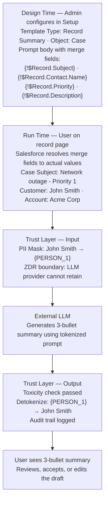

# Prompt Builder in Salesforce

**Exam Domain:** AI Capabilities of CRM (8%) + Einstein Trust Layer (38%)
**Study Priority:** HIGH — Prompt Builder is the hands-on generative AI tool; know all 4 template types and how merge fields work

---

## Core Concepts

**Prompt Builder:** Salesforce's declarative (admin-friendly) tool for creating reusable LLM prompt templates that are grounded in Salesforce CRM data via merge fields.

**Key Value Prop:** Instead of users writing prompts from scratch each time, admins create tested, governed templates that standardize AI usage across the org.

---

### The 4 Template Types

| Template Type | Purpose | Typical Placement |
|--------------|---------|------------------|
| **Field Generation** | AI generates content to populate a specific field | Field on a record's detail page or layout |
| **Record Summary** | AI generates a narrative summary of an entire record | Summary panel on record page |
| **Sales Email** | AI drafts a personalized sales outreach email | Email composer panel |
| **Flex** | General purpose — any generative task; used programmatically | Apex invocation, Agentforce Actions, Flows |

**Choosing the right template type:**
- Filling in one specific field with AI-generated text → **Field Generation**
- Summarizing everything about a record in paragraph form → **Record Summary**
- Writing a sales email draft based on Opportunity/Account/Contact data → **Sales Email**
- Building a custom AI capability in code or Agentforce → **Flex**

---

### Merge Fields — How They Work

**Syntax:** `{!$Record.FieldName}` or `{!$Record.RelatedObject.FieldName}`

**Resolution timing:** Merge fields are resolved by Salesforce BEFORE the prompt is sent to the LLM. The LLM receives the actual field values, not the merge field syntax.

**Examples:**
```
{!$Record.Name}                        → "Acme Corporation"
{!$Record.Account.Industry}            → "Technology"
{!$Record.Opportunity.Amount}          → "$450,000"
{!$Record.Contact.Title}               → "Chief Financial Officer"
{!$Record.Description}                 → [full text of the Description field]
```

**Data masking interaction:** After merge fields are resolved to actual values, the Trust Layer's Data Masking component scans for PII. If `{!$Record.Contact.Name}` resolved to "John Smith" — a name — it gets masked to `{PERSON_1}` before reaching the LLM.

---

### Prompt Builder Workflow (Admin)

1. Go to **Setup → Einstein → Prompt Builder** (or search "Prompt Builder")
2. Click **New Prompt Template**
3. Select **Template Type** (Field Generation, Record Summary, Sales Email, Flex)
4. Select the **Object** the template will run against (e.g., Case, Opportunity, Account)
5. Write the **prompt template** body using merge fields for CRM data
6. **Preview/Test**: run the template against a sample record, see the LLM output
7. **Activate** the template
8. Add the **Einstein for [Object] component** to the relevant Lightning page
9. Users see a button/panel to invoke the AI; they review and accept/edit the draft

---

### Grounding Options in Prompt Builder

| Grounding Method | What It Does | When to Use |
|-----------------|-------------|------------|
| **Merge fields** | Injects specific CRM field values into prompt | When you need specific structured CRM data |
| **Data Cloud (RAG)** | Retrieves semantically similar documents from Einstein Vector Store | When you need unstructured documents (knowledge articles, PDFs) |
| **Flow data** | A Flow runs before the prompt, retrieves computed data, passes to template | When the data requires logic to compute before use |

---

## PTA / SA Relevance

**Implementation considerations:**
- Prompt templates are metadata — deploy via Change Set or SFDX. Always build in sandbox, QA extensively with diverse records, then deploy to production.
- **Template governance**: In large orgs, un-governed prompt templates proliferate. Recommend a center of excellence (CoE) approach: a small team owns and reviews all Prompt Builder templates before activation.
- **Token cost monitoring**: Each template invocation costs tokens. For templates used on high-traffic pages (e.g., case summary on a 10,000-case-per-day service org), calculate estimated monthly Einstein AI usage cost before go-live.

**Architecture decisions:**
- Field Generation vs. Record Summary: Field Generation is better when you want to write AI output into a specific field that can then be used downstream (queried, used in automation). Record Summary is better for on-screen display only.
- Flex templates are the integration point for Agentforce Actions — when you want Agentforce to invoke a generative prompt as part of its reasoning, use a Flex template.

**Enterprise edge cases to test:**
1. Records with blank required fields — what does the template do if `{!$Record.Description}` is null?
2. Records with very long field values — does the prompt exceed the LLM's context window?
3. Multi-language records — does the template work for non-English data?
4. Records with sensitive data beyond PII — does the masking model catch all relevant fields?

**CTO conversation:**
- "Prompt Builder is your AI governance layer for generative content. Instead of every rep writing their own ChatGPT prompt, the organization defines and tests AI templates centrally. This standardizes AI quality, maintains brand voice, and creates an auditable trail of what the AI was asked and what it generated."

---

## Prompt Builder Architecture



**Limitations:**
- Context window limits: total prompt (template text + all resolved merge field values) must stay within LLM token limit. Long Description fields can push prompts over the limit, causing truncation or errors.
- No dynamic branching: Prompt Builder templates can't use if/else logic — can't say "if Account type = Enterprise, include X else include Y." Workaround: separate templates per scenario, or pre-compute a conditional value in a field via Flow.
- Merge fields surface values only — can't execute calculations, aggregations, or queries in the template body.
- Human-in-loop requirement: By default, AI output is shown to the user for review, not auto-committed. Auto-write to fields requires additional configuration (Flow invocation + template invocation).
- Licensing: Prompt Builder requires Einstein AI credits or appropriate Einstein license tier.

---

## Key Facts to Memorize

- **4 template types**: Field Generation, Record Summary, Sales Email, Flex
- **Merge field syntax**: `{!$Record.FieldName}` — resolved BEFORE LLM receives the prompt
- LLM never sees the merge field syntax — only the resolved values
- Flex templates are used in Agentforce Actions and Apex integrations
- Prompt templates are metadata — deployable via Change Set
- By default: AI draft is shown for human review, not auto-committed
- All Prompt Builder invocations run through the Einstein Trust Layer

---

## Exam Traps

**Trap 1:** "The LLM processes `{!$Record.Name}` as a formula expression." WRONG. Merge fields are resolved by Salesforce BEFORE the prompt reaches the LLM. The LLM sees "Acme Corp," not `{!$Record.Name}`.

**Trap 2:** "Sales Email templates can only be used for Account emails." WRONG. Sales Email templates can be grounded in Opportunity, Lead, Account, Contact, or other object data — "Sales Email" describes the output type, not the input object restriction.

**Trap 3:** "Prompt Builder can run complex calculations using Apex code inside the template." WRONG. Prompt Builder is declarative — merge fields surface field values only. Complex logic must be pre-computed in a Flow and stored in a field before the template merges it.

**Trap 4:** "Field Generation templates automatically write AI content into the field." NOT by default. The default UX shows the AI output for human review. Auto-writing requires additional automation configuration.

---

## Practice Questions

**Q1: An admin wants to create an AI feature that generates a one-paragraph narrative summary of an Account record, visible directly on the Account page, covering the account's industry, revenue, open opportunities, and recent cases. Which Prompt Builder template type should they use?**

A) Field Generation
B) Sales Email
C) Record Summary
D) Flex

**Answer: C** — Record Summary generates a narrative overview of a record, displayed as a panel on the record page. It's designed exactly for this "here's everything you need to know about this record" use case. Field Generation is for a specific field. Sales Email is for email drafts. Flex is for programmatic/agent use.

---

**Q2: An Agentforce agent needs to call a Prompt Builder template to generate a personalized response for a customer during a service conversation. Which template type is designed for this programmatic invocation pattern?**

A) Record Summary
B) Sales Email
C) Field Generation
D) Flex

**Answer: D** — Flex templates are the general-purpose, programmatically invokable template type. They're designed for use in Agentforce Actions, Apex, and Flows where a non-standard output format or invocation pattern is needed.

---

**Q3: A sales rep notices that when they generate a sales email using Prompt Builder, the email draft sometimes contains incorrect information that wasn't in any Salesforce fields. What is the most likely cause?**

A) The Data Masking component is incorrectly masking CRM data
B) The LLM is hallucinating — generating plausible-sounding content beyond what the merge fields provided
C) The merge fields are being sent to the LLM without being resolved
D) The Toxicity Scoring component is filtering accurate content

**Answer: B** — When an LLM receives a prompt with CRM data and generates content, it may add details from its training data that seem contextually appropriate but are not factually accurate. This is hallucination. The fix is to strengthen the prompt with explicit instructions like "Only use the information provided. Do not add information not contained in the context above."
