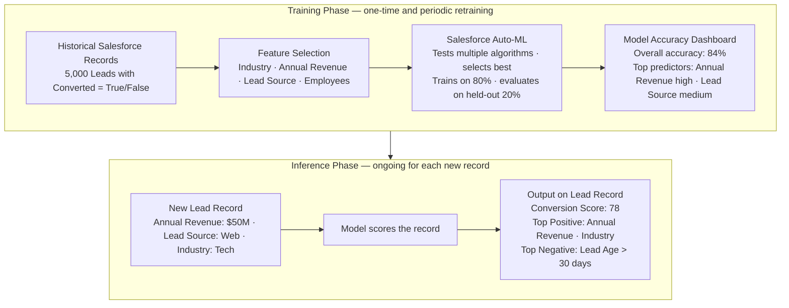

# Einstein Prediction Builder

**Exam Domain:** AI Capabilities of CRM (8%)
**Study Priority:** MEDIUM — know the two prediction types, the setup process, and how to interpret results

---

## Core Concepts

**Einstein Prediction Builder:** A no-code Salesforce tool that allows admins to build custom AI predictive models on any Salesforce object — without data science expertise.

**Core value:** Out-of-box Einstein features (Lead Scoring, Opportunity Scoring) are pre-built for specific objects/outcomes. Prediction Builder lets you create predictions for YOUR specific business questions on ANY object.

---

### Two Prediction Types

| Type | Output | When to Use | Example |
|------|--------|-------------|---------|
| **Binary Prediction** | Will this record [do X]? → Yes/No probability score | Predicting a two-outcome event | Will this lead convert? Will this customer churn? Will this case escalate? |
| **Numeric Prediction** | What will [field] be? → Numeric value | Predicting a quantitative outcome | What will this deal close at? How many support cases will this account log next quarter? |

**Binary prediction output:** A score from 0-100 representing the probability of the outcome occurring, PLUS a list of "driving factors" (top positive and negative predictors).

**Numeric prediction output:** A predicted numeric value PLUS a confidence interval range.

---

### Setup Process (Wizard-Based)

1. **Choose the object** (can be any standard or custom object)
2. **Define the prediction**: What are you trying to predict? Choose the outcome field and condition
   - Binary: choose a field + value (e.g., "Converted = True")
   - Numeric: choose the field to predict (e.g., "Close Revenue")
3. **Set the training criteria**: Which records to train on? Filters (e.g., only Leads with Status = Closed)
4. **Select input features**: Which fields should the model consider? (Can include formula fields, lookup fields)
5. **Review data quality insights**: Salesforce shows which fields have good data and which are sparse
6. **Train the model**: Salesforce trains on historical data (can take minutes to hours)
7. **Review model accuracy**: Overall accuracy %, top predictors, data health indicators
8. **Deploy**: Activate the prediction; scores appear on records as a new field
9. **Add to page layout**: Expose the score and driving factors to users on the record page

---

### Model Accuracy Concepts

| Metric | What It Means |
|--------|--------------|
| **Overall accuracy %** | % of predictions that matched actual outcomes on the held-out test set |
| **Driving factors** | The top fields that positively or negatively influenced the prediction |
| **Training/test split** | Salesforce holds back ~20% of data for testing — performance on this set = generalization estimate |
| **Data health** | Indicators of field completeness — sparse fields produce less reliable models |

**Overfitting warning**: If a model scores very high on training data but lower on test data, it may have overfit — it learned the training examples too specifically and doesn't generalize.

**Minimum data requirements**: Salesforce needs at minimum ~200-400 records that hit the outcome condition (e.g., 200+ converted leads) to build a meaningful binary prediction model. With insufficient data, Salesforce will warn you.

---

## PTA / SA Relevance

**When to recommend Prediction Builder vs. out-of-box Einstein:**
- If the standard features (Lead Scoring, Opportunity Scoring) don't fit the customer's specific use case → Prediction Builder
- Example: "We want to predict which Accounts are at risk of not renewing" — there's no out-of-box feature for this. Prediction Builder on the Account object with a churn outcome field.

**Data readiness assessment is prerequisite:**
- Run a data quality audit BEFORE building predictions. If key predictor fields (Industry, Annual Revenue, Number of Employees) are mostly null, the model will be unreliable.
- Prediction Builder provides data quality health indicators — use them to prioritize data remediation.

**Architecture consideration for enterprise deployments:**
- Prediction scores update on a scheduled basis (not real-time per field change) — set expectations with customers about score freshness
- Custom predictions can be used in Flow criteria (e.g., "if churn score > 70, create task for customer success manager")
- Driving factors are surfaced as JSON/field values — can be surfaced in Lightning components or used in Prompt Builder merge fields ("This account's top churn risk factors are: {!$Record.Churn_Factors__c}")

**CTO framing:**
- "Prediction Builder lets your business analysts build AI models specific to your business without hiring data scientists. It's supervised ML with a configuration UI — the data science happens automatically."
- Important caveat: "The model is only as good as the historical data. If your past data has systematic gaps or biases, the predictions will reflect that."

---

## Prediction Builder Architecture

**Limitations:**
- Minimum ~200-400 outcome records needed — new orgs may not have enough history
- Model scoring is batch (scheduled), not real-time — scores may lag 24-48 hours behind field changes
- Feature inputs are Salesforce fields only — cannot directly incorporate external data unless synced into Salesforce first
- Model drift: as business patterns change (new markets, product lines, sales motions), models need retraining — plan for quarterly retraining cadence
- Black box concern: individual prediction logic is not fully explainable even with driving factors — driving factors show correlation, not causation
- Binary prediction only predicts one outcome at a time — multi-class predictions (e.g., "will this case be P1, P2, or P3?") require Einstein Case Classification or custom ML

---

## Key Facts to Memorize

- Prediction Builder works on **ANY Salesforce object**
- **Two types**: Binary (Yes/No probability) and Numeric (predicted number)
- Binary prediction output: **score + driving factors**
- Numeric prediction output: **predicted value + confidence range**
- Salesforce handles model selection automatically (AutoML)
- Requires sufficient historical data with actual outcomes (min ~200-400 outcome records)
- Scores are **batch updated**, not real-time
- Driving factors show top positive and negative predictors for the score

---

## Exam Traps

**Trap 1:** "Einstein Prediction Builder can only work with Leads and Opportunities." WRONG. It works on ANY Salesforce object — standard or custom.

**Trap 2:** "Binary prediction predicts binary code (0s and 1s)." WRONG. Binary in this context means a two-outcome prediction (Yes/No, True/False, Will/Won't) — expressed as a probability score 0-100.

**Trap 3:** "Numeric prediction tells you exactly what the value will be with certainty." WRONG. Numeric prediction returns an estimated value with a confidence interval — it's a probability estimate, not a guaranteed exact number.

**Trap 4:** "Driving factors tell you WHY the model made that prediction." NUANCED. Driving factors show correlation (these fields were most associated with this outcome), not causation. The model doesn't truly "understand" why — it found statistical patterns.

---

## Practice Questions

**Q1: A B2B SaaS company wants to predict which of their current Accounts are at risk of not renewing their subscription. They want to see a 0-100 risk score on each Account record. Which Salesforce feature is most appropriate?**

A) Einstein Lead Scoring
B) Einstein Opportunity Scoring
C) Einstein Prediction Builder — Binary Prediction on Account object
D) Einstein Case Classification

**Answer: C** — Prediction Builder's binary prediction type on the Account object is perfect for this. Lead Scoring only works on Leads. Opportunity Scoring applies to Opportunities. Case Classification predicts case field values. Prediction Builder handles custom predictions on any object.

---

**Q2: After training an Einstein Prediction Builder model to predict deal value (numeric prediction), an admin notices the model shows high accuracy on training data but much lower accuracy on the held-out test data. What does this most likely indicate?**

A) The model needs more input features added
B) The model has overfit to the training data and may not generalize well to new records
C) The ZDR setting is interfering with model accuracy
D) Numeric prediction type cannot measure accuracy

**Answer: B** — High training accuracy + low test accuracy = overfitting. The model learned the training examples too specifically and fails to generalize to new data. Solutions include simplifying the model, adding more diverse training data, or removing overly specific features.

---

**Q3: An Einstein Prediction Builder binary prediction for case escalation shows "Case Age > 5 days" as a top negative driving factor and "Account Tier = Enterprise" as a top positive driving factor. How should an admin interpret these driving factors?**

A) Cases older than 5 days will never escalate; Enterprise accounts always escalate
B) Case age and account tier are statistically correlated with escalation outcomes in the training data — they do not guarantee escalation, just indicate higher or lower probability
C) These are recommendations for the model to follow in future predictions
D) These driving factors indicate data quality issues that must be fixed

**Answer: B** — Driving factors represent statistical correlation from training data, not rules or guarantees. Cases older than 5 days were correlated with lower escalation probability in historical data (perhaps resolved before escalating). Enterprise accounts showed higher escalation tendency. These are probabilistic signals, not deterministic rules.
