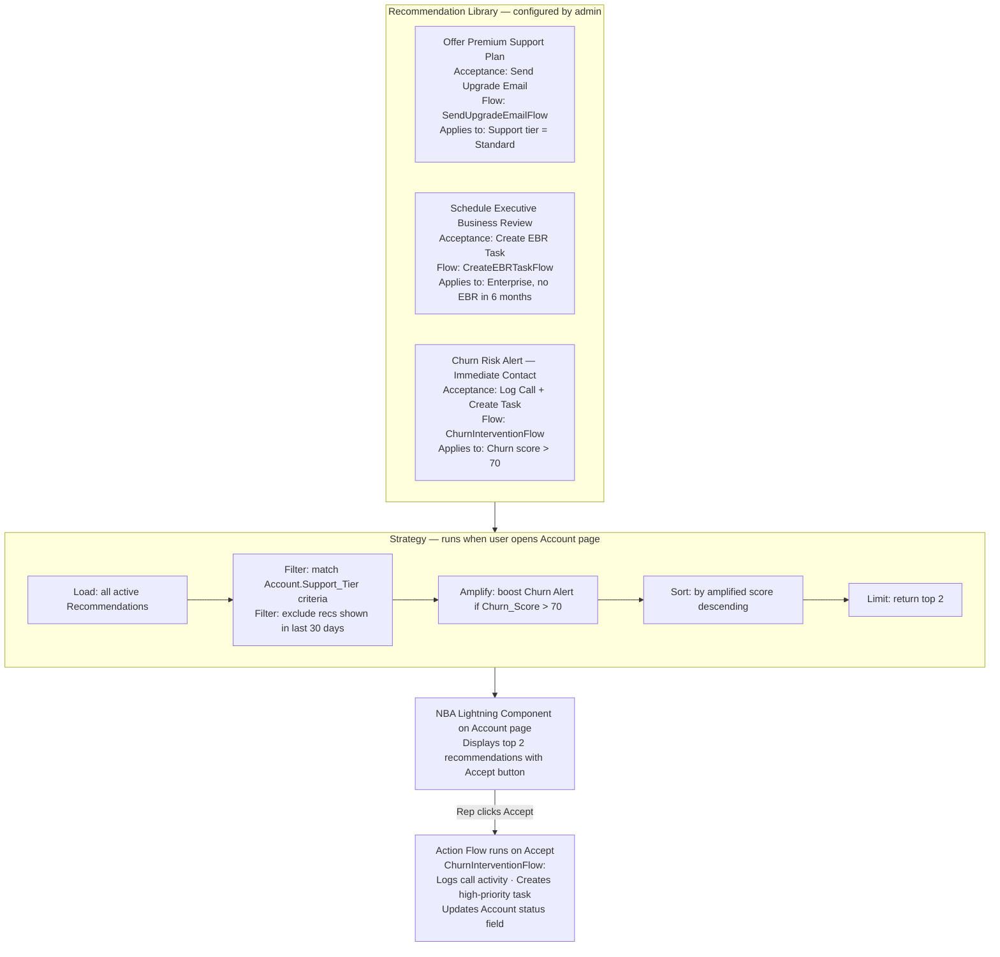

# Einstein Next Best Action and Recommendations

**Exam Domain:** AI Capabilities of CRM (8%)
**Study Priority:** MEDIUM — know the 3-component architecture (Recommendation + Strategy + Component)

---

## Core Concepts

**Einstein Next Best Action (NBA):** A Salesforce feature that proactively surfaces recommendations to CRM users at the right moment — telling sales reps which action to take next, surfacing relevant offers, or prompting service agents with helpful suggestions.

**The core question NBA answers:** "Given what we know about this customer right now, what is the single most relevant action or offer to surface to this user?"

---

### NBA 3-Component Architecture

| Component | What It Is | Configured Where |
|-----------|-----------|-----------------|
| **Recommendation** | A record that defines what to recommend — the offer, action, or suggestion | Recommendation custom object (standard in Salesforce) |
| **Strategy** | The logic that determines WHEN and to WHOM to surface each recommendation | Strategy Builder (visual flow tool) |
| **Lightning Component** | The UI element that displays recommendations to the user on a record page | Lightning App Builder |

**How they work together:**
1. User opens a record (e.g., Account page)
2. The NBA Lightning component on the page triggers the Strategy
3. Strategy runs: loads Recommendations → applies filter/sort logic → returns top ranked recommendations
4. The component displays the top recommendation(s) to the user
5. User sees the recommendation and acts on it (clicks Accept, Reject, or Dismiss)

---

### Strategy Builder Elements

| Element | Function |
|---------|---------|
| **Load** | Pulls Recommendation records into the strategy pipeline |
| **Filter** | Removes recommendations that don't apply (e.g., only show discount offers to accounts in a specific segment) |
| **Branch** | Creates conditional logic paths (if/else routing based on record values) |
| **Amplify** | Boosts the relevance score of recommendations matching certain criteria |
| **Sort** | Orders recommendations by priority, probability, or custom score |
| **Limit** | Caps how many recommendations are returned (typically 1-3) |
| **Output** | Returns the final set of recommendations to the NBA component |

**Strategy logic can incorporate:**
- Record field values (context from the current record)
- Einstein Prediction Builder scores (AI-powered filtering: "only show upsell offer if account churn score < 40")
- Flow logic (complex conditional logic)

---

### Recommendation Object — Key Fields

| Field | Description |
|-------|------------|
| **Name** | Recommendation title ("Offer Premium Support Plan") |
| **Description** | Full description shown in the UI |
| **Acceptance Label** | Button text for accepting ("Upgrade Now", "Send Email") |
| **Rejection Label** | Button text for declining ("Not Now", "Not Interested") |
| **Image** | Optional image for visual display |
| **Action Flow** | A Flow that runs when the recommendation is accepted |

**Key design principle:** When a rep accepts a recommendation, a Flow runs. The Flow does the actual work (creates a task, sends an email, creates an opportunity, logs an activity). The Recommendation itself is just the display record — the Flow is where the action happens.

---

## PTA / SA Relevance

**NBA is one of the most underutilized Einstein features in customer deployments.** In architecture reviews:

**Use case identification:**
- Service: "Show agents the top 2 knowledge articles for this case category" → NBA
- Sales: "Show reps which product to pitch based on account industry and size" → NBA
- Retention: "Flag at-risk accounts and prompt the CSM to schedule a check-in" → NBA
- Compliance: "Remind reps of required disclosure language for this deal type" → NBA

**How to explain to customers the difference between NBA and generative AI:**
- NBA = structured, curated recommendations from a predefined library (Recommendation records you create)
- Generative AI (Prompt Builder/Copilot) = open-ended content generation
- NBA is better when you want CONTROLLED outputs (specific approved offers, pre-approved messaging, compliance-friendly actions)
- Generative AI is better when you want FLEXIBLE content (any email, any summary)

**Combining NBA + Prediction Builder:**
- Train a Prediction Builder model to predict churn risk (score 0-100 on Account)
- Build a Strategy that filters: only show renewal offer recommendation if Churn Score > 70
- This creates AI-powered, contextual NBA recommendations — more targeted than pure rules-based

**CTO framing:**
- "Next Best Action is how you operationalize data insights into rep actions. Instead of a manager reviewing a churn risk dashboard and manually emailing their team, the platform surfaces the right action to the right rep at the right moment, directly in their workflow."

**Enterprise scale considerations:**
- Strategy performance: complex strategies with many Load/Filter branches can impact page load time — test Strategy execution time for high-traffic objects
- Recommendation volume: too many Recommendations in the library makes Strategy maintenance complex — keep the library focused (10-30 Recommendations for most implementations)
- Acceptance tracking: NBA logs whether recommendations are accepted/rejected — this data is valuable for measuring impact and refining strategies

---

## NBA Architecture

**Limitations:**
- NBA recommendations require manual creation and maintenance — the system doesn't automatically generate new recommendations based on patterns (unlike pure ML systems)
- Strategy complexity scales with number of use cases — large strategy libraries become difficult to maintain and test
- Acceptance/rejection data is tracked but does not automatically retrain the Strategy — feedback loop must be implemented manually
- NBA is best for curated, known-good recommendations — not suited for open-ended or novel action suggestions
- Page load performance: complex Strategies with many Load sources and Filter conditions can add 1-3 seconds to page load

---

## Key Facts to Memorize

- **NBA 3 components**: Recommendation (what) + Strategy (when/who) + Lightning Component (where)
- Strategy Builder elements: **Load → Filter → Branch → Amplify → Sort → Limit → Output**
- When a rep accepts a recommendation, a **Flow** runs (does the actual work)
- Recommendation records have: Name, Description, Acceptance Label, Rejection Label, Action Flow
- NBA can incorporate **Prediction Builder scores** in Strategy filter logic
- NBA = controlled, curated outputs; NOT open-ended generation

---

## Exam Traps

**Trap 1:** "The Strategy creates the Recommendation records." WRONG. The Strategy is the logic that determines which EXISTING Recommendation records to show, and to whom. Recommendation records are created separately.

**Trap 2:** "Einstein Next Best Action uses AI to generate new recommendations dynamically." WRONG. NBA serves recommendations from your predefined Recommendation library. AI (Prediction Builder) can be used in Strategy logic, but the recommendations themselves are curated by your team.

**Trap 3:** "When a rep accepts a recommendation, the system automatically emails the customer." ONLY IF you configured an Action Flow to do so. The Flow is where the action happens — accepting a recommendation without a configured Flow does nothing beyond tracking the acceptance.

---

## Practice Questions

**Q1: A company configures Einstein Next Best Action to show a "Schedule Renewal Call" recommendation on Account pages. When a rep accepts the recommendation, a Flow should automatically create a follow-up task. Which NBA component defines and triggers this automated follow-up behavior?**

A) The Recommendation record's Acceptance Label field
B) The Strategy's Amplify element
C) The Action Flow configured on the Recommendation record
D) The NBA Lightning Component

**Answer: C** — The Action Flow is the Flow referenced in the Recommendation record that executes when a user accepts the recommendation. This is where the automation lives — task creation, email sending, record updates.

---

**Q2: An admin builds a Strategy for a sales Recommendations feature. The Strategy loads all Recommendation records, but some recommendations should only appear for accounts with annual revenue over $1M. Which Strategy element handles this?**

A) Load
B) Filter
C) Sort
D) Limit

**Answer: B** — The Filter element removes recommendations from the pipeline that don't meet defined criteria. Here, a Filter with condition "Account.AnnualRevenue > 1000000" would keep only enterprise-scale recommendations in the pipeline.

---

**Q3: A Solution Architect is designing a Next Best Action implementation that should surface different recommendations depending on whether an account's AI-predicted churn score is above or below 60. The recommendation library already exists. What is the recommended approach?**

A) Create two separate NBA Lightning Components on the page — one for high risk and one for low risk
B) Use an Amplify element in the Strategy to boost all recommendations equally
C) Incorporate the Einstein Prediction Builder churn score field in the Strategy's Filter or Branch logic to route to different recommendation sets based on the score threshold
D) Use Prompt Builder to generate recommendations dynamically instead of NBA

**Answer: C** — The Strategy's Filter or Branch elements can reference any field on the record — including Einstein Prediction Builder score fields. Routing logic like "if Churn_Score > 60, load high-churn recommendations; else load standard recommendations" is exactly what Branch is designed for. One component handles both paths cleanly.
