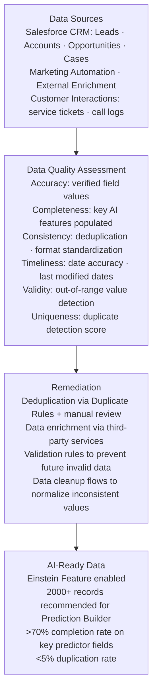

# Why Data Quality Matters for AI

**Exam Domain:** Data for AI (17%)
**Study Priority:** HIGH — the 6 data quality dimensions are directly tested; GIGO is foundational

---

## Core Concepts

### GIGO Principle

**GIGO = Garbage In, Garbage Out**

The most important concept in this section. AI models learn from training data. If training data is wrong, incomplete, or biased, the model learns wrong, incomplete, or biased patterns — and produces wrong, incomplete, or biased outputs. No algorithm can compensate for fundamentally bad input data.

**The corollary for Salesforce:** Before enabling any Einstein predictive feature, assess data quality first. A Lead Scoring model trained on mostly-blank lead records produces near-random scores.

---

### 6 Data Quality Dimensions

| Dimension | Definition | Salesforce Example | Impact on AI |
|-----------|-----------|-------------------|-------------|
| **Accuracy** | Data values are correct and reflect reality | Account.AnnualRevenue = $5M (actual revenue is $50M — data entry error) | Model learns wrong revenue → wrong correlations |
| **Completeness** | All required fields are populated; no critical gaps | 70% of Lead records have Industry blank | Model can't use Industry as a predictor |
| **Consistency** | Same data is represented the same way across the system | Company names: "Acme", "Acme Corp", "ACME Corporation" | Model sees three separate companies instead of one |
| **Timeliness** | Data is current and up to date | Opportunity close dates not updated when slipped | Model trained on stale dates predicts wrong timing |
| **Validity** | Data conforms to defined formats and acceptable values | Phone = "1234" (not a valid phone number format) | Model feature is noisy or non-functional |
| **Uniqueness** | No duplicate records exist | 3 duplicate Account records for "Acme Corp" | Training data counts the same company 3x → distorted patterns |

**Mnemonic:** **A**lways **C**heck **C**lean **T**imely **V**alid **U**nique → ACCTVУ → (or just memorize the 6 words directly)

---

### Pre-AI Data Quality Assessment Process

Before enabling Einstein features, assess data quality in 6 steps:

1. **Define what you need**: What fields will the AI model use? Which object? What's the minimum population you need for training?
2. **Profile the data**: What is the actual completeness/accuracy of key fields? (Run reports, use Salesforce Optimizer)
3. **Identify gaps**: Which fields are most incomplete? Where are the biggest quality issues?
4. **Prioritize remediation**: Fix the fields that matter most for the AI use case — not everything at once
5. **Remediate**: Data cleanup, deduplication, data enrichment (third-party data providers), field validation rules
6. **Re-profile and validate**: Confirm improvements before training the model

---

### Data Quality Tools in Salesforce

| Tool | What It Shows |
|------|--------------|
| **Salesforce Optimizer** | Health report across the org — field usage, completion rates, general data quality |
| **Salesforce Reports** | Custom reports to check field completion rates (% of leads with Industry populated) |
| **Duplicate Rules and Matching Rules** | Detect and prevent duplicate records (Uniqueness dimension) |
| **Data Cloud Data Explorer** | Data quality insights across unified profiles (completeness, freshness) |
| **Validation Rules** | Prevent bad data from entering (Validity dimension enforcement) |
| **Einstein Data Studio** | (in Data Cloud) Data health scoring for AI readiness |

---

## PTA / SA Relevance

**Data quality is the #1 reason Einstein predictive features underperform.** In customer engagements, this is your most important qualification question: "Before we design an AI solution, let's look at the data it will train on."

**What to check before an AI implementation:**
- Lead Scoring: What % of leads have Industry, Annual Revenue, Company Size, Lead Source populated? Run a completion % report.
- Opportunity Scoring: Are all Closed opportunities accurately marked Closed Won / Closed Lost? (Mis-staged Opps corrupt the training signal)
- Prediction Builder: How many records have the outcome condition (e.g., Churn = True)? Less than 200-400 qualified records → unreliable model

**Common data quality anti-patterns:**
1. "We'll fix the data later." → You cannot fix historical training data after the model is built. Fix before training.
2. "The AI will figure it out." → Models find patterns in what's there. If Industry is blank on 80% of leads, the model can't use it.
3. "Our CRM data is clean enough." → It almost never is. Always validate with reports before committing to AI timelines.

**Enterprise-scale data quality challenges:**
- Large orgs: 200K+ leads accumulated over years with varying data standards — historical data quality often worse than current
- M&A scenarios: merged org data has inconsistent field conventions (Consistency dimension failures)
- Global orgs: different regions use different naming conventions, currencies, date formats — creates Consistency and Validity issues

**CTO framing:**
- "Your AI strategy is only as good as your data strategy. Companies that invest in CRM data quality before enabling AI get 3-5x better AI outcomes than companies that turn on AI first and try to clean data afterward."
- Position data quality as a strategic investment, not just a housekeeping task.

---

## Data Quality Architecture (Enterprise View)

**Limitations:**
- Even after remediation, historical data may retain subtle biases that are hard to detect — data quality is never 100%
- Third-party data enrichment adds cost and introduces its own quality/bias issues
- Data quality tools in Salesforce identify issues but don't automatically fix them — remediation requires manual effort or automation investment
- Model training data reflects a point in time — ongoing data quality monitoring is necessary as business patterns evolve
- Some quality problems (Accuracy) are hard to detect automatically — requires business domain knowledge to identify wrong values

---

## Key Facts to Memorize

- **GIGO** = Garbage In, Garbage Out — bad data → bad AI
- **6 dimensions**: Accuracy, Completeness, Consistency, Timeliness, Validity, Uniqueness
- **Accuracy** = data is correct
- **Completeness** = required fields are populated
- **Consistency** = same data represented the same way everywhere
- **Timeliness** = data is current
- **Validity** = data conforms to expected format/range
- **Uniqueness** = no duplicate records
- Fix data quality BEFORE training AI models — you cannot fix historical training data after the fact
- Tools: Salesforce Optimizer, Reports, Duplicate Rules, Validation Rules, Data Cloud Data Explorer

---

## Exam Traps

**Trap 1:** "AI will find patterns even in incomplete data." Partially true but misleading. AI makes the best of available data, but missing features limit model quality. A model with 60% field completion for a key predictor is unreliable.

**Trap 2:** Confusing Accuracy and Validity. Accuracy = the value is CORRECT (real-world truth). Validity = the value is in the right FORMAT. An email address formatted as "test@email" might be VALID format but INACCURATE if it's the wrong person's email.

**Trap 3:** "Uniqueness just means not having duplicates in the CRM." Correct in concept, but uniqueness also extends to inconsistent representations — "IBM" vs. "IBM Corp" vs. "IBM Corporation" may be duplicate entities that a deduplication check needs to identify.

**Trap 4:** "Timeliness refers to how fast the AI responds." WRONG. In data quality context, Timeliness means the data itself is current and up-to-date. Stale data causes the AI to learn outdated patterns.

---

## Practice Questions

**Q1: A Salesforce admin discovers that 65% of Lead records have the "Industry" field blank. They plan to enable Einstein Lead Scoring immediately. What is the most significant risk?**

A) Einstein Lead Scoring will fail to activate without a complete dataset
B) The model will assign arbitrary scores since it cannot use Industry as a predictor, producing unreliable results that could mislead the sales team
C) The Trust Layer will block the model from training on incomplete data
D) Lead Scoring will automatically exclude blank-field records from its predictions

**Answer: B** — High field incompleteness means the model cannot effectively use Industry as a predictor. The model will still train and score, but with reduced accuracy. This violates the data quality principle of Completeness and demonstrates GIGO — the incomplete training data produces unreliable scores.

---

**Q2: A data analyst finds that the company's Salesforce CRM has "Acme", "Acme Corp", "Acme Corporation", and "ACME Inc." as separate Account records all representing the same company. Which data quality dimension is violated?**

A) Accuracy
B) Completeness
C) Timeliness
D) Consistency and Uniqueness

**Answer: D** — This violates both Consistency (the same entity is represented in multiple formats) and Uniqueness (there are effectively 4 duplicate records for one company). From an AI perspective, any model trained on this data would treat these as 4 separate companies, distorting patterns.

---

**Q3: An organization completed a data quality assessment and found that many Opportunity close dates reflect the original estimated close date from months ago and have never been updated as deals slipped. Which data quality dimension does this violate?**

A) Validity
B) Accuracy and Timeliness
C) Uniqueness
D) Completeness

**Answer: B** — The dates are technically valid (they are real dates in correct format), but they fail Accuracy (incorrect — the actual close date should be updated) and Timeliness (stale — the data is not current). AI trained on these dates would learn incorrect timing patterns for deal cycles.
