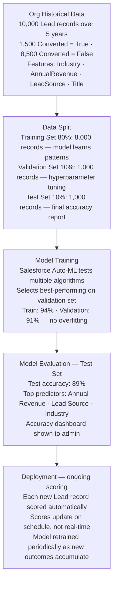

# Training Data Explained

**Exam Domain:** Data for AI (17%)
**Study Priority:** HIGH — labeled vs. unlabeled, train/validation/test split, overfitting vs. underfitting are all directly tested

---

## Core Concepts

### Labeled vs. Unlabeled Data

| Type | Definition | Used For | Example |
|------|-----------|---------|---------|
| **Labeled data** | Records where the outcome is KNOWN and annotated | Supervised learning (training models that predict known outcomes) | Lead records marked "Converted = True" or "Converted = False" |
| **Unlabeled data** | Records where outcomes are NOT pre-annotated | Unsupervised learning (finding patterns without guidance) | Customer transaction records used to find behavioral clusters |

**Creating labels requires effort:** Someone (or an automated process) must mark each record with the correct outcome. This is expensive for large datasets — which is why labeled data is often the bottleneck for supervised ML.

**Einstein's approach:** For predictive features like Lead Scoring, Einstein trains on your org's historical records where outcomes already exist (Converted field = True/False). The "label" is the actual historical outcome stored in the CRM field — no manual annotation needed.

---

### The Training / Validation / Test Split

Before training an ML model, the dataset is split into three parts:

| Set | % of Data | Purpose | Analogy |
|-----|-----------|---------|---------|
| **Training set** | ~70-80% | The model learns from this data — parameters are updated based on these examples | Textbook you study from |
| **Validation set** | ~10-15% | Used DURING training to tune hyperparameters and check for overfitting — model doesn't train on this | Practice exams you check yourself on |
| **Test set** | ~10-15% | Used ONCE after training is complete — provides an unbiased estimate of real-world performance | Final exam you haven't seen before |

**Critical rule for test set:** The test set must NEVER be seen by the model during training or hyperparameter tuning. If you adjust the model based on test set results, you've "contaminated" the test set and your performance estimate is no longer unbiased.

**In Salesforce Prediction Builder:** Salesforce automatically handles this split — you don't manually divide the data. It holds back approximately 20% for evaluation. The model accuracy shown in the dashboard reflects test set performance.

---

### Overfitting vs. Underfitting

| Condition | What Happened | Training Performance | Test Performance | Problem |
|-----------|--------------|---------------------|-----------------|---------|
| **Overfitting** | Model memorized training data — learned noise/specifics instead of general patterns | HIGH | LOW | Model won't generalize to new records |
| **Underfitting** | Model is too simple — didn't capture meaningful patterns | LOW | LOW | Model isn't useful at all |
| **Good fit (goal)** | Model learned real patterns that generalize | HIGH | Also HIGH (or close) | |

**How to think about it:**
- Overfitting: The student memorized every practice question verbatim but fails on slightly different final exam questions
- Underfitting: The student barely studied and fails both practice and final exam

**Diagnosing from performance numbers:**
- Training accuracy: 96%, Test accuracy: 71% → **OVERFITTING** (large gap between train and test)
- Training accuracy: 62%, Test accuracy: 60% → **UNDERFITTING** (low on both)
- Training accuracy: 88%, Test accuracy: 84% → **GOOD FIT** (small gap, both reasonable)

**Causes of overfitting in Salesforce context:**
- Too little training data (model memorizes the few examples)
- Too many features relative to records
- Training on data with noise/errors that the model memorized

**Remediation:**
- Overfitting: more training data, fewer features, regularization
- Underfitting: more training data, more/better features, more complex model

---

### Data Volume Considerations

| Einstein Feature | Minimum Data Requirement |
|----------------|--------------------------|
| Einstein Lead Scoring | Requires sufficient converted leads — ~200+ per segment recommended |
| Einstein Prediction Builder (binary) | ~200-400+ records that hit the outcome condition |
| Einstein Prediction Builder (numeric) | ~500+ records with the numeric field populated |
| LLM pre-training | Billions of documents (handled by LLM provider — not your concern) |

**Key principle:** More high-quality labeled data = better models. But quality matters more than quantity. 500 accurately-labeled records outperform 5,000 poorly-labeled records.

---

### How Einstein Learns from Org-Specific Data

Einstein predictive features (Lead Scoring, Prediction Builder) train a **personalized model** for each org:

1. Einstein analyzes your org's historical records
2. Finds correlations between features (field values) and the outcome (converted, closed, escalated)
3. Trains a model specific to your org's patterns
4. Applies that model to score new records in your org

**Implication:** Two companies using Einstein Lead Scoring get DIFFERENT models, even if they're in the same industry. Your org's specific historical patterns determine the model. This is why data quality matters — your model is only as good as your history.

---

## PTA / SA Relevance

**The most common implementation mistake for Einstein predictive features:**

"I enabled Lead Scoring but the scores don't seem accurate."

Diagnosis checklist:
1. How many converted leads does the org have? (If < 200, model is unreliable)
2. What's the completion rate for key fields (Industry, Revenue, Lead Source, Title)?
3. Is the training data time-period representative of current business? (Old data from a different business model?)
4. Are there duplicate leads inflating the training set?

**Overfitting in practice:**
- Org with 50 converted leads trains Lead Scoring → model may overfit to characteristics of those 50 specific leads
- New leads from different sources score very differently from what reps expect
- Solution: get more training data before deploying (either wait for more history or import historical data from other systems)

**Enterprise data pipeline design:**
- For optimal AI outcomes, design a historical data preservation strategy: don't delete or archive old records — keep them for training
- Clean historical data using batch Apex or Data Loader before training, not after

**CTO framing:**
- "Every Einstein model is trained specifically on your business data. This means the AI learns your patterns — how YOUR customers behave, what YOUR reps have seen. This personalization is the core advantage vs. generic AI."
- "But it also means: your model quality = your data quality × your data volume. Both need investment."

---

## Training Data Architecture

**Limitations:**
- Einstein handles the train/validation/test split automatically — but admins can't inspect the exact split or validate it
- Prediction Builder doesn't expose the model's algorithm type — it uses AutoML internally; no visibility into which algorithm was chosen
- Models trained on historical data become stale as business patterns change — schedule periodic retraining (quarterly or when business significantly changes)
- Class imbalance: if 98% of records are "not converted," the model may learn to predict "not converted" for everyone and still show 98% accuracy. Einstein handles this internally but it's important to understand.

---

## Key Facts to Memorize

- **Labeled data** = known outcomes annotated on training records (for supervised learning)
- **Unlabeled data** = no pre-annotated outcomes (for unsupervised learning)
- **Train/Validation/Test split**: ~70-80% / 10-15% / 10-15%
- **Training set** = what the model learns from
- **Validation set** = used during training to prevent overfitting
- **Test set** = used ONCE at the end for final performance estimate
- **Overfitting** = high train accuracy, LOW test accuracy (model memorized training data)
- **Underfitting** = low train AND test accuracy (model too simple)
- Einstein trains a personalized model on YOUR org's historical data
- More quality data = better models; Einstein requires minimum ~200-400 outcome records for binary predictions

---

## Exam Traps

**Trap 1:** "High training accuracy means the model is good." NOT necessarily. High training accuracy combined with much lower test accuracy = overfitting. Always check both.

**Trap 2:** "The test set is used to improve the model." WRONG. The test set is used ONLY to evaluate final performance. Using it to improve the model invalidates it as an unbiased evaluation.

**Trap 3:** "Einstein Lead Scoring uses global Salesforce data from all customers." WRONG. Einstein Lead Scoring trains a personalized model specific to each individual org's historical data.

**Trap 4:** "Labeled data is better than unlabeled data." Depends on the use case. Labeled data enables supervised learning (specific outcome prediction). Unlabeled data enables unsupervised learning (pattern discovery). Neither is inherently better — they serve different purposes.

---

## Practice Questions

**Q1: An Einstein Prediction Builder model for lead conversion shows Training Accuracy: 95% and Test Accuracy: 68%. What is the most likely explanation and recommended action?**

A) The model is performing well; both scores should be used together for evaluation
B) The model is underfitting; adding more features will resolve the problem
C) The model is overfitting; it has memorized the training data and doesn't generalize. Consider gathering more training data and checking for noisy or overly specific features.
D) The Test Set was configured incorrectly and should be removed from the evaluation

**Answer: C** — A large gap between training accuracy (95%) and test accuracy (68%) indicates overfitting. The model learned the training examples too specifically. Solutions: more diverse training data, feature reduction, or regularization. The test set should NOT be removed — it's the unbiased evaluation mechanism.

---

**Q2: Einstein Lead Scoring requires historical lead data to train its model. A startup has been using Salesforce for 3 months and has 45 converted leads. What is the expected quality of Einstein Lead Scoring predictions for this org?**

A) Einstein will train a highly accurate model because it also uses Salesforce's global data
B) Einstein Lead Scoring will be unreliable because 45 converted leads is insufficient training data for a meaningful model; at least several hundred are recommended
C) The training will fail and Einstein Lead Scoring cannot be activated
D) The model will perform well because lead conversion patterns are universal

**Answer: B** — With only 45 converted leads, the model lacks sufficient training examples. Einstein Lead Scoring trains on each org's own data (not global data). Fewer examples mean higher overfitting risk and lower generalization quality. The recommendation is to accumulate more history before relying on these scores.

---

**Q3: Before training an Einstein Prediction Builder model for customer churn, a data team uses a set of 1,000 records to adjust the model's hyperparameters and compare different configurations. What is this set of records called?**

A) Test set
B) Training set
C) Validation set
D) Feature set

**Answer: C** — The Validation Set is used during the model development process to tune hyperparameters and compare configurations. The training set is what the model learns from. The test set is the held-out final evaluation. Feature set refers to the input variables, not a data split.
