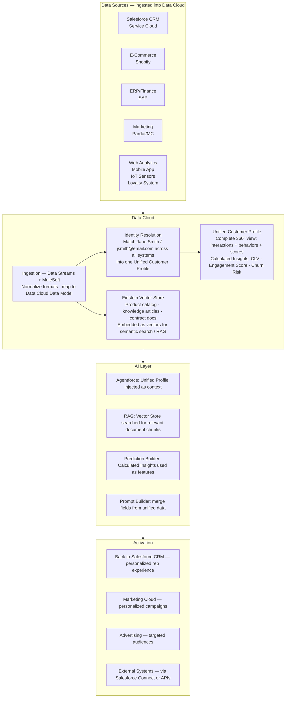

# Data Cloud: Foundation for AI

**Exam Domain:** Data for AI (17%)
**Study Priority:** HIGH — Data Cloud's role as AI grounding platform is heavily tested

---

## Core Concepts

**Data Cloud (formerly Salesforce CDP):** Salesforce's customer data platform that ingests data from multiple sources, unifies it into a single customer profile, and makes it available for AI, activation, and analytics.

**Why Data Cloud matters for AI:**
- Agentforce and generative AI features can be grounded with Data Cloud's Unified Customer Profile
- Einstein Vector Store (in Data Cloud) enables RAG-powered AI
- Calculated Insights provide computed metrics on top of unified data for AI use

**Data Cloud ≠ standard Salesforce CRM data storage.** It's a separate, purpose-built data management platform that ingests, harmonizes, and activates customer data at scale.

---

### 4 Core Data Cloud Pillars

| Pillar | What It Does | AI Relevance |
|--------|-------------|-------------|
| **Data Ingestion** | Pulls data from Salesforce CRM, external systems, files, streaming events into Data Cloud | Makes all relevant data available for AI grounding |
| **Identity Resolution** | Matches records from different sources that represent the same person (deterministic + probabilistic matching) | Ensures AI has ONE unified view of each customer, not fragmented views |
| **Unified Customer Profile** | Single 360° view of each customer, aggregating all ingested and resolved data | The "context" injected into Agentforce prompts for personalized responses |
| **Activation** | Pushes unified data back to Salesforce CRM, marketing platforms, advertising audiences, and external systems | Enables AI-driven actions to reach customers across channels |

---

### Key Data Cloud Components for AI

**Unified Customer Profile:**
- A single record representing one real customer, composed of matched data from all sources
- Includes: all CRM interactions, purchase history, service history, web behavior, marketing engagement
- Used by Agentforce as grounding context: "This customer has purchased X, had Y service issues, last engaged Z days ago"

**Calculated Insights:**
- User-defined metrics computed on top of unified profile data
- Examples: Customer Lifetime Value (CLV), average purchase frequency, engagement score, days since last purchase
- These computed values can be used in AI prompts and Prediction Builder features

**Einstein Vector Store:**
- Stores vector embeddings of documents (knowledge articles, PDFs, contracts, product info)
- Enables semantic/vector search for RAG-powered Agentforce
- When Agentforce needs to answer a product question, it searches the Vector Store for relevant document chunks

**Data Streams:**
- Connections that continuously ingest data from external sources (S3 buckets, Salesforce CRM, MuleSoft APIs, real-time event streams)
- Keeps Data Cloud data current for AI grounding

---

### Data Cloud vs. Standard Salesforce CRM

| Aspect | Standard Salesforce CRM | Data Cloud |
|--------|------------------------|------------|
| **Data scope** | CRM interactions only (Leads, Accounts, Cases, Opportunities) | Any data from any source (CRM + web + marketing + ERP + IoT) |
| **Profile model** | Object-based (one Lead, one Account record) | Unified Customer Profile (merged across systems) |
| **Volume** | Standard CRM data limits | Petabyte-scale data storage |
| **AI role** | Source of features for Einstein predictive models | Grounding context for Agentforce; Vector Store for RAG |
| **License** | Included in CRM licenses | Separate Data Cloud license required |

---

### How Data Cloud Grounds Agentforce

**Without Data Cloud grounding:**
- Agentforce can only access standard Salesforce CRM data via Actions (Flows, SOQL)
- Limited to what's stored in CRM objects

**With Data Cloud grounding:**
- Agentforce can access the full Unified Customer Profile — including data from systems not in Salesforce CRM
- Can answer questions like "What is this customer's total purchase history across all channels?" based on unified data
- Can retrieve semantically relevant documents (via Vector Store) to answer product/policy questions

---

## PTA / SA Relevance

**Data Cloud is a major architecture decision in any enterprise AI conversation:**
- "Do you have a Customer Data Platform?" → If the answer is No, Agentforce grounding is limited to CRM data only
- "How fragmented is your customer data?" → Multiple systems without a unified view = poor AI personalization outcomes
- "What's your real-time data requirement?" → Data Cloud supports near-real-time streaming; batch integrations lag hours

**Common customer scenarios:**
1. **Retailer with e-commerce + Salesforce Service Cloud:** Customer calls service about an online order. Service rep (or Agentforce agent) has no visibility into e-commerce order history stored in Shopify. → Data Cloud ingests Shopify data, unifies the profile → agent can see full order history in context.

2. **Financial services with multiple product lines:** Customer has checking, savings, mortgage, and investment accounts across 4 systems. → Data Cloud unifies them → Agentforce has complete financial relationship context for every interaction.

3. **Global retailer with loyalty program:** 50M customer profiles with loyalty data in one system, purchase history in another, preferences in another. → Data Cloud unified profiles → AI personalization at scale.

**Architecture decision: Data Cloud vs. MuleSoft for data unification:**
- Data Cloud: purpose-built for customer 360° profiles; better for AI grounding; includes identity resolution
- MuleSoft: better for real-time transactional data integration; API mesh patterns; not designed as a profile store
- Often used together: MuleSoft for real-time system integrations → feeds into Data Cloud for profile unification and AI

**CTO framing:**
- "Data Cloud is the memory layer for AI. Without it, every AI interaction starts from zero — the agent knows only what's in a single CRM record. With Data Cloud, every interaction starts with complete customer context — everything they've ever done across every touchpoint."
- Position investment in Data Cloud as an AI infrastructure investment, not just a CRM add-on.

---

## Data Cloud Architecture (Enterprise Scale)

**Limitations:**
- Data Cloud requires a separate license — not included with standard Salesforce CRM licenses
- Identity resolution is not perfect — probabilistic matching can create false positives (merging records for different people) or false negatives (missing matches)
- Data ingestion latency: near-real-time streaming is possible but most ingestion jobs run on schedules (15 min - daily), meaning profiles may lag actual events
- Einstein Vector Store has indexing latency: new documents take time to be processed, embedded, and available for retrieval (minutes to hours)
- Unified profiles are only as complete as the data ingested — if key data sources aren't connected, the "360° view" has gaps
- At petabyte scale: Data Cloud queries and profile retrievals add latency compared to standard CRM object queries

---

## Key Facts to Memorize

- **Data Cloud = Customer Data Platform** — unifies data from multiple sources
- **4 pillars**: Data Ingestion, Identity Resolution, Unified Customer Profile, Activation
- **Unified Customer Profile** = single 360° customer view aggregated from all sources
- **Identity Resolution** = matches records across systems to one unified person
- **Calculated Insights** = computed metrics on top of unified data (CLV, engagement score)
- **Einstein Vector Store** = where vector embeddings live for RAG in Data Cloud
- Data Cloud requires **separate license** — not included in CRM
- With Data Cloud grounding: Agentforce has full customer context across all channels
- Without Data Cloud: Agentforce limited to standard CRM object data

---

## Exam Traps

**Trap 1:** "Data Cloud replaces Salesforce CRM." WRONG. Data Cloud works alongside CRM — it ingests CRM data and provides enriched unified profiles back to it. They're complementary, not competitive.

**Trap 2:** "Identity Resolution automatically merges duplicate Salesforce Account records." WRONG. Identity Resolution creates a Unified Customer Profile in Data Cloud by matching records from different systems. It doesn't modify or merge Salesforce CRM records.

**Trap 3:** "Data Cloud grounding requires retraining the LLM." WRONG. Data Cloud grounding uses RAG — retrieving context from unified profiles and Vector Store and injecting into prompts. No model retraining.

**Trap 4:** "Calculated Insights are the same as formula fields." WRONG. Formula fields are computed on individual records. Calculated Insights are computed metrics across the unified profile (aggregating data from multiple source systems) — much more powerful for AI features.

---

## Practice Questions

**Q1: A large retailer wants their Agentforce Service Agent to access a customer's complete purchase history from Salesforce Commerce Cloud, their service history from Service Cloud, and their loyalty program data from an external system — all in one interaction. What is the foundational data architecture requirement?**

A) The retailer must build custom Apex connectors for each system
B) Data Cloud with Identity Resolution and Unified Customer Profile — so all three data sources are unified and available for Agentforce grounding
C) Agentforce can access all these systems natively via standard CRM Actions
D) A MuleSoft real-time integration that routes data to Agentforce on demand

**Answer: B** — Data Cloud with Identity Resolution creates a Unified Customer Profile that aggregates data from multiple source systems. Agentforce can then be grounded with this unified profile, giving it complete customer context in a single interaction. Custom Apex connectors and MuleSoft alone don't provide the unified, AI-ready profile Data Cloud offers.

---

**Q2: What is the purpose of Einstein Vector Store in Data Cloud?**

A) It stores encrypted PII for the Trust Layer's Data Masking component
B) It stores vector embeddings of documents and knowledge articles that Agentforce can search semantically for RAG-based grounding
C) It computes Calculated Insights for unified customer profiles
D) It provides real-time streaming data ingestion from external systems

**Answer: B** — Einstein Vector Store holds the vector embeddings of documents (product info, knowledge articles, policies, contracts). When Agentforce needs to answer a question, it searches the Vector Store semantically and retrieves the most relevant document chunks to inject into the prompt. This is the RAG mechanism within Salesforce.

---

**Q3: Identity Resolution in Data Cloud matches records from multiple source systems that represent the same individual into a Unified Customer Profile. What is the primary benefit of this for AI?**

A) It reduces the number of Salesforce licenses required
B) It ensures AI interactions are based on a complete, accurate customer view rather than fragmented data from individual systems
C) It automatically corrects data quality issues in the source systems
D) It encrypts customer data for GDPR compliance

**Answer: B** — Identity Resolution's value for AI is eliminating data fragmentation. When Agentforce grounds its responses in a Unified Customer Profile, it has complete context (all purchases, all service interactions, all preferences) rather than seeing only the data in one system. This is what enables truly personalized AI interactions.
