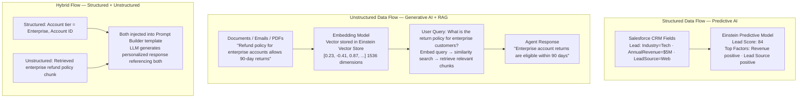

# Structured vs. Unstructured Data

**Exam Domain:** Data for AI (17%)
**Study Priority:** HIGH — the exam tests which AI type works with which data type, and how unstructured data enables generative AI

---

## Core Concepts

### Data Type Taxonomy

| Type | Definition | Examples | % of Enterprise Data |
|------|-----------|---------|---------------------|
| **Structured** | Organized in predefined rows/columns; machine-readable | CRM fields (Account Name, Annual Revenue, Case Priority), database tables, spreadsheets | ~20% |
| **Unstructured** | No predefined format; human-readable but not easily machine-parseable | Emails, PDFs, call recordings, images, videos, chat logs, contracts | ~80-90% |
| **Semi-structured** | Has some organization (metadata, tags) but not rigid row/column format | JSON, XML, CSV with irregular fields, HTML | Subset of the above |

**The 80/20 insight:** 80-90% of enterprise data is unstructured — emails, documents, call recordings, chat transcripts. Traditional databases and BI tools couldn't use this data. **LLMs can.** This is why generative AI unlocks massive untapped business value.

---

### Structured Data and AI

**Primary use: Predictive AI**
- Structured fields are the features predictive ML models use
- Examples: Lead Scoring uses Industry, Annual Revenue, Lead Source (all structured fields)
- Data must be clean, complete, consistent (the 6 quality dimensions apply most critically here)

**Generative AI can also use structured data** — but as grounding context via merge fields, not for model training.

---

### Unstructured Data and AI

**Primary use: Generative AI (LLMs)**
- LLMs are trained on text — they natively process and generate unstructured data
- This is the major capability jump: AI can now read, summarize, analyze, and generate human-readable content

**Salesforce use cases with unstructured data:**
- **Email summarization**: LLM reads a customer email thread (unstructured) → generates a case summary
- **Contract analysis**: LLM reads a PDF contract (unstructured) → extracts key terms
- **Call transcript analysis**: LLM reads a call transcript (unstructured) → generates talking points
- **Knowledge article search**: semantic search on article content (unstructured) → finds most relevant articles for a case

---

### Vector Embeddings — Making Unstructured Data Searchable

**The problem:** Traditional databases can't search for meaning — only exact keywords.

**The solution:** Vector embeddings convert text to numerical vectors that capture semantic meaning.

**How it works:**
1. Document (unstructured text) → embedding model → vector (list of numbers, e.g., 1536-dimensional array)
2. Vectors stored in Einstein Vector Store (Data Cloud)
3. User query → embedding model → query vector
4. Vector similarity search: find documents with vectors mathematically closest to query vector
5. Most similar documents retrieved → injected into LLM prompt for RAG

**Semantic search vs. keyword search:**
- Keyword: "refund policy" finds only documents containing those exact words
- Semantic: "refund policy" finds documents about "return procedures," "money-back guarantees," "cancellation terms" — because they're semantically related

---

### Structured vs. Unstructured AI Use Cases in Salesforce

| Use Case | Data Type | AI Feature | Type of AI |
|---------|----------|-----------|-----------|
| Predict which leads will convert | Structured (CRM fields) | Einstein Lead Scoring | Predictive |
| Score churn risk on accounts | Structured (CRM fields) | Prediction Builder | Predictive |
| Summarize a case thread | Unstructured (emails, notes) | Prompt Builder / Case Summarization | Generative |
| Search knowledge articles for case | Unstructured (article text) | Einstein Vector Store + RAG | Generative (RAG) |
| Draft a personalized email | Structured (CRM) + Unstructured (generated) | Prompt Builder | Generative |
| Answer questions from a product manual | Unstructured (PDF text) | Agentforce + Vector Store | Generative (RAG) |
| Cluster customers by behavior | Semi-structured/Structured (event data) | Data Cloud Calculated Insights | Unsupervised |

---

## PTA / SA Relevance

**The "80% of enterprise data is unstructured" stat is a powerful conversation opener with CTOs:**
- "Your CRM stores 20% of your customer data — the structured interactions. But the real insight is in the other 80%: the emails your reps send, the call recordings, the support transcripts, the contracts, the proposals. Einstein and Agentforce can now work with all of that."

**Architecture patterns for unstructured data in Salesforce:**
1. **Email/CRM data**: standard Salesforce data natively available for Prompt Builder merge fields
2. **Knowledge articles**: can be ingested directly into Data Cloud Vector Store for semantic search
3. **External documents** (PDFs, SharePoint): require ingestion into Data Cloud via Data Streams or Einstein Files Connect → then embedded in Vector Store
4. **Call recordings**: require transcription first (Einstein Conversation Intelligence or third-party) → transcript stored as text → then usable for Prompt Builder or Vector Store

**Common customer question:** "Can Agentforce search through our SharePoint files to answer customer questions?"
- YES — but requires Data Cloud Vector Store setup: ingest SharePoint content into Data Cloud → embed as vectors → Agentforce uses RAG to retrieve relevant chunks

**Implementation complexity gradient:**
- Simplest: Prompt Builder with standard CRM fields (all structured, no additional setup)
- Medium: RAG with Salesforce Knowledge Articles (Knowledge → Data Cloud ingest → Vector Store)
- Complex: RAG with external document repositories (file ingestion pipeline + chunking strategy + Vector Store)

**Enterprise scale considerations:**
- Large document libraries (10K+ PDFs) require significant Vector Store indexing time and ongoing re-indexing as content changes
- Chunking strategy is critical: chunk too large → irrelevant content retrieved; chunk too small → context lost
- Multi-language documents: embedding models perform better on English; non-English documents may require language-specific embedding models for best retrieval quality

---

## Structured vs. Unstructured Architecture

**Limitations:**
- Embedding quality degrades with very technical, specialized, or non-English content — standard embedding models trained mostly on English general-purpose text may miss domain-specific nuances
- Vector search is probabilistic, not deterministic — it may not always retrieve the most relevant chunk, especially with ambiguous queries
- Document freshness: Vector Store indexes documents at ingest time; updated documents must be re-ingested and re-embedded to reflect changes
- Token cost for unstructured data: Documents are often large; chunking and retrieving multiple large chunks increases total token consumption per Agentforce interaction

---

## Key Facts to Memorize

- **Structured** = organized rows/columns (CRM fields) → used primarily for **predictive AI**
- **Unstructured** = free-form text, images, audio (80-90% of enterprise data) → used primarily for **generative AI**
- **Semi-structured** = JSON, XML, CSV
- **LLMs natively process unstructured text** — this is the capability breakthrough
- **Vector embeddings** = text → numbers preserving semantic meaning
- **Einstein Vector Store** (in Data Cloud) stores embeddings for RAG
- **Semantic search** = vector search finds meaning, not just keywords
- Structured + Unstructured can be combined in Prompt Builder (merge fields + Data Cloud retrieval)

---

## Exam Traps

**Trap 1:** "Predictive AI works best with unstructured data." WRONG. Predictive AI (Lead Scoring, Prediction Builder) works primarily with structured CRM data. LLMs/Generative AI are designed for unstructured data.

**Trap 2:** "Vector embeddings are encryption." WRONG. Embeddings are numerical representations that capture semantic meaning for similarity search. They are not a security mechanism.

**Trap 3:** "Semantic search requires the exact keywords to find relevant results." WRONG. That's keyword search. Semantic search finds conceptually similar content even without exact keyword matches.

**Trap 4:** "All enterprise data is structured." WRONG. 80-90% of enterprise data is unstructured (emails, documents, recordings). Traditional AI (predictive) couldn't use it; generative AI (LLMs) can.

---

## Practice Questions

**Q1: A company wants to build an Agentforce agent that can answer customer questions about their return policy, which is documented in a 30-page PDF. What is the recommended technical approach?**

A) Include the full 30-page PDF text in every Prompt Builder template
B) Train an LLM specifically on the return policy document
C) Ingest the PDF into Data Cloud, chunk and embed it in Einstein Vector Store, and use RAG to retrieve relevant policy sections per customer query
D) Convert the PDF to structured fields in Salesforce CRM

**Answer: C** — RAG with Data Cloud Vector Store is the appropriate approach for document-based Q&A. Including the full document in every prompt wastes tokens and may exceed context limits. Training a specific LLM is expensive and creates staleness issues. Converting to CRM fields loses the natural language context.

---

**Q2: Which of the following is an example of unstructured data that can be leveraged by Einstein generative AI features?**

A) Account.AnnualRevenue = $5,000,000
B) Lead.Industry = "Technology"
C) A customer service email: "I've been waiting 3 weeks for my refund and I'm extremely frustrated"
D) Case.Priority = "High"

**Answer: C** — The customer service email is unstructured data — free-form text with no predefined field structure. Einstein generative AI (LLMs) can read, analyze, and summarize this. Options A, B, and D are all structured CRM field values.

---

**Q3: How does semantic search differ from traditional keyword-based search when used for AI grounding?**

A) Semantic search is faster but less accurate than keyword search
B) Semantic search finds documents based on mathematical similarity of meaning; keyword search only finds documents containing the exact query words
C) Semantic search requires more structured data than keyword search
D) Semantic search and keyword search produce identical results for most queries

**Answer: B** — Semantic search converts queries and documents to vectors (embeddings) and finds the most mathematically similar vectors. This allows it to retrieve relevant content even when exact words don't match. Keyword search only retrieves documents containing the exact terms. For generative AI grounding, semantic search is significantly more effective for natural language queries.
