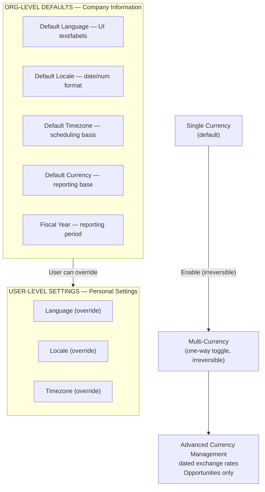

# Company Information & Settings

## Exam Domain
Configuration & Setup — 20% of exam

## Core Concepts

Company Information is the master configuration record for your Salesforce org. It controls defaults that affect every user — locale, language, timezone, currencies, and your org's identity. The exam tests this mostly through "where do you go to find/change X?" scenarios.

**Locale settings (the three you need to know):**
- **Default Language:** The language for all labels, field names, and UI text. Users can override this in their personal settings.
- **Default Locale:** Controls date/number/currency formats (e.g., MM/DD/YYYY vs DD/MM/YYYY). Per user overrideable.
- **Default Timezone:** Used for time-based workflow/flow triggers and for users who haven't set their own timezone. Critical for scheduled automations.

**Currencies:**
- Single-currency orgs: one currency, set in Company Information
- Multi-currency orgs: enabled once (irreversible), allows multiple currencies with dated exchange rates
- **Advanced Currency Management (ACM):** Dated exchange rates for Opportunities — historical rates are preserved instead of converting at current rate

**My Domain:**
- Custom subdomain for your Salesforce URL: `yourcompany.my.salesforce.com`
- **Required for:** Lightning Experience components, SSO (OAuth), certain AppExchange packages, Visualforce page routing
- Once deployed to users, you cannot undo My Domain
- Steps: Register → Wait for provisioning → Test → Deploy to users

## PTA / SA Relevance

Multi-currency and ACM come up in every global enterprise deal. The key architectural decision: if a customer has opportunities in multiple currencies and wants accurate historical reporting (revenue recognized at the exchange rate when the deal closed, not today's rate), they need ACM. Without ACM, all currency-denominated fields reconvert at today's rate — this makes historical pipeline analysis inaccurate.

**For integration architecture:** My Domain is a hard dependency for modern Salesforce integrations. Any SSO setup, any Lightning component in Experience Cloud, any external system using OAuth — all require My Domain. If a customer is still on the legacy login URL, flag this in every architecture review.

## Architecture / How It Works

**Limitations:**
- Multi-currency enablement is **irreversible** — you cannot turn it off once enabled
- ACM only applies to Opportunities and related objects — not all objects support dated exchange rates
- My Domain registration takes time (usually minutes to hours) before it can be deployed
- Changing the Default Timezone does NOT retroactively adjust stored datetime values — only affects future scheduling

## Key Facts to Memorize

- **Company Information** is at: Setup → Company Settings → Company Information
- Org ID is found in Company Information — unique identifier for your org
- Default Locale ≠ Default Language: Locale = formats, Language = UI labels
- Multi-currency = irreversible once enabled
- ACM = dated exchange rates, only for Opportunities
- My Domain = required for Lightning components, SSO, certain AppExchange packages
- Standard fiscal year: Jan–Dec; Custom fiscal year: any 12-month period (configured separately)
- "Storage Used" in Company Information shows data and file storage consumption

## Exam Traps

- **"You can disable multi-currency after enabling it"** — FALSE. It's a one-way door.
- **"My Domain is optional for Lightning Experience"** — FALSE. Required for Lightning web components, SSO, and certain AppExchange packages.
- **"Default Timezone affects all users regardless of their personal settings"** — FALSE. Users can override timezone in their personal settings.
- **"ACM applies to all currency fields in the org"** — FALSE. ACM is specific to Opportunities (and related objects) — not a global org-wide setting for all objects.
- **"Changing Default Locale changes the language of UI labels"** — FALSE. Locale affects formats (dates, numbers). Language changes UI labels.

## Practice Questions

**Q:** An admin needs to ensure that opportunities display exchange rates as of the date the opportunity was created, not today's exchange rate. What feature do they need?
**A:** Advanced Currency Management (ACM) with dated exchange rates. Requires multi-currency to be enabled first.

**Q:** A company is implementing SSO with an external identity provider. The admin notices that the OAuth configuration requires a specific Salesforce URL format. What prerequisite is needed?
**A:** My Domain must be registered and deployed to users.

**Q:** Where does an administrator find the Salesforce Organization ID?
**A:** Setup → Company Settings → Company Information.

**Q:** A company operates globally and needs dates to display in DD/MM/YYYY format for UK users but MM/DD/YYYY for US users. How is this configured?
**A:** Users set their own Default Locale in Personal Settings. The org-level Default Locale sets the baseline, but each user can override it.
