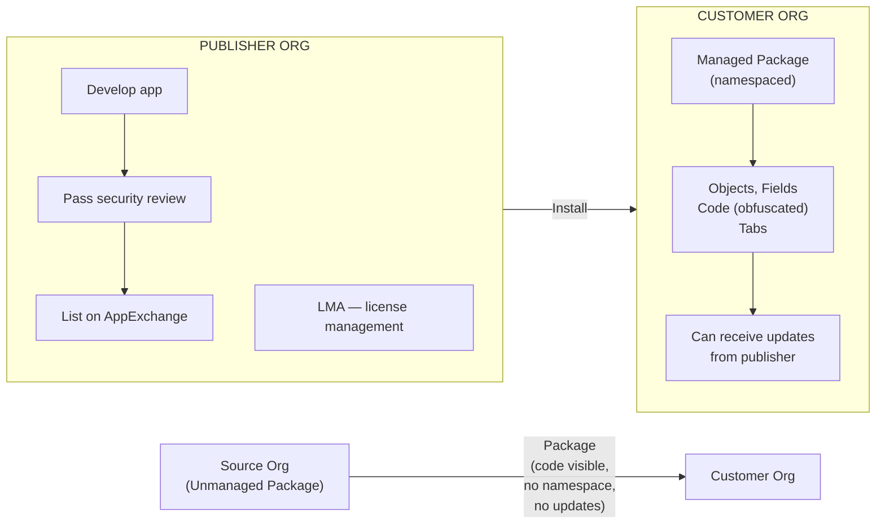

# AppExchange

## Exam Domain
Configuration & Setup — 20% of exam

## Core Concepts

AppExchange is Salesforce's marketplace for pre-built apps, components, flows, and solutions built by Salesforce partners. Think of it as the App Store for Salesforce. The exam tests the mechanics of installing packages and the difference between managed and unmanaged packages.

**Two package types:**

| | Managed Package | Unmanaged Package |
|---|---|---|
| Code visible? | No (obfuscated) | Yes (open source) |
| Upgradeable? | Yes (publisher can push updates) | No (you own the code) |
| Installed namespace? | Yes (e.g., `mypkg__FieldName__c`) | No namespace |
| Locked fields? | Yes (can't edit managed components) | No (fully customizable) |
| Who uses it? | ISV commercial apps | Templates, samples, free tools |

**Lightning Managed App (LMA):** The tool ISVs use to manage licenses for their managed packages. LMA lives in the publisher's org, not the customer's. As a customer admin, you don't interact with LMA directly.

**Installation flow:**
1. Find app on AppExchange
2. Log into the target org from AppExchange (choose Production or Sandbox)
3. Select install for: Admins Only / All Users / Specific Profiles
4. Configure security access (profile permissions for installed objects/tabs)
5. After install: configure the app per instructions

**Security review:** All AppExchange apps go through Salesforce security review before listing. This doesn't mean they're perfectly safe for your org's data — you still need to review what data they access.

## PTA / SA Relevance

AppExchange decisions come up in every implementation. The key architectural questions:

1. **Build vs Buy:** Can we get 80% of the functionality from an AppExchange app and customize the remaining 20%? Or is the business logic so custom that we'd spend more time bending the ISV product than building it ourselves?

2. **Managed package risks:** Managed packages add dependencies to your org. Upgrades can break your customizations if you've built logic against the package's API. Uninstalling a managed package that has data associated with it requires a data migration plan.

3. **Namespace pollution:** Managed packages introduce namespaced fields (e.g., `mypkg__Custom_Field__c`). This affects every report, flow, and integration that references those fields. In complex orgs with multiple installed packages, namespace management becomes an architecture concern.

4. **Security and data access:** When you install an AppExchange app, you're granting that code access to your org. Always review: what objects does it query? Does it send data to external endpoints? This is especially important for financial services or healthcare customers with compliance requirements.

## Architecture / How It Works

**Limitations:**
- Managed package components cannot be modified — if you need to change logic, you're dependent on the ISV
- Uninstalling a managed package does not automatically delete its data — the objects/fields may remain as unused metadata
- Security review by Salesforce does not guarantee the app is safe for all compliance frameworks (HIPAA, PCI, etc.)
- Some AppExchange items require specific Salesforce editions — always check compatibility

## Key Facts to Memorize

- Managed packages: namespaced, obfuscated code, upgradeable, used by commercial ISVs
- Unmanaged packages: open code, no namespace, no upgrades, used for samples/templates
- AppExchange = Salesforce's marketplace; all listings pass Salesforce security review
- LMA (Lightning Managed App) = publisher's tool for license management; customers don't see it
- Install options: Admins Only, All Users, Specific Profiles
- Can install to Production or Sandbox (best practice: Sandbox first)
- Managed package fields use namespace prefix: `namespace__FieldName__c`

## Exam Traps

- **"Unmanaged packages can be updated by the publisher"** — FALSE. Only managed packages receive publisher updates.
- **"Installing an AppExchange app automatically grants all users access"** — FALSE. You choose: Admins Only, All Users, or Specific Profiles.
- **"All AppExchange apps are free"** — FALSE. Many are commercial apps with license fees.
- **"LMA is installed in the customer's org to manage licenses"** — FALSE. LMA lives in the publisher's/ISV's org.
- **"You should install AppExchange packages in Production first"** — FALSE. Best practice is to test in Sandbox first.

## Practice Questions

**Q:** A company wants to install an AppExchange CRM analytics app. They want to test it before going live. What is the recommended approach?
**A:** Install the package in a Sandbox first. Test configuration, permissions, and functionality. Then install in Production.

**Q:** What is the difference between a managed and unmanaged package?
**A:** Managed packages have obfuscated (non-editable) code, a namespace prefix, and can receive updates from the publisher. Unmanaged packages have visible, editable code, no namespace, and cannot be updated by the original author.

**Q:** An admin installed an AppExchange package but regular sales reps can't see the new tabs. What installation option was likely selected?
**A:** "Admins Only" was selected during installation. The admin needs to grant access to the appropriate profiles or change the installation to "All Users" or "Specific Profiles."

**Q:** A field installed from an AppExchange managed package appears as `acme__Revenue_Score__c`. What does `acme__` indicate?
**A:** It's the namespace prefix of the managed package, assigned by the publisher (Acme). All components in a managed package share this prefix.
