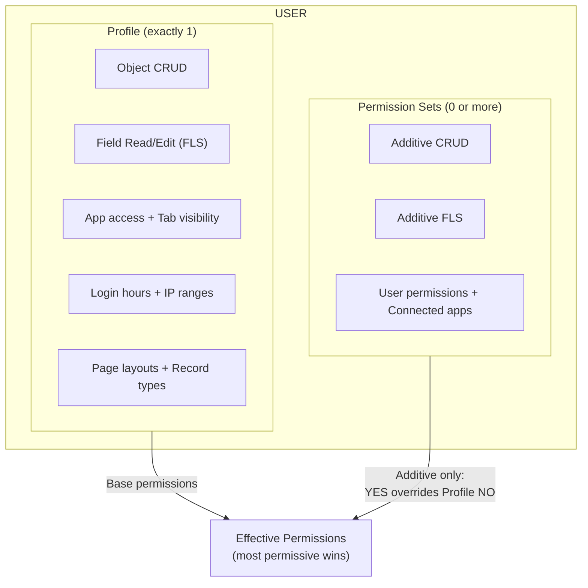

# Profiles & Permission Sets

## Exam Domain
Configuration & Setup — 20% of exam

## Core Concepts

Profiles and Permission Sets are the two mechanisms for controlling what users CAN DO (not what they can see — that's the sharing model). They control object-level security (CRUD) and field-level security (FLS).

**Profile — the baseline:**
- Every user gets exactly ONE profile
- Profile controls: Object CRUD, Field Read/Edit, App access, Tab visibility, Login hours, Login IP ranges, Page layouts, Record types
- Think of profile as the "job description" — it defines the base permissions for a role type (Sales Rep, Support Agent, Admin)
- Standard profiles: System Administrator, Standard User, Read Only, Solution Manager, Marketing User, Contract Manager, Chatter Free User

**Permission Sets — additive only:**
- A user can have ZERO or MANY permission sets
- Permission Sets can only ADD permissions (never remove)
- They override the profile's "no" with a "yes" — never the other way
- Use case: a standard sales rep needs temporary access to one extra object, or a subset of reps needs a special feature
- **Permission Set Groups:** Bundle multiple Permission Sets together for easier assignment (newer feature, but on the exam)

**What profiles control that Permission Sets do NOT:**
- Login hours (what times the user can log in)
- Login IP ranges (what IP addresses can be used)
- Page layouts (which layout a user sees for a record)
- Record type availability (defaults and access)

**What Permission Sets can do:**
- Grant object CRUD (in addition to profile)
- Grant field read/edit (in addition to profile)
- Assign connected apps
- Grant user permissions (like "Manage Leads")

## PTA / SA Relevance

The Salesforce roadmap (announced 2022–2023) is moving toward a world where Profiles are deprecated as a permissions mechanism. The future state: every user gets the "Minimum Access" profile (essentially no permissions), and ALL permissions are delivered through Permission Set Groups. This is a significant architectural shift.

**Current state for exam:** Profiles still do what they always did. But in architecture conversations with customers, you should be recommending Permission Set-centric designs now, not profile-heavy designs.

**For enterprise customers:** Profile proliferation is a real maintenance problem. Customers with 50+ custom profiles typically have them because someone cloned a profile and tweaked it once — now there are 50 slightly-different profiles that are impossible to audit. The Permission Set model is more maintainable: you have a few base profiles, and permissions are composable through Permission Sets.

**FLS matters in integrations:** When an API integration uses a specific user's credentials (integration user), that user's profile/permission set FLS controls what fields the API can read or write. A common integration bug is "field X is not populated in the API response" when the real cause is FLS on the integration user.

## Architecture / How It Works

**FLS additive rule:** If Profile says READ = No but a Permission Set says READ = Yes, the user CAN read the field. Permission Sets can only add permissions, never remove them.

**Object-Level Security (OLS) — CRUD:**
- **C** = Create new records
- **R** = Read/view records (if sharing also allows)
- **U** = Edit (Update) existing records
- **D** = Delete records

**Limitations:**
- Permission Sets cannot REMOVE permissions granted by a profile — additive only
- Login hours and IP ranges are profile-only — no Permission Set equivalent
- Page layout assignments are profile+record type only (cannot use Permission Sets for this)
- Permission Set Groups require a license — check edition compatibility
- Changing a profile change affects ALL users on that profile simultaneously — risky at scale

## Key Facts to Memorize

- Profile = required, exactly 1 per user, can grant AND restrict
- Permission Sets = optional, any number, additive only (can only grant, not restrict)
- FLS wins: if profile says No, a Permission Set can override to Yes
- The reverse is FALSE: a Permission Set cannot take away what a profile grants
- Login hours and Login IP ranges = Profile only (not in Permission Sets)
- Permission Set Groups = bundle multiple Permission Sets for easier management
- "Minimum Access" profile = essentially empty profile; pure Permission Set design
- OLS = object-level (CRUD per object); FLS = field-level (read/edit per field)

## Exam Traps

- **"A user can have multiple profiles"** — FALSE. Exactly one.
- **"Permission Sets can restrict access"** — FALSE. Additive only.
- **"You can set login hours in a Permission Set"** — FALSE. Login hours are Profile-only.
- **"If a profile gives Read on a field, a Permission Set can remove it"** — FALSE. Permission Sets can only add.
- **"Profiles and Permission Sets both control page layouts"** — FALSE. Only Profiles (combined with Record Types) control page layout assignments.
- **"Deleting a profile deletes its users"** — FALSE. You cannot delete a profile that has active users assigned.

## Practice Questions

**Q:** A sales rep has a profile that does not give access to the custom object `Project__c`. The admin needs to grant this rep access to `Project__c` without changing their profile (which is shared with 200 other reps). What is the solution?
**A:** Create a Permission Set that grants CRUD on `Project__c` and assign it to the specific rep.

**Q:** An admin needs to prevent a specific group of users from logging in on weekends. What tool should they use?
**A:** Profile → Login Hours. Set the allowed login hours to exclude weekends. Permission Sets cannot control login hours.

**Q:** A user's profile grants Read access to the `Annual_Revenue__c` field. A Permission Set assigned to the user says No access. Can the user read the field?
**A:** Yes. Permission Sets are additive — they cannot remove a permission already granted by the profile. The profile's Read access stands.

**Q:** What is the maximum number of Permission Sets you can assign to a single user?
**A:** There is no fixed limit stated — the exam treats it as "multiple" or "zero or more." The practical limit is based on license type, but for the exam: a user can have many Permission Sets.
