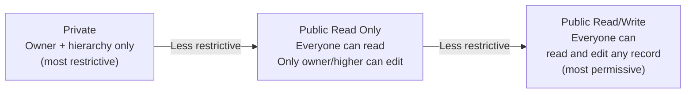
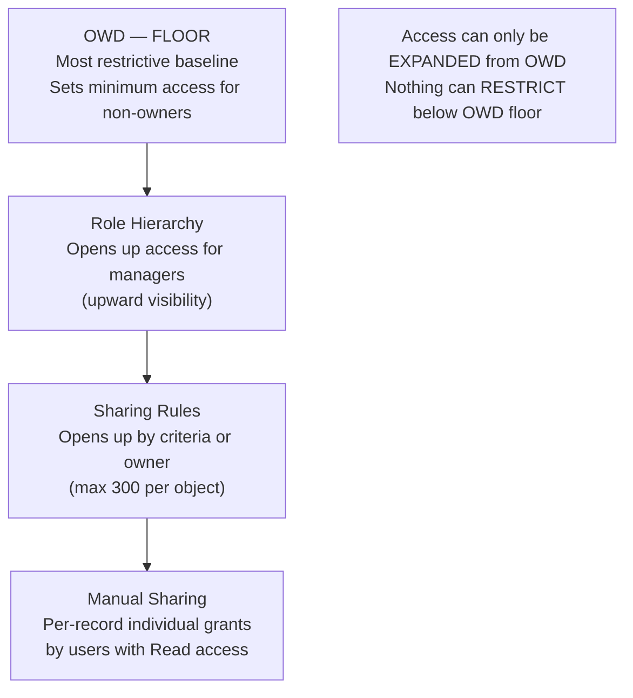

# Org-Wide Defaults (OWD)

## Exam Domain
Configuration & Setup — 20% of exam

## Core Concepts

Org-Wide Defaults set the FLOOR for record access — the most restrictive baseline for who can see and edit records they don't own. Everything in the sharing model builds on top of OWD.

The key mental model: OWD answers "If you have no special access, what can you see?" The role hierarchy, sharing rules, and manual sharing can only open access UP from this floor — they can never restrict below it.

**The four OWD settings:**

| Setting | Can Read? | Can Edit? | Use Case |
|---|---|---|---|
| Private | No | No | Sensitive data (HR records, finance) |
| Public Read Only | Yes | No | Reference data (products, price books) |
| Public Read/Write | Yes | Yes | Collaborative data (activities, cases) |
| Controlled by Parent | Based on parent | Based on parent | Detail records in M-D relationships |

**"Controlled by Parent"** — only available for objects in a Master-Detail or Lookup relationship. The child record's visibility follows the parent record's visibility.

**OWD is set per object.** Each object has its own OWD. Accounts might be Private, Contacts might be Public Read Only, Custom Object might be Public Read/Write.

**Grant Access Using Hierarchies checkbox:** When enabled (default), role hierarchy automatically extends OWD access. When DISABLED, role hierarchy does NOT apply to that object — only sharing rules and manual sharing can open access. This is an advanced setting for objects where you explicitly don't want managers to see subordinates' records.

**External vs Internal OWD:** Since Spring 2013, OWD has separate settings for internal users and external users (Experience Cloud / Community users). You can set Account to Public Read/Write for internal and Private for external.

## PTA / SA Relevance

OWD is the single most consequential security decision in a Salesforce implementation. Getting it wrong is expensive to fix:

**Too permissive OWD:** Setting everything to Public Read/Write means anyone can read and edit any record. Fine for small teams, catastrophic for enterprises with GDPR/HIPAA compliance requirements. Easy to open, hard to close — tightening OWD on a live org triggers recalculation of all sharing rules and can cause performance issues.

**Too restrictive OWD:** Setting everything to Private with a flat role hierarchy means users can't collaborate. Every shared-visibility use case needs a sharing rule, and you hit the 300-rule limit quickly.

**The right architecture:** Start with the most restrictive OWD that makes business sense, then use role hierarchy and sharing rules to open up what's needed. This is the "least privilege" principle applied to Salesforce.

**OWD recalculation:** When you change OWD, Salesforce runs a sharing recalculation job. On large orgs (millions of records), this can take hours. Always change OWD during off-peak hours with appropriate change management.

## Architecture / How It Works

**External vs Internal OWD** — set separately for internal users and Experience Cloud/Community users:

| Object | Internal OWD | External OWD |
|---|---|---|
| Account | Public Read/Write | Private |
| Opportunity | Private | Private |

**Limitations:**
- OWD can only be loosened by Role Hierarchy, Sharing Rules, or Manual Sharing — never tightened by them
- "Controlled by Parent" requires an active relationship (M-D or Lookup) to a parent object
- Changing OWD triggers sharing recalculation — can be slow on large orgs
- Grant Access Using Hierarchies cannot be disabled on standard objects — only custom objects
- Once you disable hierarchy access for an object, re-enabling it requires another recalculation

## Key Facts to Memorize

- OWD = the FLOOR of record access (minimum access anyone has)
- 4 settings: Private, Public Read Only, Public Read/Write, Controlled by Parent
- "Controlled by Parent" = child inherits parent's access level
- OWD is per-object — each object has its own setting
- Role Hierarchy, Sharing Rules, Manual Sharing can only OPEN access, never restrict
- External OWD (for Community/Experience users) is set separately from Internal OWD
- "Grant Access Using Hierarchies" checkbox controls whether role hierarchy applies to an object

## Exam Traps

- **"OWD controls what users can do on records"** — HALF TRUE. OWD controls READ and EDIT access for non-owners. But CRUD permission also requires the right Profile/OLS.
- **"Sharing Rules can restrict access below OWD"** — FALSE. Sharing Rules and all other mechanisms can only extend access, never restrict.
- **"Private OWD means no one can see other users' records"** — FALSE. Users in higher roles and sharing rule beneficiaries can still access records.
- **"Controlled by Parent only applies to Master-Detail relationships"** — FALSE. It also applies to Lookup relationships.
- **"You can set OWD differently for internal vs external users"** — TRUE (since Spring 2013 — external OWD is supported).

## Practice Questions

**Q:** A company sets Account OWD to Private. A sales rep in Dallas can't see any accounts owned by a rep in New York, even though their Regional Manager should oversee both regions. The role hierarchy is correctly configured with the Regional Manager above both reps. Why might this still fail?
**A:** The "Grant Access Using Hierarchies" option may be unchecked for the Account object, disabling role hierarchy sharing. Or the reps are not properly placed under the Regional Manager in the hierarchy.

**Q:** What OWD setting allows all users to read each other's Opportunity records but only owners (and managers) can edit them?
**A:** Public Read Only.

**Q:** An admin sets Case OWD to Private. A support agent can't see cases assigned to their teammates. What is the MINIMUM change to allow teammates to read each other's cases without giving edit access?
**A:** Change Case OWD to Public Read Only. Or create Sharing Rules to open read access for the support team.

**Q:** A child record on a custom object has OWD set to "Controlled by Parent." A user has access to the parent Account. Can they see the child record?
**A:** Yes. "Controlled by Parent" means the child record's visibility follows the parent's visibility. If they can see the parent, they can see the child.
