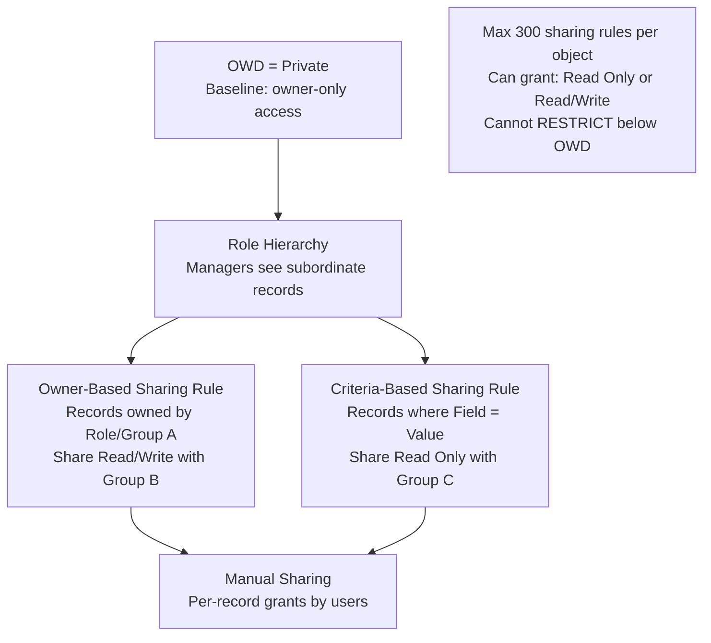

# Sharing Rules

## Exam Domain
Configuration & Setup — 20% of exam

## Core Concepts

Sharing Rules extend record access beyond what OWD and role hierarchy provide. They're automated, criteria-based grants — "if this condition, then grant this group access." Sharing Rules make exceptions to the Private OWD floor at scale.

**Two types of Sharing Rules:**

| Type | Based On | Example |
|---|---|---|
| Owner-Based | Who owns the record | "All records owned by Sales Team role → share with Support Team role" |
| Criteria-Based | Field values on the record | "All Opportunities where Stage = 'Closed Won' → share with Finance role" |

**What Sharing Rules can grant:**
- **Read Only** — the group can view but not edit
- **Read/Write** — the group can view and edit

**Who you can share WITH:**
- Public groups
- Roles
- Roles and subordinates
- Territories
- Individual users (that's Manual Sharing, not Sharing Rules)

**Limits:** Maximum 300 sharing rules per object.

**Public Groups:** Named collections of users, roles, roles+subordinates, or other groups. Used in Sharing Rules to share with a logical "set" of people instead of managing individual users.

## PTA / SA Relevance

Sharing rules are the workhorse of the Salesforce sharing model for exceptions. But they have scaling limits and performance implications:

**The 300-rule limit is real:** Orgs with complex visibility requirements (e.g., a financial services firm where each advisor can see their clients plus cross-sell prospects) can hit 300 rules per object. When you get near this limit, you need to consider:
1. Programmatic sharing (Apex-managed sharing) for record-by-record grants
2. Territory Management for account-based sharing
3. Reconsidering whether OWD is too restrictive

**Criteria-based sharing is powerful but slow to recalculate:** Every time a record's fields change in a way that might affect criteria, the sharing engine re-evaluates. On objects with millions of records and many criteria-based rules, this creates governor limit and performance issues.

**Public Groups are underused:** Many customers manage sharing rules by role, but Public Groups are more flexible and easier to maintain. A "Public Group" called "EMEA Sales" can include multiple roles, specific users, and other groups. When org structure changes, you update the group, not every individual sharing rule.

## Architecture / How It Works

**Limitations:**
- Maximum 300 sharing rules per object — hard limit
- Sharing Rules cannot restrict access — only extend it
- Criteria-based sharing rules only evaluate when a record is saved (not in real time for all changes)
- Sharing Rules cannot share with individual users directly (use Manual Sharing for that)
- Performance impact: large criteria-based rules trigger recalculations on every record update

## Key Facts to Memorize

- 2 types: Owner-Based (who owns it) and Criteria-Based (field values)
- Max 300 sharing rules per object
- Can share with: roles, roles+subordinates, public groups, territories
- Can grant: Read Only or Read/Write
- Cannot share with individual users (use Manual Sharing for that)
- Cannot restrict access — sharing rules only open access
- Public Groups = named collections of users/roles for use in sharing
- Recalculate Sharing Rules = forces re-evaluation (available in Setup under Sharing Settings)

## Exam Traps

- **"Sharing Rules can restrict access below OWD"** — FALSE. Only opening access, never restricting.
- **"You can share a record with a specific individual using a Sharing Rule"** — FALSE. Sharing Rules target groups/roles. For individuals, use Manual Sharing.
- **"There is no limit to the number of sharing rules per object"** — FALSE. 300 per object.
- **"Owner-Based Sharing Rules are based on the record's field values"** — FALSE. Owner-Based = who owns the record. Field values = Criteria-Based.
- **"Sharing Rules override OWD to restrict access"** — FALSE. Sharing rules build ON TOP of OWD; they cannot reduce below it.

## Practice Questions

**Q:** A company wants to allow the Finance team to see all Opportunities where Stage = "Closed Won" but not edit them. What should the admin create?
**A:** A Criteria-Based Sharing Rule on Opportunities: when Stage = Closed Won, share Read Only with the Finance team (or Public Group containing Finance).

**Q:** An admin needs to share all Accounts owned by the East Region Sales Team with the West Region Sales Team (Read/Write access). What type of sharing rule is this?
**A:** Owner-Based Sharing Rule — based on who owns the Account (East Region Sales Team role).

**Q:** An org has 280 existing sharing rules on the Opportunity object. The admin wants to add 25 more. Is this possible?
**A:** No. The maximum is 300 sharing rules per object. They would need to use an alternative (Public Groups to consolidate rules, Apex-managed sharing, or reconsider OWD).

**Q:** What is a Public Group and how does it relate to Sharing Rules?
**A:** A Public Group is a named collection of users, roles, roles+subordinates, or other groups. It's used as the target of a Sharing Rule ("share with Public Group: EMEA Sales"). It simplifies management because you update the group instead of every sharing rule when membership changes.
