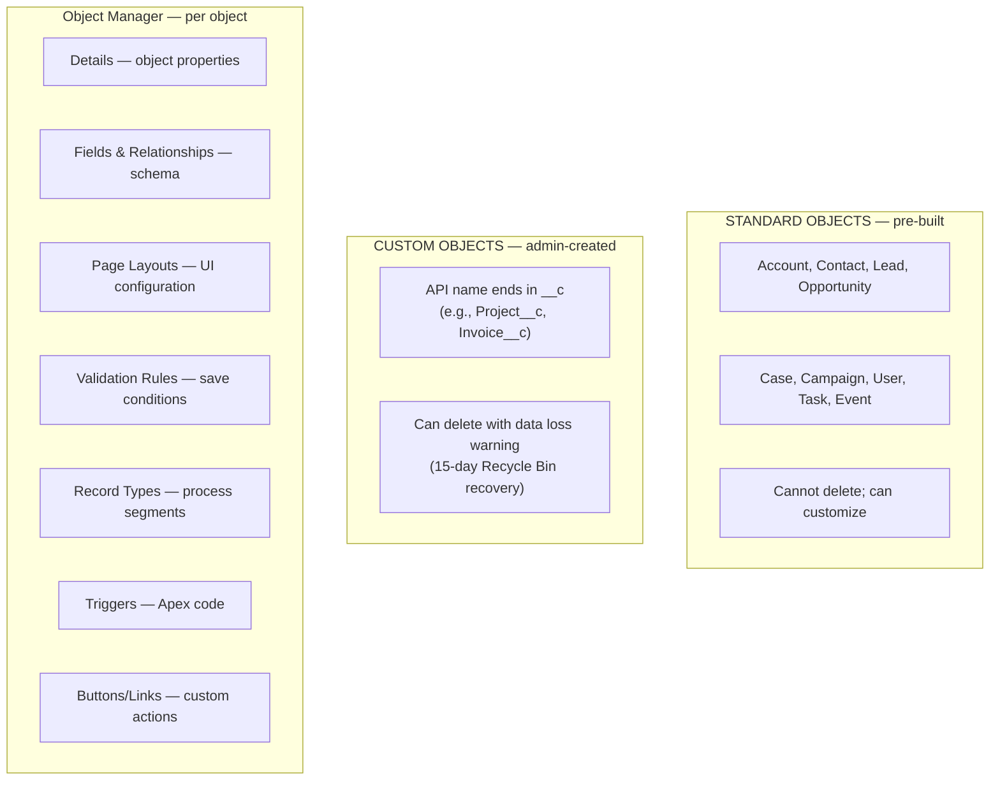

# Object Manager & Standard Objects

## Exam Domain
Object Manager & Lightning App Builder — 20% of exam

## Core Concepts

Object Manager is the central admin UI for working with all objects — standard and custom. Think of it as the schema browser and configuration hub for the Salesforce data model.

**Getting there:** Setup → Object Manager (or use the quick find: "Object Manager")

**Standard Objects:** Pre-built objects included with Salesforce — Account, Contact, Lead, Opportunity, Case, Campaign, etc. You cannot delete standard objects. You can customize them (add fields, change layouts, add validation rules).

**Custom Objects:**
- Created by admins/developers to model unique business data
- Always end in `__c` (API name)
- Examples: `Project__c`, `Invoice__c`, `Custom_Product__c`
- You can create, modify, and (carefully) delete custom objects
- Custom object API names also use `__c`: `Project__c.Budget__c`

**Object limits by edition:**
| Edition | Custom Objects |
|---|---|
| Professional | 50 |
| Enterprise | 200 |
| Unlimited | 2,000 |
| Developer Edition | 400 |

**Key Object Manager capabilities:**
- Fields & Relationships — all fields on the object
- Page Layouts — which fields/buttons on record pages
- Validation Rules — conditions that block saves
- Record Types — segment records for different processes
- Triggers — Apex code that runs on events
- Field Sets — named collections of fields (for dynamic UIs)
- Search Layouts — what shows in search results

**Standard objects you need to know for the exam:**
- **Account** — organization or individual (if Person Accounts enabled)
- **Contact** — individual associated with an Account
- **Lead** — unqualified prospect; can be converted to Account + Contact + Opportunity
- **Opportunity** — sales deal in progress
- **Case** — customer service request
- **Campaign** — marketing initiative; members tracked
- **Product (Product2)** — item for sale; tied to Price Books
- **Task / Event** — activity records
- **User** — Salesforce users

## PTA / SA Relevance

Object Manager is where you see the data model of a Salesforce org. In an architecture assessment, one of the first things to check is:
- How many custom objects are in use vs the edition limit?
- Are custom objects well-named (namespace conventions)?
- Are there orphaned custom objects (built, never deployed, never deleted)?

**Data model debt:** Enterprise customers accumulate custom objects over years. Objects get built for one project and abandoned. An org with 185 custom objects approaching the 200-limit in Enterprise Edition is a real problem — upgrading to Unlimited edition costs money and requires contract changes. Always flag object count in org assessments.

**Standard object customization limits:** You can add up to 500 custom fields to most standard objects. This also accumulates — an Account object with 300 custom fields is a maintenance and performance problem.

## Architecture / How It Works

**Limitations:**
- Cannot delete standard objects
- Deleting a custom object permanently deletes ALL data in that object (with 15-day recovery window in recycle bin)
- Custom object limits vary by edition — Enterprise = 200, Unlimited = 2,000
- API names are permanent — you can change the label but NOT the API name of a deployed custom object (without disrupting integrations/code)
- `__c` suffix is reserved for custom components — you cannot name a standard field with `__c`

## Key Facts to Memorize

- Custom objects: API name ends in `__c`
- Standard objects: no `__c` suffix
- Custom field API names also end in `__c`
- Cross-object references in formulas use `__r` (relationship traversal): `Account__r.Name`
- Enterprise Edition: 200 custom objects max
- Unlimited Edition: 2,000 custom objects max
- Object Manager: Setup → Object Manager (access for all standard + custom objects)
- Cannot delete standard objects
- Can add up to 500 custom fields per object

## Exam Traps

- **"You can delete the Account object"** — FALSE. Standard objects cannot be deleted.
- **"Deleting a custom object only removes the object definition, not the data"** — FALSE. Deleting a custom object deletes all data in it (it goes to the Recycle Bin first).
- **"Custom object names can use any characters"** — FALSE. Must follow API naming rules: no spaces, no special characters except underscores, cannot start with a number or underscore.
- **"All editions have the same number of custom objects"** — FALSE. Varies by edition (50 for Professional, 200 for Enterprise, 2,000 for Unlimited).

## Practice Questions

**Q:** An admin creates a custom object to track project budgets. The label is "Project Budget." What would its API name be?
**A:** `Project_Budget__c` — spaces become underscores in the API name, and `__c` is appended for all custom objects.

**Q:** A company is on Enterprise Edition and has 195 custom objects. A new project requires 10 more custom objects. What is the issue?
**A:** Enterprise Edition is limited to 200 custom objects. They only have 5 slots left. They would need to either delete unused objects or consider upgrading to Unlimited Edition.

**Q:** Where does an admin go to add a new custom field to the Account object?
**A:** Setup → Object Manager → Account → Fields & Relationships → New.

**Q:** An admin needs to reference a field from a parent Account on a custom formula field on Contact. What syntax is used?
**A:** `Account.FieldName__c` (for standard relationship) or `RelationshipName__r.FieldName__c` (for custom lookup relationships). The `__r` suffix is used for traversing relationships in formulas.
