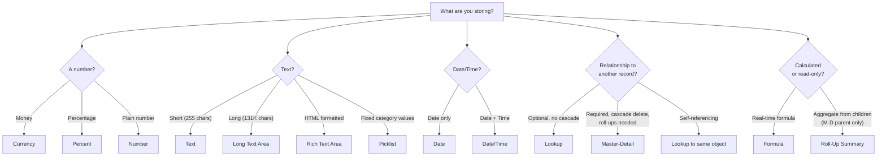

# Custom Fields & Data Types

## Exam Domain
Object Manager & Lightning App Builder — 20% of exam

## Core Concepts

Every field in Salesforce has a data type that determines what kind of data it stores and what you can do with it. Choosing the wrong data type is a common mistake that's painful to fix after data has been entered.

**Key field types for the exam:**

| Field Type | What It Stores | Key Details |
|---|---|---|
| Text | Single-line string | Max 255 chars; cannot exceed |
| Text Area | Multi-line string | Up to 255 chars (no rich text) |
| Long Text Area | Multi-line long text | Up to 131,072 chars |
| Rich Text Area | HTML-formatted text | Up to 131,072 chars; stores HTML |
| Number | Numeric value | Set decimal places; no $ symbol |
| Currency | Money value | Shows currency symbol; multi-currency aware |
| Percent | Percentage | Stored as decimal (0.75 = 75%) |
| Date | Calendar date | No time component |
| Date/Time | Date + time | Includes timezone handling |
| Checkbox | True/False | Cannot be blank; always true or false |
| Picklist | Single-select dropdown | Controlled values list |
| Multi-Select Picklist | Multiple selections | Semicolon-separated storage |
| Lookup | Relationship to another record | Optional; no cascade delete |
| Master-Detail | Required relationship to parent | Cascade delete; Roll-Up Summary enabled |
| Formula | Calculated value | Read-only; computed at runtime |
| Roll-Up Summary | Aggregate from children | Only on Master-Detail parent |
| Auto Number | Auto-incrementing ID | Read-only; set prefix/format |
| URL | Web address | Clickable link in UI |
| Email | Email address | Clickable link; send-email button |
| Phone | Phone number | Clickable to call on mobile |
| Geolocation | Lat/Long coordinates | Used with proximity searches |

**Relationship field types comparison:**

| | Lookup | Master-Detail |
|---|---|---|
| Required? | No (optional) | Yes (required on child) |
| Cascade delete? | No | Yes (delete parent = delete children) |
| Roll-Up Summary? | No | Yes (on parent only) |
| OWD inheritance? | Independent | Child inherits parent OWD |
| Max per object? | Unlimited (practically) | 2 |
| Convert to other? | Can convert to M-D (if criteria met) | Can convert to Lookup |
| Parent can be deleted? | Yes (child stays, field nulled) | No (cannot delete parent with children) |

## PTA / SA Relevance

Field type decisions are data model decisions with long-term consequences. Common enterprise issues:

**Text vs Picklist debate:** Text fields for categorical data create data quality nightmares ("North America," "north america," "NA," "N/A" all mean the same thing). Always use Picklist for categorical data.

**Multi-Select Picklist is an anti-pattern at scale:** Salesforce stores it as semicolon-delimited text. You cannot use SOQL to filter on "contains a specific value" efficiently. Reports with multi-select picklist filters are buggy. If a field needs more than one selection, consider a junction object or separate checkbox fields.

**Currency vs Number:** In integrations, use Currency fields for all monetary values to get proper multi-currency conversion. A Number field stores a raw number that won't be converted across currencies in reports.

**Formula field performance:** Formula fields are calculated at runtime — they don't consume storage but they do consume compute. Objects with dozens of complex formula fields can slow record load times. If performance is an issue, consider persisting values via Flow.

## Architecture / How It Works

**Limitations:**
- Text field max = 255 characters; cannot store more without using Long Text Area
- Roll-Up Summary only available on the Master-Detail *parent* object
- Max 2 Master-Detail relationships per object
- Max 25 Roll-Up Summary fields per object
- Formula fields: read-only, cannot be used in SOQL WHERE clauses as searchable index fields
- Multi-Select Picklist: limited SOQL filtering; cannot use standard equality operators
- Converting Lookup to Master-Detail requires: no existing data with null parent, no existing sharing rules, no permissions based on relationship

## Key Facts to Memorize

- Text = max 255 chars; Long Text Area = max 131,072 chars
- Lookup = optional, no cascade, no roll-up
- Master-Detail = required, cascade delete, allows roll-up summary, max 2 per object
- Roll-Up Summary = only on M-D parent, max 25 per object
- Formula = read-only, calculated at runtime, not stored
- Auto Number = system-assigned sequential ID, read-only
- Checkbox = always has a value (True/False) — never blank
- Multi-Select Picklist = stored as semicolon-delimited text
- Currency field = multi-currency aware (respects exchange rates)
- Date ≠ Date/Time: Date has no time component

## Exam Traps

- **"Roll-Up Summary fields can be created on Lookup relationships"** — FALSE. Only on Master-Detail relationship parent objects.
- **"Formula fields store their calculated value in the database"** — FALSE. Formula fields are calculated at runtime and are not stored.
- **"A checkbox field can be left blank"** — FALSE. Checkboxes always have a value: True or False. Default is False.
- **"You can have unlimited Master-Detail relationships on a custom object"** — FALSE. Maximum 2 Master-Detail fields per object.
- **"Deleting a parent record in a Lookup relationship deletes all child records"** — FALSE. In Lookup, deleting the parent just nulls the relationship field on children. In Master-Detail, deleting the parent cascades and deletes children.

## Practice Questions

**Q:** An admin needs to calculate the total value of all related line items on an Order record and display it as a field on the Order. The relationship between Orders and Line Items is Master-Detail. What type of field should be created on the Order?
**A:** Roll-Up Summary field on the Order (parent in the Master-Detail relationship), using a SUM function on the line item amount field.

**Q:** What is the maximum number of characters that can be stored in a standard Text field?
**A:** 255 characters. For longer text, use Long Text Area (up to 131,072 characters).

**Q:** A business analyst wants to capture which products a customer is interested in (they may be interested in multiple). A developer suggests a Multi-Select Picklist. What are the risks of this approach?
**A:** Multi-Select Picklist values are stored as semicolon-delimited text, making them difficult to filter in reports and SOQL. Reporting on individual values is limited. A better approach for scalable analysis is a junction object with a lookup to a Product object.

**Q:** A custom object has a Lookup relationship to Account. What happens to the custom object records if the parent Account is deleted?
**A:** The lookup field on the custom object records is set to null (cleared). The custom object records are NOT deleted — they remain as orphaned records.
