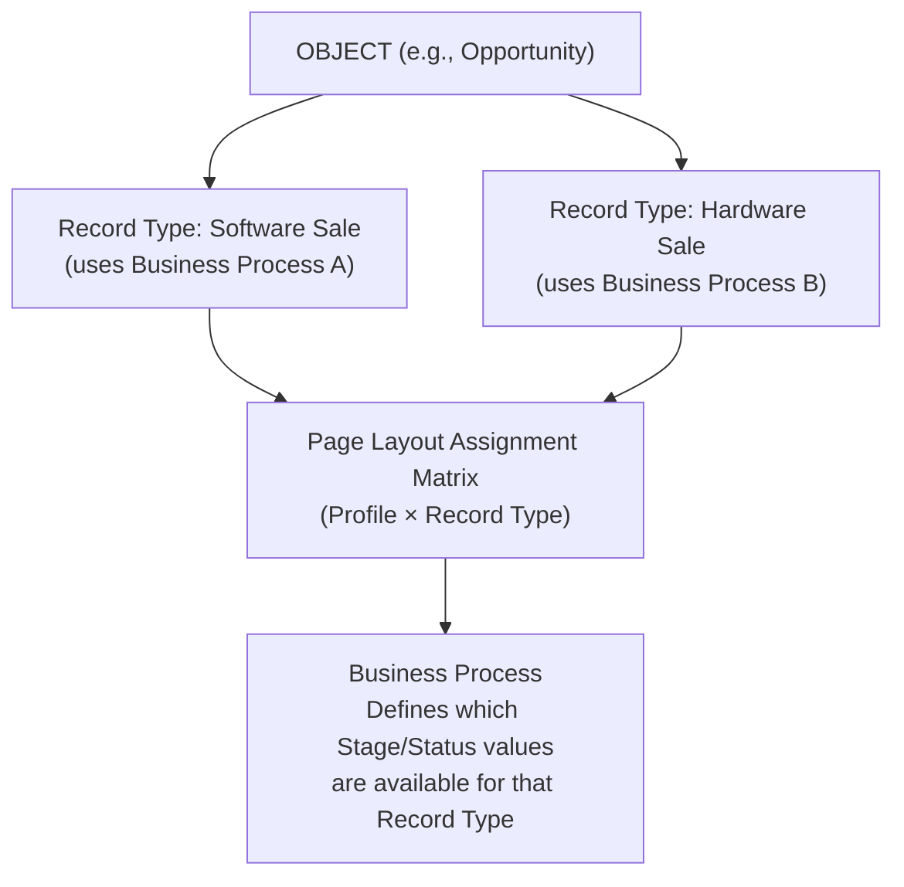

# Page Layouts & Record Types

## Exam Domain
Object Manager & Lightning App Builder — 20% of exam

## Core Concepts

**Page Layouts** control what users see on a record page in the UI — field placement, sections, required fields (UI-level only), related lists, and buttons. They are a UI tool, NOT a security tool.

**What Page Layouts control:**
- Which fields appear and in what order
- Which fields are required (in the UI for that layout)
- Which related lists appear
- Which buttons/actions appear
- Field properties: read-only, required (on the layout)

**What Page Layouts do NOT control:**
- Whether a user can read a field (that's FLS)
- Whether a user can access a record (that's sharing model)
- Data validation (that's Validation Rules)

**Record Types** segment records into different "types" with different:
- Page layouts (each record type can use a different layout)
- Picklist values (each record type can have a subset of picklist values)
- Business processes (for Leads, Opportunities, Cases — stage/status values)

Use case example: A company sells both Software and Hardware. They create two Opportunity Record Types: Software Sale and Hardware Sale. Each has a different page layout (different fields), different stage values, and different picklist options.

**Page Layout Assignment:**
Layout assignments are controlled by Profile + Record Type combination. Go to Object → Page Layouts → Page Layout Assignment to see the matrix.

**Business Processes:**
A special feature for Lead (Lead Status values), Opportunity (Stage values), Case (Status values), and Solution (Status values). A Business Process defines which status/stage values are available. Record Types are associated with Business Processes.

## PTA / SA Relevance

Record Types are one of the most over-used features in Salesforce. A common anti-pattern: using Record Types to solve a field visibility problem that should be solved with Dynamic Forms.

**When Record Types are appropriate:**
- You have genuinely different types of records with different data models, stage flows, or picklist options
- You need to assign different page layouts per segment

**When Record Types are NOT appropriate:**
- You just want to filter a list view (use a picklist field + filter instead)
- You want to show/hide individual fields based on conditions (use Dynamic Forms / Lightning App Builder page visibility rules instead)

**Dynamic Forms (Spring 2021+):** Allows field-level conditional visibility on Lightning Record Pages without separate page layouts. Reduces page layout proliferation. Available for custom objects and most standard objects. In architecture discussions, recommend Dynamic Forms over creating multiple record types for field visibility.

**The layout matrix:** In large orgs with 5 record types and 8 profiles, you have a 5×8=40 possible layout combinations. Managing this manually is painful. Document it in a matrix and review during any implementation.

## Architecture / How It Works

**Page Layout Assignment Matrix** (Profile × Record Type → Layout):

| Profile | Software Sale | Hardware Sale |
|---|---|---|
| Sales Rep | Layout A | Layout B |
| Manager | Layout C | Layout C |
| System Admin | Admin Layout | Admin Layout |

**Business Processes** (available for Lead, Opportunity, Case, Solution):
- Enterprise Process: Prospect → Qualify → Propose → Negotiate → Closed Won/Lost
- SMB Process: Lead → Propose → Closed Won/Lost
- Each Opportunity Record Type is linked to a Business Process that defines its Stage values

**Limitations:**
- Page layouts are UI-only — they don't enforce security
- "Required on layout" only applies when using that specific layout in the UI; not enforced via API
- Max page layouts per object: practically unlimited, but 100+ is unmanageable
- Dynamic Forms not yet available on all standard objects (check release notes for current status)
- Record Types don't create separate objects — it's still one object, just segmented
- You cannot delete a Record Type that has records associated with it until those records are reassigned

## Key Facts to Memorize

- Page Layouts = UI control; NOT security
- "Required" on a page layout is UI-only (not API-enforced)
- Record Types = segment records with different layouts, picklist values, business processes
- Business Processes = specific to: Lead (Lead Status), Opportunity (Stage), Case (Status), Solution
- Page Layout Assignment = by Profile + Record Type combination
- FLS wins over page layout for field visibility (security layer beats UI layer)
- Dynamic Forms (LEX) = conditional field visibility without multiple layouts

## Exam Traps

- **"Making a field required on a page layout enforces it for all users and via API"** — FALSE. Page layout "required" is UI-only. Validation rules enforce required fields everywhere including API.
- **"Record Types control which objects users can access"** — FALSE. Record Types segment records within an object. Object access is controlled by Profile/OLS.
- **"You can have one page layout serve all profiles and record types"** — TRUE, but it means everyone sees the same layout. The feature allows differentiation, you don't have to use it.
- **"Business Processes are available for all objects"** — FALSE. Only Lead, Opportunity, Case, and Solution have Business Processes.
- **"Dynamic Forms replaces page layouts entirely"** — FALSE. Not available on all objects; page layouts still used for compact layouts, related lists, and Classic access.

## Practice Questions

**Q:** A company needs the Opportunity Stage picklist to show different values for their Enterprise sales team versus their SMB sales team. What should the admin configure?
**A:** Create two Record Types (Enterprise Opportunity and SMB Opportunity) each associated with a different Business Process that defines the applicable Stage values.

**Q:** An admin wants to make the `Budget__c` field required only in the UI for Sales Reps, but not for Managers. The field should not be required via API. How should this be configured?
**A:** Create two page layouts — one for Sales Reps with `Budget__c` marked as required, one for Managers without the required setting. Assign layouts via the Page Layout Assignment matrix per Profile.

**Q:** Where does an admin configure which page layout a specific profile sees for a given record type?
**A:** Object Manager → [Object] → Page Layouts → Page Layout Assignment. This shows the matrix of profile × record type → layout assignment.

**Q:** A user can see a field on their page layout, but it always appears blank even though other users report data is there. What is the likely cause?
**A:** FLS is set to "Not Visible" for that user's profile on that field. FLS overrides page layout visibility — if FLS hides the field, it appears blank regardless of being on the layout.
