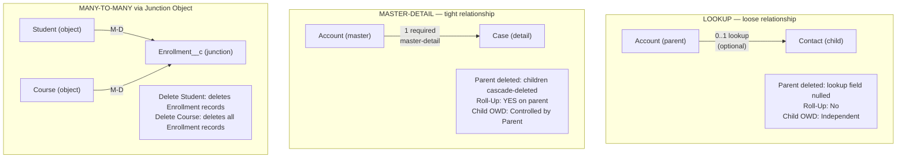

# Relationships & Junction Objects

## Exam Domain
Object Manager & Lightning App Builder — 20% of exam

## Core Concepts

Relationships define how Salesforce objects connect to each other. Getting this right is foundational to the data model.

**Lookup Relationship:**
- Creates a loose link between two objects
- The child record can exist without a parent (optional relationship)
- Deleting the parent does NOT delete child records — the lookup field is set to null
- No Roll-Up Summary field capability
- Child has its own OWD (independent access)
- Each object can have many lookups (no strict limit)

**Master-Detail Relationship:**
- Creates a tight parent-child bond
- The child MUST have a parent — the relationship field is required
- Deleting the parent DOES cascade-delete all children
- Enables Roll-Up Summary fields on the parent
- Child inherits the parent's OWD (Controlled by Parent)
- Max 2 per object (cannot create a third Master-Detail)
- The parent object in M-D controls the child's sharing

**Many-to-Many with Junction Objects:**
- Salesforce doesn't have a native M:M field type
- Solution: create a third "junction" object with two Master-Detail relationships, one to each "parent"
- Example: Student ←→ Course (a student can enroll in many courses; a course has many students)
- Create `Enrollment__c` with `Student__c` (M-D) and `Course__c` (M-D)
- The junction object record represents the relationship instance

**Hierarchical Relationship:**
- Special Lookup to the same object
- Only available on the User object
- Used for: Manager field on User (who is this user's manager?)
- Creates a self-referential hierarchy on User records

**Self-Relationship (Lookup):**
- A Lookup that points to the same object
- Example: Account → Parent Account (Account hierarchy)
- Used for hierarchical structures like Account parent/child organizations

## PTA / SA Relevance

Relationship design is schema design. The decisions made here affect:

**Integration complexity:** Every relationship creates a foreign key join in SOQL. Deep relationship traversals (Account → Contact → Custom → Related Custom) impact query performance. SOQL has a 5-level relationship traversal limit for child-to-parent queries in formulas.

**Data migration complexity:** When loading data with relationships, you need to load parents before children. If you're migrating to a junction object pattern, you need to load both "parent" objects first, then the junction records. This is why External ID fields are critical in data loads.

**Cascade delete risk:** Master-Detail cascade delete is powerful but dangerous during data migrations. If you delete a parent record by accident in a M-D relationship, all children are gone too (they go to Recycle Bin, 15-day recovery). In data management operations on Production, be very careful with M-D parent deletions.

**Junction object limits:** A junction object with two M-D relationships is limited to 2 M-D fields max (same as any other object). If you need three "parents," one of them must be a Lookup instead. This affects roll-up summary availability.

## Architecture / How It Works

**Limitations:**
- Maximum 2 Master-Detail relationships per object (hard limit)
- Maximum 25 Roll-Up Summary fields per object (on M-D parent)
- Lookup relationships cannot have Roll-Up Summary fields
- Junction objects with two M-D parents: deleting either parent cascades through the junction
- Converting a Lookup to Master-Detail requires: all existing records have a value (no nulls), no existing owner-based sharing rules, relationship must not be shared with another org (no portals on that sharing model)
- SOQL parent-to-child traversal: you can traverse 5 levels up (child-to-parent); 1 level down (parent-to-child) in subqueries

## Key Facts to Memorize

- Lookup: optional, no cascade, no roll-up, independent OWD
- Master-Detail: required, cascade delete, roll-up enabled, child inherits parent OWD
- Max 2 M-D relationships per object
- Junction object = two M-D fields to create M:M relationship
- Hierarchical = self-referential Lookup on User object only
- M-D cascade delete: delete parent → all children deleted (go to Recycle Bin first)
- Roll-Up Summary only on M-D parent — count/sum/min/max of child values
- Converting Lookup → M-D: existing null values in the field will block the conversion

## Exam Traps

- **"Roll-Up Summary fields can be created on Lookup relationships"** — FALSE. Only M-D parents.
- **"You can have multiple Master-Detail relationships on one object"** — TRUE up to 2; FALSE for more than 2.
- **"Deleting a Lookup parent deletes all child records"** — FALSE. Deleting a Lookup parent just nulls the field on children.
- **"Junction objects use two Lookup relationships"** — FALSE. Standard junction object pattern uses two M-D relationships (for cascade delete behavior and roll-up capability).
- **"Hierarchical relationship can be used on any object"** — FALSE. Only available on the User object.

## Practice Questions

**Q:** A company tracks Students and Courses, and students can enroll in multiple courses. Courses can have multiple students. How should this be modeled in Salesforce?
**A:** Create a junction object `Enrollment__c` with two Master-Detail relationships: one to Student and one to Course. This creates the many-to-many relationship.

**Q:** An admin needs to count the total number of open Cases related to each Account. What type of field should be created, and where?
**A:** Roll-Up Summary field on the Account object (parent of the M-D relationship with Case). Function: COUNT, filtered by Case Status = Open.

**Q:** What happens to Opportunity records when their parent Account is deleted, given that Account-Opportunity is a Lookup relationship?
**A:** The Account lookup field on Opportunities is set to null. Opportunities are NOT deleted — they remain as unassociated records.

**Q:** A developer needs to convert a Lookup relationship to a Master-Detail. What must be true before the conversion can happen?
**A:** All existing records must have a value in the Lookup field (no null values). There cannot be existing owner-based sharing rules on the child object. The field must not be referenced in portals/communities with sharing.
