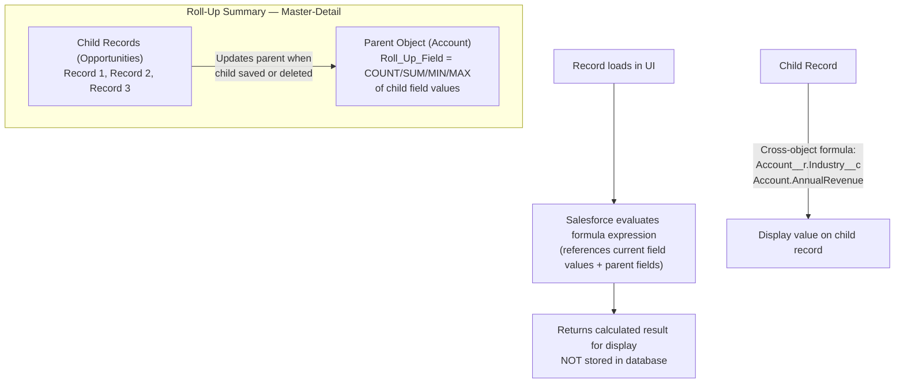

# Formula & Roll-Up Summary Fields

## Exam Domain
Object Manager & Lightning App Builder — 20% of exam

## Core Concepts

**Formula Fields:**
- Read-only fields whose value is calculated in real time
- NOT stored in the database — recalculated every time the record is loaded
- Can reference other fields on the same record OR related records (cross-object)
- Cannot reference other formula fields in complex ways (limitations on chaining)
- The formula evaluates to a data type: Text, Number, Currency, Date, Date/Time, Checkbox, Percent

**Key formula functions to know:**

| Function | What It Does |
|---|---|
| `IF(condition, true_value, false_value)` | Conditional branching |
| `AND(a, b)` / `OR(a, b)` | Logical operators |
| `NOT(condition)` | Negates a boolean |
| `ISBLANK(field)` | Checks if a field has no value (text + others) |
| `ISNULL(field)` | Legacy; prefer ISBLANK for text fields |
| `ISPICKVAL(picklist_field, "value")` | Checks if a picklist equals a value |
| `TEXT(picklist_field)` | Converts picklist to text |
| `TODAY()` | Returns today's date |
| `NOW()` | Returns current date+time |
| `DATEVALUE(date_time_field)` | Extracts date from Date/Time |
| `YEAR(date)` / `MONTH(date)` / `DAY(date)` | Date component extraction |
| `LEFT(text, n)` / `RIGHT(text, n)` | Substring extraction |
| `CONTAINS(text, substring)` | Returns true if text contains substring |
| `LEN(text)` | Length of a text string |
| `CEILING(number)` / `FLOOR(number)` | Rounding |
| `MOD(number, divisor)` | Modulo |
| `HYPERLINK(url, label)` | Creates a clickable link |
| `IMAGE(url, alt_text)` | Embeds an image |

**ISBLANK vs ISNULL:**
- `ISNULL` only works correctly with Number, Date, Date/Time fields
- `ISBLANK` works with ALL field types including Text
- **Best practice: always use ISBLANK** — it handles text fields correctly (empty string vs null)
- A text field can be empty ("") without being null — ISNULL returns false for empty text; ISBLANK returns true

**Cross-Object Formula:**
- Reference a parent record's field from a child formula
- Syntax for standard relationships: `Account.Name`, `Account.AnnualRevenue`
- Syntax for custom relationships: `RelationshipName__r.FieldName__c`
- Can traverse up to 10 levels of relationships in a formula (but watch for circularity)

**Roll-Up Summary Fields:**
- Available ONLY on the parent side of a Master-Detail relationship
- Aggregate values from child records
- Functions: COUNT (how many children), SUM, MIN, MAX
- Can include a filter (e.g., COUNT only where Status = "Active")
- Max 25 Roll-Up Summary fields per object
- Roll-up values update when child records are created, edited, or deleted (near real-time)

## PTA / SA Relevance

Formula fields are the no-code calculation engine in Salesforce. They're widely used and rarely cause issues when simple, but become maintenance problems at enterprise scale:

**Formula complexity debt:** A formula with 10 nested IFs referencing 8 different objects becomes unmaintainable. When reviewing an org, look for formula fields with character counts near the 3,900-character limit — they're usually doing too much and should be refactored into Flow-populated text fields.

**Cross-object formulas and SOQL:** Formula fields that cross object relationships trigger additional SOQL queries at runtime. An object with 20 cross-object formulas on a page will load slower. For high-volume objects, consider persisting values via triggered Flow.

**Roll-up alternative (for Lookups):** When customers have Lookup relationships but need aggregate calculations, they often need a custom Apex trigger or a Record-Triggered Flow to maintain the calculated value. This is a common architecture discussion — "I want a roll-up summary but my relationship is a Lookup, what do I do?"

## Architecture / How It Works

**Limitations:**
- Formula fields: max 3,900 characters in the formula, 5,000 bytes compiled
- Cross-object formulas: max 10 levels of relationship traversal
- Roll-Up Summary: max 25 per object; only on M-D parent
- Formula fields are NOT searchable (can't use in SOQL WHERE with indexed performance)
- ISNULL returns false for empty text fields — use ISBLANK instead
- Roll-up fields do NOT recalculate immediately on all bulk data loads — may require manual recalculation

## Key Facts to Memorize

- Formula = read-only, calculated at runtime, NOT stored
- ISBLANK preferred over ISNULL for text fields
- ISPICKVAL checks picklist values in formulas
- Cross-object formula: use `__r` for custom relationships in formula
- Roll-Up Summary = only on M-D parent, max 25 per object
- Roll-up functions: COUNT, SUM, MIN, MAX
- Roll-Up with filter = only count/aggregate records where condition is met
- TODAY() = date; NOW() = date+time
- TEXT() converts picklist to text for string operations

## Exam Traps

- **"Formula fields store their value in the database"** — FALSE. Calculated at runtime only.
- **"ISNULL works correctly with text fields"** — FALSE. ISNULL returns false for empty text fields (""). Use ISBLANK.
- **"Roll-Up Summary fields can be created on Lookup relationships"** — FALSE. Only on M-D parent objects.
- **"You can use ISPICKVAL on a text field"** — FALSE. ISPICKVAL only works with Picklist fields.
- **"Formula fields can reference other formula fields without any limits"** — FALSE. Formula fields cannot reference other formula fields in a way that creates complex chains; there are compile size limits and circular reference prohibitions.

## Practice Questions

**Q:** An admin wants a formula field on Opportunity that shows "High Value" if Amount > 100,000 and "Standard" otherwise. Write the formula logic.
**A:** `IF(Amount > 100000, "High Value", "Standard")`

**Q:** A text formula field should show "Empty" if the Description field is blank, and the Description value if it has content. What function checks for blank text?
**A:** Use `ISBLANK(Description)` — not ISNULL. The formula: `IF(ISBLANK(Description), "Empty", Description)`

**Q:** An admin wants to count the number of Closed Won Opportunities related to each Account. What type of field should they create, and what is the filter?
**A:** Roll-Up Summary field on Account (M-D parent), function: COUNT, with filter: Opportunity Stage equals "Closed Won."

**Q:** A formula field on Contact needs to show the Account's Industry field value. The Account-Contact relationship is standard. What is the syntax?
**A:** `Account.Industry` — for standard relationships, use the relationship name directly without `__r`. For custom lookup relationships, use `RelationshipFieldName__r.FieldName__c`.
