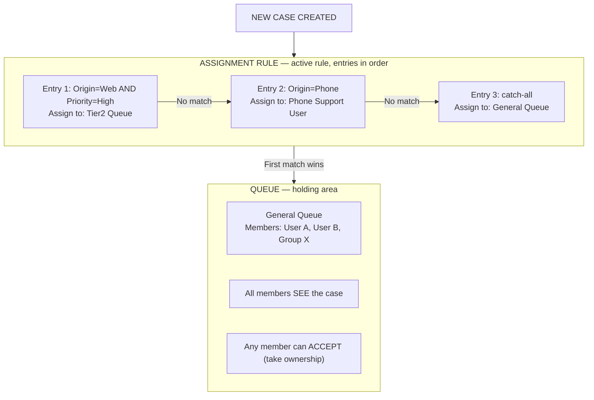

# Queues & Assignment Rules

## Exam Domain
Service & Support Apps — 11% of exam

## Core Concepts

**Queues:**
- A holding area for records that haven't been assigned to an individual yet
- Records sit in a queue until a team member "accepts" them (takes ownership)
- Queues can own: Cases, Leads, Orders, Knowledge Articles, custom objects
- Members of a queue see all records in the queue
- Any queue member can take ownership of a record from the queue

**Queue Setup:**
- Setup → Queues → New
- Define: Queue Name, Email (for notifications), Supported Objects, Queue Members
- Queue Members can be: individual users, public groups, roles, roles+subordinates

**Assignment Rules (Cases and Leads):**
- Automatically route a record to a user or queue when criteria match
- Only ONE assignment rule can be active per object
- Rule entries evaluated in order — **first match wins**, stops evaluating
- Each entry: criteria + assigned to (user or queue) + notification email template

**When assignment rules run:**
- For Cases: when created via Web-to-Case, Email-to-Case, or manually with "Assign using active assignment rules" checkbox checked
- For Leads: when created via Web-to-Lead, manually with assignment checkbox, or via API with the flag set
- Manual transfers don't automatically use assignment rules unless the checkbox is checked

**Case Queues vs Case Owners:**
- A Case owned by a Queue: visible to all queue members
- A Case owned by a User: only that user (and their hierarchy) can see it (OWD-dependent)
- When a user "accepts" a case from a queue, ownership transfers to them

## PTA / SA Relevance

Queues + Assignment Rules = basic routing. Omni-Channel = intelligent real-time routing. For enterprise Service Cloud implementations:

**The limitation of assignment rules at scale:** Rule entries evaluated sequentially (first match wins) are easy to break. If a rule entry criteria is wrong, or the order gets shuffled, cases land in the wrong place. For complex routing logic — skill-based routing, capacity-based assignment, real-time availability — Omni-Channel with Service Cloud Routing is the right architecture.

**Queue ownership for compliance:** Cases in a queue are visible to all queue members. If you need records in a "shared space" but still want to control who can see which cases (compliance use case), queues alone aren't sufficient. You need a more granular sharing model.

## Architecture / How It Works

**Limitations:**
- Only one assignment rule active per object at a time
- Assignment rules don't run by default on manual record creation unless "Assign using active assignment rules" checkbox is checked
- Queue members all see all records in the queue — no field-level filtering within a queue
- Queues available for: Cases, Leads, Orders, Service Contracts, custom objects (not Opportunities by default)

## Key Facts to Memorize

- Queue = holding area; records unassigned until a member accepts
- Queue members: users, groups, roles, roles+subordinates
- One assignment rule active per object
- Rule entries evaluated in order; first match wins
- Cases in queue: all members see them
- Assignment rule runs on: Web-to-Case, Email-to-Case, with "Assign using active rules" checkbox
- Queue can own Cases, Leads, custom objects (not Opportunities natively)

## Exam Traps

- **"Multiple assignment rules can be active at the same time for Cases"** — FALSE. One active rule per object.
- **"When a case is assigned to a queue, only the queue owner can see it"** — FALSE. All queue members can see cases in a queue.
- **"Assignment rules run automatically every time a case is manually created"** — FALSE. For manually created cases, the "Assign using active assignment rules" checkbox must be checked.
- **"Queues are available for the Opportunity object"** — FALSE. Queues are not natively available for Opportunities.

## Practice Questions

**Q:** A company wants cases created by phone calls to go to the Phone Support team and cases created via their website to go to the Web Support team. How should this be configured?
**A:** Create an Assignment Rule with two entries: Entry 1: Case Origin = Phone → assign to Phone Support Queue; Entry 2: Case Origin = Web → assign to Web Support Queue.

**Q:** A support agent wants to know how to pick up a case from their team's queue. What does the agent do?
**A:** Open the list view for the queue (or find the case in the queue), open the Case record, and click "Accept" or change the Case Owner to themselves.

**Q:** An admin creates a new assignment rule for Cases but the old routing still seems to be working. What is likely the issue?
**A:** The new rule hasn't been activated. Only ONE rule can be active — the admin needs to activate the new rule (which automatically deactivates the previous active rule).
