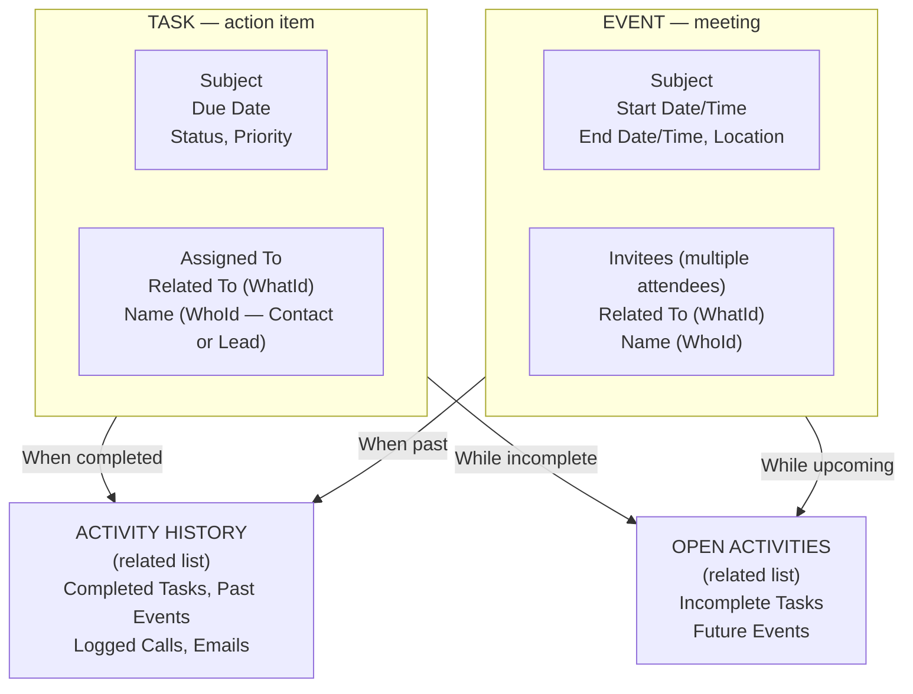

# Activities: Tasks & Events

## Exam Domain
Productivity & Collaboration — 7% of exam

## Core Concepts

Activities in Salesforce are the tracking mechanism for all interactions — calls, emails, meetings, to-dos. They come in two types: Tasks and Events.

**Task:**
- A to-do item or action to be completed
- Has a Due Date (no start/end time)
- Can be related to multiple records (WhoId = Contact/Lead, WhatId = any object)
- Status: Not Started, In Progress, Completed, etc.
- Can be assigned to another user (assigned tasks vs my tasks)
- Recurring tasks: can be set up to repeat on a schedule

**Event:**
- A scheduled meeting or appointment
- Has Start Date/Time AND End Date/Time
- Can sync with Google Calendar or Outlook via Lightning Sync / Einstein Activity Capture
- Can have invitees (multiple attendees)
- "All Day Event" option removes time component

**Open Activities vs Activity History:**
- **Open Activities** related list: incomplete Tasks and upcoming Events
- **Activity History** related list: completed Tasks, past Events, logged calls, sent emails
- This distinction matters on page layout — they're two separate related lists

**Log a Call:**
- Creates a completed Task (logs a phone call that already happened)
- Quickly record what was discussed on a call
- Appears in Activity History

**Einstein Activity Capture (EAC):**
- Syncs emails and calendar events between Salesforce and Gmail/Outlook
- Does NOT create real Task/Event records in Salesforce by default (uses "Activities" surface)
- EAC emails don't appear in reports or SOQL unless special reporting is enabled
- Separate from standard Salesforce email/calendar sync

**Send Email from Salesforce:**
- Email sent from a record is logged as an email activity
- Templates can be used
- Requires email configuration (email relay or Salesforce email)

## PTA / SA Relevance

Activity tracking is where CRM adoption lives or dies. Sales reps who don't log activities provide no visibility for managers. The common enterprise challenge: getting sales reps to log activities in Salesforce vs their email/calendar.

**EAC vs traditional activity logging:** EAC is Salesforce's answer to this — automatically capture email and calendar activity without requiring manual logging. But there's a trade-off: EAC data doesn't behave like standard Salesforce records (limited reporting, not in SOQL by default). Customers need to understand this before rolling out EAC as their primary activity tracking mechanism.

**Activity reporting:** Standard Salesforce Reports can report on Tasks and Events as standard objects. If you use EAC and need to report on captured activities, you need "Einstein Activity Capture Reporting" or Einstein Analytics (now Tableau CRM) for full analysis.

## Architecture / How It Works

**Limitations:**
- Tasks can only be related to ONE WhoId (Contact/Lead) and ONE WhatId (any object)
- Events can have multiple invitees (attendees) unlike Tasks
- Activity History doesn't include in-flight (open) activities
- EAC captured activities are stored in a separate data store — not in standard Task/Event objects; limited SOQL and reporting access
- Recurring tasks create individual task records (not one master task)

## Key Facts to Memorize

- Task = to-do with due date; Event = meeting with start+end time
- Open Activities = incomplete tasks + future events
- Activity History = completed tasks + past events + logged calls + sent emails
- "Log a Call" = creates a completed Task immediately
- WhoId = Contact or Lead (the Person the activity is about)
- WhatId = any other object (Account, Opportunity, Case, etc.)
- EAC syncs Gmail/Outlook but activity doesn't appear in standard reports by default
- Events can have multiple invitees (attendees); Tasks are assigned to one person

## Exam Traps

- **"Log a Call creates an Event record"** — FALSE. Log a Call creates a completed Task (not an Event).
- **"Activity History shows upcoming events"** — FALSE. Upcoming events are in Open Activities. Activity History shows completed/past activities.
- **"Einstein Activity Capture creates standard Task and Event records"** — FALSE. EAC stores captured activities separately and they are not standard Task/Event records in SOQL.
- **"Tasks can be related to multiple Contact records simultaneously"** — FALSE. Tasks have one WhoId (one Contact or Lead) and one WhatId.

## Practice Questions

**Q:** A sales rep logs a call with a customer. Where does this activity appear on the related Contact record?
**A:** Activity History related list. Logged calls are completed Tasks and appear in Activity History (not Open Activities).

**Q:** What is the difference between Open Activities and Activity History related lists?
**A:** Open Activities shows incomplete Tasks and upcoming Events. Activity History shows completed Tasks, past Events, logged calls, and emails.

**Q:** A manager wants to report on all Activities logged by their sales team in the last 30 days. What objects should the report be built on?
**A:** Activities (which includes both Tasks and Events). Use a Task and Events report type. Note: EAC-captured activities may not be included — those require separate reporting setup.
