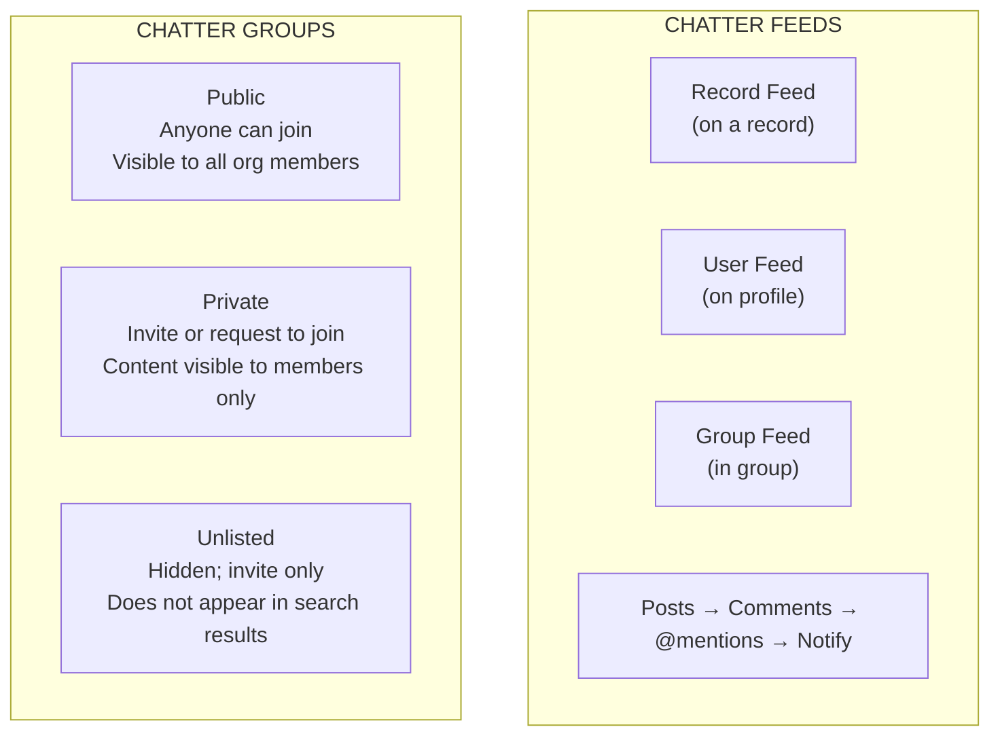

# Chatter & Collaboration

## Exam Domain
Productivity & Collaboration — 7% of exam

## Core Concepts

Chatter is Salesforce's internal social collaboration tool — like an enterprise social network built into your CRM. It's not a chatting tool (no real-time chat) — it's a feed-based collaboration platform.

**Chatter Feeds:**
- Every record has a Chatter feed (post, comment, attach files)
- Users have profile feeds
- Groups have group feeds
- @mentions notify specific users

**Chatter Groups:**
- Collaborative spaces for teams or projects
- Three types:
  1. **Public:** Anyone can see and join; posts visible to all org members
  2. **Private:** Must request/be invited; content only visible to members
  3. **Unlisted (Archived):** Hidden; must be invited; doesn't appear in searches

**Chatter Licenses:**
| License | What They Get |
|---|---|
| Salesforce (full) | Full Chatter + CRM access |
| Chatter Free | Chatter only; no CRM object access |
| Chatter External | External users (non-employees); limited Chatter access in communities |

**Key Chatter behaviors:**
- **Follow:** Follow a user or record to get their feed posts in your feed
- **@mention:** Tags a specific user in a post; they get a notification
- **#hashtag:** Categorize posts (searchable)
- **Like/Comment:** Standard social interactions
- **Files:** Attach files to Chatter posts; stored in Salesforce Files
- **Groups as email list:** Chatter Groups can receive emails that post to the group feed

**Chatter Free users:**
- Cannot access standard CRM objects (Accounts, Contacts, Opportunities)
- Can use Chatter Groups, Files, and messaging features
- Useful for: HR, IT, departments that need collaboration but not CRM access

## PTA / SA Relevance

Chatter is often underutilized. The most common observation in enterprise orgs: Chatter feeds are empty because sales reps never post there. The adoption question is: what replaces Slack or Teams? For many customers, the answer is Slack (now Salesforce Slack) not Chatter.

**Slack + Salesforce integration:** Since the Salesforce acquisition of Slack (2021), the strategy is: Slack for real-time collaboration, Salesforce for CRM records. The integration brings CRM record context into Slack channels. For new implementations, recommend Slack over Chatter for collaboration — Chatter still serves the purpose of feed-based record updates, but human conversation should be in Slack.

**Chatter for approval notifications:** One underrated use case — Chatter posts when a record enters an approval process, notifying stakeholders without email. This is the "right" way to use Chatter in automation.

## Architecture / How It Works

**License tiers:**
- **Full Salesforce** — Full CRM + All Chatter
- **Chatter Free** — Chatter only (no CRM objects — no Accounts, Contacts, Opportunities)
- **Chatter External** — Limited Chatter for external/non-employee users in communities

**Limitations:**
- Chatter is not real-time chat (no instant messaging); it's asynchronous feed-based
- Chatter Free users cannot access standard CRM objects
- Unlisted groups don't appear in search — members must be explicitly invited
- Chatter posts are not stored in standard report objects — limited reporting on Chatter activity
- Files shared via Chatter are stored in Salesforce Files and count against storage limits

## Key Facts to Memorize

- Chatter = feed-based collaboration; NOT real-time chat
- 3 group types: Public (anyone), Private (invite/request), Unlisted (hidden, invite-only)
- Chatter Free = collaboration only, no CRM record access
- @mention = notifies specific user
- Follow = subscribe to a user's or record's feed updates
- Groups can receive email posts (email-to-group address)
- Chatter available to all full Salesforce license users by default

## Exam Traps

- **"Chatter Free users can access Opportunity records"** — FALSE. Chatter Free is Chatter-only; no CRM objects.
- **"Private Chatter groups are visible in search results to all org members"** — FALSE. Private groups appear in search (people can request to join), but Unlisted groups don't appear at all.
- **"Chatter enables real-time messaging between users"** — FALSE. Chatter is feed-based/asynchronous. Real-time messaging = Slack (separate product).
- **"Anyone can join an Unlisted Chatter Group"** — FALSE. Unlisted groups require an invitation — they don't appear in searches.

## Practice Questions

**Q:** A company wants to create a Chatter group for a sensitive executive project that should not appear in search results. Which group type should be used?
**A:** Unlisted group. It won't appear in search results and membership is by invitation only.

**Q:** A company wants to give 50 HR employees access to Chatter for collaboration but they don't need any CRM record access. What license type should they use?
**A:** Chatter Free license. It's significantly cheaper than full Salesforce licenses and provides Chatter access without CRM object access.

**Q:** What happens when a user uses @mention in a Chatter post?
**A:** The mentioned user receives a notification (email and/or in-app notification, depending on their notification settings) and the post appears in their Chatter feed.

**Q:** What is the difference between a Private and an Unlisted Chatter Group?
**A:** Private groups appear in search results (anyone can request to join, but must be approved). Unlisted groups don't appear in search results at all — membership is by invitation only from the group owner.
