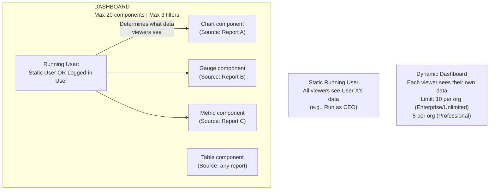

# Dashboards

## Exam Domain
Data & Analytics — 14% of exam

## Core Concepts

Dashboards are visual displays of report data. Each dashboard component is powered by one underlying report. Dashboards don't store data — they run their source reports when refreshed.

**Dashboard Components (chart types):**
- **Chart** (bar, line, pie, donut, funnel, scatter) — requires Summary or Matrix report
- **Gauge** — shows a value against a range (like a speedometer)
- **Metric** — shows a single key number
- **Table** — shows a list (works with any report type, including Tabular)
- Maximum 20 components per dashboard

**Dashboard Filters:**
- Up to 3 filters per dashboard
- Allow viewers to filter dashboard data without editing the underlying reports
- Example: a Region filter that applies to all components on the dashboard

**Running User — the critical concept:**

| | Static Running User | Dynamic Dashboard |
|---|---|---|
| Data shown | Fixed user's data (same for everyone) | Each viewer sees their OWN data |
| Configured by | Admin (sets specific user) | "Run as logged-in user" setting |
| Limits | No limit | Enterprise/Unlimited = 10; Professional = 5 |
| Use case | Executive summary everyone sees | Manager dashboards where each person sees their team |

**Static Running User:** Everyone who views the dashboard sees data as if they are the configured running user. A CTO dashboard run as "CEO" would show the CEO's data access scope to anyone who opens it.

**Dynamic Dashboard:** Each user sees data based on their own data access. A "My Team's Pipeline" dashboard each manager views would show only their team's data. Requires a separate license feature; limited quantity per org.

**Dashboard Refresh:**
- Dashboards show data from the LAST time they were refreshed
- Does NOT refresh automatically in real-time
- Manual refresh: click "Refresh" button
- Scheduled refresh: set a refresh schedule (hourly, daily, etc.)
- Viewers see the "last refreshed" timestamp

## PTA / SA Relevance

Dashboards are the executive and management reporting layer. The running user concept is the most commonly misunderstood feature:

**Enterprise pattern:** Sales VP opens their dashboard and sees the whole company's pipeline. Their direct reports open the same dashboard and see only their region's pipeline. This requires Dynamic Dashboards. Without Dynamic Dashboards, you'd need to create a separate dashboard per manager (maintenance nightmare).

**The 10-dynamic-dashboard limit:** This catches enterprise customers. A company with 50 regional managers can't give each their own dynamic dashboard view — they'd need multiple dynamic dashboard definitions, or use CRM Analytics which has no such limit. Plan for this early in implementation.

**Dashboard as a managed analytics service:** Many customers share "read-only" dashboards with senior leadership. The static running user pattern + "View-only" dashboard sharing is the standard pattern. Create a service account user (integration user or reporting user) with appropriate data access, set them as the dashboard running user, share the dashboard with leadership.

## Architecture / How It Works

**Limitations:**
- Maximum 20 components per dashboard
- Maximum 3 filters per dashboard
- Dynamic dashboards: 5 in Professional, 10 in Enterprise/Unlimited (hard limit)
- Table component = only works well with Tabular (or Summary/Matrix)
- Chart components require Summary or Matrix reports (Tabular = no charts)
- Dashboards don't refresh in real-time — must manually refresh or schedule
- Dashboard refresh data is visible to anyone with dashboard access (regardless of running user — they'll see the running user's data, not their own, on a static dashboard)

## Key Facts to Memorize

- Max 20 components per dashboard
- Max 3 dashboard filters
- Static Running User = everyone sees that user's data
- Dynamic Dashboard = each viewer sees own data; limited to 10 (Enterprise/Unlimited)
- Dashboard components need underlying reports (Summary/Matrix for charts; any for Table)
- Tabular report = Table component ONLY in dashboards
- Dashboard data shown = last refresh time (not real-time)
- Schedule refresh available: daily, weekly frequency options

## Exam Traps

- **"Dynamic dashboards have no limit in any edition"** — FALSE. Enterprise/Unlimited = 10; Professional = 5.
- **"Dashboards refresh automatically in real-time"** — FALSE. Manual or scheduled refresh only.
- **"You can add unlimited components to a dashboard"** — FALSE. Maximum 20 components.
- **"A Tabular report can be used for a bar chart dashboard component"** — FALSE. Tabular reports only work as Table components in dashboards.
- **"On a static dashboard, each viewer sees their own data"** — FALSE. Static running user means EVERYONE sees the running user's data.
- **"Dashboard filters allow viewers to change the underlying report criteria"** — FALSE. Dashboard filters apply additional filtering on top of the report; they don't change the underlying report definition.

## Practice Questions

**Q:** A VP of Sales wants a dashboard where each regional manager who views it sees only their team's pipeline data, not the whole company's pipeline. What type of dashboard running user should be configured?
**A:** Dynamic Dashboard (Run as logged-in user). Each manager will see data based on their own role and data access.

**Q:** An org has Enterprise Edition. How many dynamic dashboards can they have?
**A:** 10 dynamic dashboards.

**Q:** An admin wants to add a bar chart showing Opportunity amount by Stage to a dashboard. The report is Tabular format. What must they do first?
**A:** Convert the report to Summary format and add a grouping on Stage. Tabular reports cannot be used for chart components in dashboards.

**Q:** A dashboard was last refreshed at 9 AM. It's now 2 PM. An executive opens the dashboard. What data do they see?
**A:** Data as of the 9 AM refresh. Dashboards show the last refreshed data, not real-time data. The executive would need to click Refresh to get current data.
