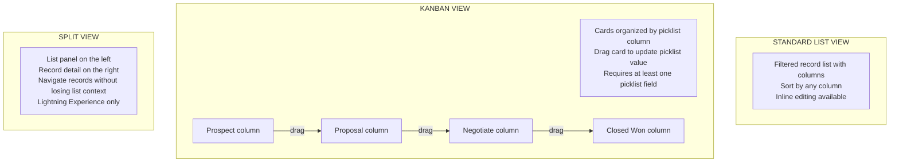

# List Views & Filters

## Exam Domain
Data & Analytics — 14% of exam

## Core Concepts

List Views are filtered lists of records for a specific object. They're the first interface users see when navigating to an object (e.g., clicking "Accounts" shows the default list view of accounts). They're simpler and faster than reports for everyday "show me my records" use cases.

**List View features:**
- Filter records by any accessible field
- Choose which columns to display
- Sort by any column
- Share with specific groups or all users

**List View visibility options:**
- **Only I can see this list view** — private, for your own use
- **All users can see this list view** — public, visible to everyone
- **Share with specific groups of users** — targeted sharing to roles/groups

**Kanban View:**
- Visual drag-and-drop board view (like Trello/Jira boards)
- Available for objects with a picklist field (Opportunity Stage, Case Status, etc.)
- Group records by any picklist field
- Drag cards between columns to update the picklist value
- Can configure which fields show on each card
- Works with any list view that has a picklist grouping

**Split View:**
- Shows list on the left, record detail on the right
- Navigate through records without losing the list context
- Available in Lightning Experience

**Inline Editing in List Views:**
- Edit field values directly in the list view without opening the record
- Must be enabled
- Can edit multiple records at once (bulk edit from list view)

**Filter Logic:**
- Add filter criteria to list views
- Combine with AND/OR logic
- Advanced filter logic: write custom logic like "(1 AND 2) OR 3"

**Pinning a list view:** Users can "pin" a list view to set it as the default view when they navigate to that object.

## PTA / SA Relevance

List Views are the daily operational interface for most Salesforce users. Getting list views right is a UX and adoption decision:

**Common patterns:**
- Sales reps: "My Open Opportunities" as default pinned view
- Support agents: "My Open Cases" + "My Team's Queue" views
- Managers: "All Open Cases – High Priority" for triage

**Kanban for pipeline management:** The Kanban view on Opportunities is the most intuitive pipeline management interface for sales teams. Drag a deal from "Proposal" to "Closed Won" — that's the whole Stage update. Many sales teams prefer this over the classic list view for daily deal management.

**List Views vs Reports:** The exam sometimes asks "should you use a list view or a report?" Practical rule: list view = operational, daily work, simple filters; report = analysis, aggregation, sharing/scheduling, dashboard.

## Architecture / How It Works

**Limitations:**
- List Views don't support aggregation or grouping (use Summary reports for that)
- Kanban view requires at least one picklist field to group by
- Inline editing must be enabled in org settings (can be turned off)
- List Views are per-object — you can't create a list view that shows records from multiple objects
- Sharing "All users" makes the list view visible to everyone — changes to the filter affect all viewers
- Performance: complex filter logic on large datasets can slow list view loading

## Key Facts to Memorize

- List View = filtered record list for one object; simpler than reports
- Kanban View = drag-and-drop board view; group by picklist; updates field on drag
- Split View = list + detail side-by-side in Lightning Experience
- Inline Editing = edit fields directly in the list without opening record
- Visibility: Private | All Users | Specific Groups
- Pinning = setting a list view as default for that object
- Filter Logic: can use AND/OR and custom logic formula (1 AND 2) OR 3

## Exam Traps

- **"Kanban view can group by any field type"** — FALSE. Kanban view requires a picklist field to group by.
- **"List views can show records from multiple objects"** — FALSE. List views are per-object.
- **"Inline editing in list views requires individual record opening"** — FALSE. Inline editing allows editing directly in the list view.
- **"List views support charts and summary calculations"** — FALSE. Use reports for aggregation and charts.

## Practice Questions

**Q:** A sales manager wants to see all Opportunities visually organized by Stage so they can drag deals from one stage to another. What view should they use?
**A:** Kanban View on the Opportunity list view, grouped by Stage field.

**Q:** An admin creates a list view filtered to "My Team's Open Cases" and wants it visible only to the Support Manager role. What visibility option should they choose?
**A:** "Share with specific groups of users" and select the Support Manager role.

**Q:** A support agent wants to update the Status field on 10 cases at once without opening each one. What feature should they use?
**A:** Inline Editing in List Views — check the boxes on multiple records and edit the Status field inline to apply the same value to all selected records.

**Q:** What is the difference between a List View and a Report?
**A:** List Views show filtered records for operational daily use — simple, real-time, no aggregation. Reports support grouping, aggregation, charts, scheduling, and dashboard embedding — they're for analysis. Use list views for "show me my records"; use reports for "summarize and analyze data."
