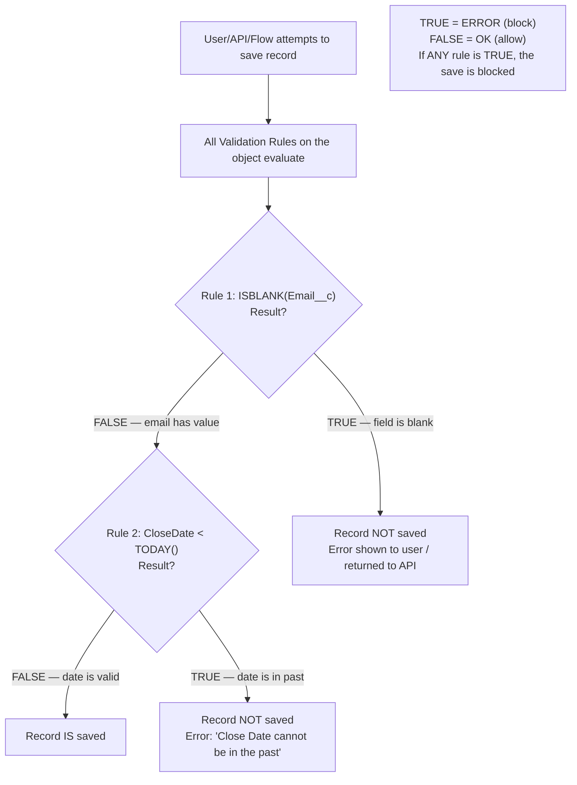

# Validation Rules

## Exam Domain
Workflow/Process Automation — 16% of exam

## Core Concepts

Validation Rules enforce data quality by preventing records from being saved if they don't meet specific criteria. The key mental model: **if the formula returns TRUE, show the error. If FALSE, save the record.**

This seems backwards but it makes sense: the formula asks "Is there a problem?" If the answer is YES (TRUE), block the save.

**The formula result:**
- `TRUE` = invalid data → block the save, show the error message
- `FALSE` = valid data → allow the save to proceed

**Common validation formula functions:**

| Function | Purpose | Example |
|---|---|---|
| `ISBLANK(field)` | True if field has no value | `ISBLANK(Email__c)` |
| `ISNULL(field)` | Legacy; true if null (use ISBLANK for text) | — |
| `ISPICKVAL(picklist, "value")` | True if picklist equals value | `ISPICKVAL(Status, "Closed")` |
| `ISCHANGED(field)` | True if field value changed on this save | `ISCHANGED(Stage)` |
| `ISNEW()` | True if this is a new record (insert) | `ISNEW()` |
| `NOT(condition)` | Negates | `NOT(ISBLANK(Phone))` |
| `AND(a, b)` | Both must be true | — |
| `OR(a, b)` | Either can be true | — |
| `LEN(text)` | Length of text | `LEN(Description) < 10` |
| `REGEX(text, pattern)` | True if text matches pattern | `REGEX(Phone, "[0-9]{10}")` |
| `TODAY()` | Current date | `Close_Date__c < TODAY()` |

**Practical pattern:**
```
Block save if Close_Date is in the past when Stage is not Closed:
AND(
  NOT(ISPICKVAL(StageName, "Closed Won")),
  NOT(ISPICKVAL(StageName, "Closed Lost")),
  CloseDate < TODAY()
)
```
If this returns TRUE → error. If FALSE → OK.

**Validation rules run:**
- When a user saves a record from the UI
- When records are created/updated via API
- When records are imported via Data Import Wizard / Data Loader (unless bypass)
- When a Flow updates a record

**Bypass options (in order of preference):**
1. Use `ISNEW()` or `ISCHANGED()` to scope the rule
2. Custom field `Bypass_Validation__c` (checkbox) + add `NOT(Bypass_Validation__c)` to rule
3. Profile-based bypass (add profile check to rule formula) — not recommended for security

## PTA / SA Relevance

Validation rules are the no-code data quality enforcement layer. They're the right tool for business rules that must be enforced consistently regardless of how data enters the org (UI, API, import, integration).

**Validation rules in integrations:** When an integration fails to write a record, "validation rule failed" is the most common error. The integration developer needs the admin to either: (a) exempt the integration user from specific rules, or (b) ensure the integration sends all required fields. Always document which validation rules exist on objects that receive integration data.

**Performance impact:** Each validation rule requires formula evaluation on every save. Objects with 30+ validation rules on every save operation create overhead. Consolidate rules where possible (use AND/OR logic to combine related checks into one rule).

**The "Required on Page Layout" trap:** Page layout required fields are UI-only. A field not filled in via API bypasses the layout required. If a field MUST have a value in all cases, use a Validation Rule: `ISBLANK(Field__c)`.

## Architecture / How It Works



**Limitations:**
- Validation rules cannot update other records — they only block/allow the current save
- Validation rules run BEFORE Before-Save Flows — if a rule fires, the flow doesn't run
- Cannot easily bypass validation rules for specific users without adding conditions to the formula
- Validation rules are org-wide — they apply to ALL record types unless you add record type conditions
- Maximum 500 active validation rules per object (practical limit is much lower for performance)

## Key Facts to Memorize

- TRUE = ERROR (blocks save); FALSE = OK (allows save)
- ISBLANK works for text + number/date; ISNULL only works for non-text fields
- ISPICKVAL checks picklist value in formulas
- ISCHANGED checks if a field changed on this particular save
- ISNEW checks if this is a record insert (not an update)
- Validation rules run for UI, API, imports, and Flow-triggered saves
- Error message is shown to the user (or returned as API error) when rule fires

## Exam Traps

- **"A validation rule formula returning FALSE blocks the save"** — FALSE. FALSE = allow. TRUE = block.
- **"ISNULL should be used to check if a text field is empty"** — FALSE. Use ISBLANK for text fields. ISNULL returns false for empty text strings.
- **"Validation rules only run when saving from the UI"** — FALSE. They run on all saves: UI, API, import tools, and Flows.
- **"Making a field required on a page layout enforces it everywhere including via API"** — FALSE. Page layout required = UI only. Use a Validation Rule for universal enforcement.
- **"ISCHANGED fires on every save"** — FALSE. ISCHANGED returns TRUE only if the specific field's value was changed on THIS save. It returns FALSE if the field was not modified.

## Practice Questions

**Q:** Write a validation rule that blocks saving a Case if the Priority is "High" but the Account is blank.
**A:**
```
AND(
  ISPICKVAL(Priority, "High"),
  ISBLANK(AccountId)
)
```
If TRUE → error: "High priority cases must be linked to an Account."

**Q:** A validation rule formula: `NOT(ISBLANK(Phone))` — what does this rule do?
**A:** This returns TRUE when Phone is NOT blank (has a value). That would mean the rule fires when phone HAS a value — that seems wrong. More likely intent is `ISBLANK(Phone)` to fire when phone IS blank. This is a logic trap — double-check NOT() usage.

**Q:** An admin wants a validation rule that only runs when a record is first created (not on subsequent edits). What function should they use?
**A:** `ISNEW()`. Add `AND(ISNEW(), [other conditions])` to scope the rule to inserts only.

**Q:** A validation rule blocks an API integration from creating records. The integration is sending all required fields. What else might cause this?
**A:** The validation rule's formula evaluates to TRUE for the data the integration is sending. For example, a date in a specific format, a picklist value not matching ISPICKVAL, or a field the integration doesn't set that the rule checks. Review the specific rule formulas and check what the API is sending.
