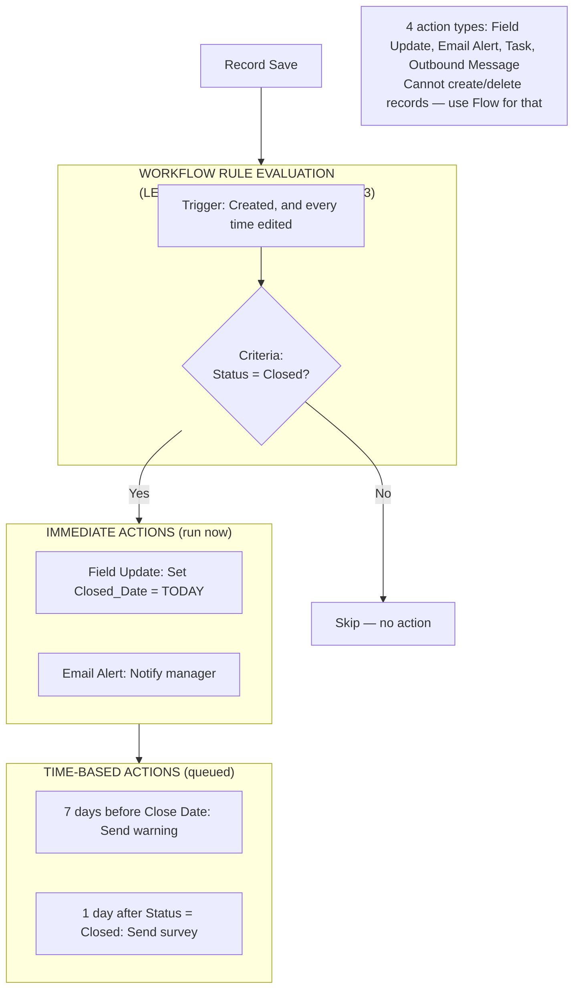

# Workflow Rules (Legacy)

## Exam Domain
Workflow/Process Automation — 16% of exam

## Core Concepts

Workflow Rules are Salesforce's original automation tool — now considered legacy (retired for new orgs after February 2023). You cannot create NEW workflow rules in new Salesforce orgs, but they still appear on the exam because millions of existing orgs have them and admins need to understand them for maintenance.

**Workflow Rules = LEGACY. New automation should use Flow.**

**How Workflow Rules work:**
1. Define a trigger (when does the rule evaluate?)
2. Define criteria (does the record match a condition?)
3. Define immediate or time-based actions (what happens?)

**Three trigger types:**
1. **Created** — fires only when a new record is created
2. **Created, and every time it's edited** — fires on create AND on every edit
3. **Created, and any time it's edited to subsequently meet criteria** — fires once when criteria first becomes true (re-evaluates if criteria is unmet and then met again)

**Four action types:**

| Action | What It Does |
|---|---|
| Field Update | Updates a field value on the triggering record (or parent via M-D) |
| Email Alert | Sends an email to specified recipients using a template |
| Task | Creates a Task record assigned to someone |
| Outbound Message | Sends an XML message to an external web service endpoint |

**Time-Based Actions (Time Triggers):**
- Actions that fire X days/hours BEFORE or AFTER a date field
- Example: "7 days before Close Date, send a reminder email"
- Example: "24 hours after Created Date, if still Open, reassign to manager"
- Time triggers queue up when the rule fires; they're executed by a background process

**Key limitation on Field Updates:** Workflow rule field updates can cause re-evaluation of other workflow rules (cascading). There is a 16-level re-evaluation limit to prevent infinite loops.

## PTA / SA Relevance

Workflow Rules are in every legacy Salesforce org. In your role as a PTA:

**Org assessment:** If a customer has hundreds of workflow rules, that's technical debt. The Salesforce automation recommendation is to migrate workflow rules to Flow over time. Salesforce has provided Migration Tooling to assist with this.

**"Should we migrate our workflow rules?"** Yes — Salesforce is phasing them out. They won't be deleted from existing orgs immediately, but they won't receive new features and they're harder to debug than Flows. The migration conversation is: prioritize rules that are complex or cause problems first; migrate simple rules in bulk.

**Outbound Messages:** Workflow rule Outbound Messages are a legacy integration pattern (SOAP XML to an endpoint). Modern integrations use Flow + Apex Callouts or Platform Events. If you see Outbound Messages in an org, it's a signal of old integration architecture.

## Architecture / How It Works

**Limitations:**
- LEGACY — cannot create new workflow rules in new orgs (post Feb 2023)
- Cannot perform complex logic (no branching, no loops, no subflows)
- Time triggers: if criteria is no longer met when the time trigger fires, action is skipped (or still fires depending on configuration)
- Cannot create or delete records (only update fields, create tasks, send emails, send messages)
- Cannot update child records (only the triggering record or parent via M-D)
- 16-level cascading re-evaluation limit

## Key Facts to Memorize

- Workflow Rules = LEGACY; retire in favor of Flow
- 3 trigger options: Created; Created and every time edited; Created and when criteria subsequently met
- 4 actions: Field Update, Email Alert, Task, Outbound Message
- Time-based actions: trigger X days/hours before/after a date field
- Cannot create or delete records (use Flow for that)
- Cannot branch logic (use Flow for that)
- Maximum 300 workflow rules per object

## Exam Traps

- **"Workflow Rules can create new records"** — FALSE. They can only update fields, create Tasks, send emails, or send outbound messages.
- **"Workflow Rules are the recommended automation tool in new Salesforce implementations"** — FALSE. Flow is the recommended tool. Workflow Rules are legacy.
- **"Time-based actions always fire regardless of current record state"** — FALSE. By default, if the criteria is no longer met when the time trigger fires, the actions may be skipped.
- **"Workflow rules can branch into multiple paths"** — FALSE. Workflow rules have simple criteria → actions; no branching. Use Flow for decision trees.
- **"The four action types are: Field Update, Email Alert, Flow, Task"** — FALSE. The fourth action is Outbound Message, not Flow.

## Practice Questions

**Q:** A company has a workflow rule that sends a task to the account manager 30 days before an Opportunity's Close Date. Which workflow action type and trigger type is this?
**A:** Time-Based Action (Email Alert or Task — 30 days before Close Date field). Trigger: Created, and every time it's edited (to re-calculate when Close Date changes).

**Q:** A workflow rule was set to evaluate "Created, and any time it's edited to subsequently meet criteria." An Opportunity Stage changes from Proposal to Closed Won (criteria = Stage is Closed Won). The rule fires. The Stage changes back to Proposal, then back to Closed Won. Does the rule fire again?
**A:** Yes. "Subsequently meet criteria" means the rule fires each time the criteria transitions from unmet → met. So moving from Proposal → Closed Won (again) triggers it again.

**Q:** Why are workflow rules considered legacy and what should be used instead?
**A:** Workflow Rules were retired for new orgs in February 2023. They are being replaced by Flow (Record-Triggered Flow), which provides greater capabilities: multi-step logic, branching, record creation/deletion, subflows, and better debugging tools.
