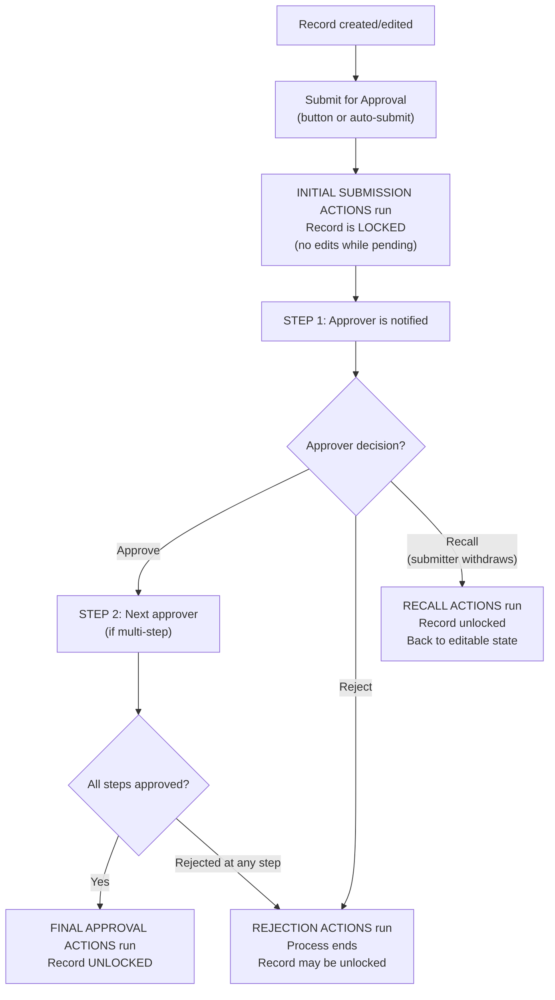

# Approval Processes

## Exam Domain
Workflow/Process Automation — 16% of exam

## Core Concepts

Approval Processes are structured workflows where a record must be reviewed and approved (or rejected) by one or more users before moving forward. Unlike other automation, approval processes require human decisions.

**When to use:** Contract approval, discount authorization, expense approval, new product approval — any business process where a person must explicitly review and sign off.

**The four action sets in an Approval Process:**

| Set | When It Runs |
|---|---|
| Initial Submission Actions | When the record is first submitted for approval |
| Approval Actions | When an approver approves the record |
| Rejection Actions | When an approver rejects the record |
| Recall Actions | When the submitter recalls (withdraws) the request |

Each action set can contain: Field Updates, Email Alerts, Tasks, Outbound Messages (same as workflow rule actions).

**Approval Steps:**
- Multi-step approvals: Step 1 → Step 2 → etc.
- Each step has its own approver and criteria
- Step criteria determines when that step is entered (skip a step if criteria not met)

**Approver options per step:**
- **Specific user:** Named person always approves
- **Related user:** Based on a user field on the record (e.g., "Manager" field = submitter's manager)
- **Role/Queue:** Any member of the role or queue can approve
- **Apex:** Custom logic to determine approver

**Delegated Approver:**
- An approver can designate a delegated approver who can act on their behalf
- Configured in the approver's user record ("Delegated Approver" field)
- Useful when the primary approver is on vacation

**Record Lock:**
- When a record is submitted for approval, it is **locked** — users cannot edit it while it's pending approval
- The submitter and admins can recall/unlock
- Approvers can optionally be allowed to edit locked records (configurable)

**Approval History related list:**
- Shows every approval step, who acted, and the outcome
- Visible on the record

**Multi-Step Approvals:**
- Step 1 approver approves → moves to Step 2 approver
- If Step 1 rejects → Rejection Actions run (process over)
- If Step 2 approves → Approval Actions run (final approval)

## PTA / SA Relevance

Approval Processes are business governance tools. Every enterprise has approval workflows — the question is whether they're in Salesforce or happening via email/Slack outside the system.

**The "offline approval" anti-pattern:** Many companies have approvals happening in email chains while the record in Salesforce shows the pre-approval state. This breaks auditability and compliance. Moving approvals into Salesforce Approval Processes creates an audit trail (Approval History), enforces sequential steps, and reduces the risk of approved data not being updated.

**Approval Process limitations at scale:** Standard Approval Processes don't support parallel approval (multiple approvers must ALL approve before proceeding — each goes in sequence). For complex approval matrices (committee approvals, parallel sign-offs), you need custom Apex or a third-party CPQ/approvals app.

**Chatter approvals:** When an approval request is generated, a Chatter post can be created on the record, notifying stakeholders. Approvers can approve/reject directly from the Chatter feed (mobile-friendly).

## Architecture / How It Works

**Limitations:**
- Standard Approval Processes are sequential (one approver at a time per step) — no native parallel approval
- Record is locked while pending — cannot be edited without recalling first
- Only one approver can be "active" per step at a time (unless using a queue/role with any member can approve)
- Approval Process limit: 1,000 active processes per org
- Cannot create Approval Processes for all objects — limited to standard objects and custom objects

## Key Facts to Memorize

- 4 action sets: Initial Submission, Approval, Rejection, Recall
- Record is LOCKED when submitted for approval
- Multi-step: sequential steps, each step can have its own approver
- Approver types: specific user, related user field, role, queue, Apex
- Delegated Approver = backup approver set by primary approver in their user settings
- Recall = submitter withdraws the approval request (unlocks record)
- Approval Actions run only when ALL steps are approved
- Rejection at any step runs Rejection Actions (process ends)

## Exam Traps

- **"A record can be edited while it's in an approval process"** — FALSE. Records are locked during approval. Must recall to edit.
- **"Rejection actions run when the final step is rejected only"** — FALSE. Rejection actions run when ANY step is rejected (process terminates).
- **"Approval Actions run after each step approval"** — FALSE. Approval Actions only run when the ENTIRE process (all steps) is approved.
- **"A delegated approver can approve on behalf of anyone"** — FALSE. A delegated approver can only act for the specific user who designated them as their delegate.
- **"Initial Submission Actions run when approval is granted"** — FALSE. Initial Submission Actions run when the record is SUBMITTED, before any approval decisions.

## Practice Questions

**Q:** A contract is submitted for approval. Before any approver acts, the sales rep realizes there was an error in the contract. What must the rep do to edit the record?
**A:** Recall the approval request. This runs the Recall Actions and unlocks the record. The rep can then fix the error and resubmit.

**Q:** An Approval Process has 3 steps. Step 2 is rejected. What happens?
**A:** The Rejection Actions run immediately. The approval process ends — Step 3 is not reached. The record may be unlocked (depending on Rejection Action configuration) and the submitter is notified.

**Q:** An approver is going on vacation for 2 weeks. What should they configure to ensure approvals aren't blocked?
**A:** Set a Delegated Approver on their User record. Their delegate can approve/reject requests on their behalf while they're away.

**Q:** An admin needs to automatically lock a field to "Pending" status when a deal is submitted for approval and then change it to "Approved" when all steps are approved. What action sets should contain these field updates?
**A:** Initial Submission Actions: field update to "Pending." Approval Actions: field update to "Approved." (Note: Approval Actions run only after ALL steps are approved.)
