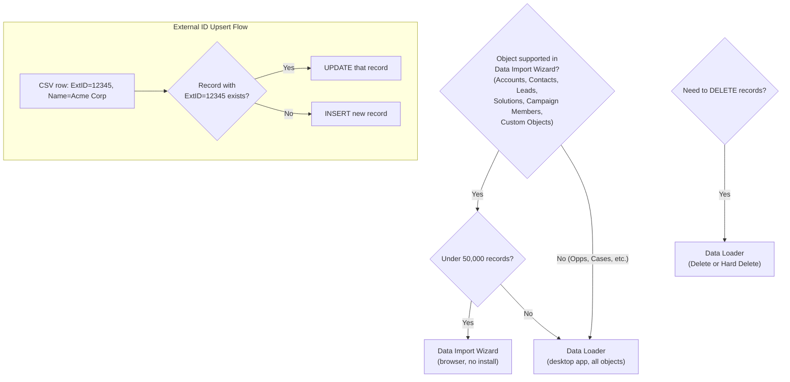

# Data Import & Export

## Exam Domain
Data & Analytics — 14% of exam

## Core Concepts

Salesforce provides two main import tools and two export mechanisms. Knowing which to use for which scenario is a frequent exam topic.

**Data Import Wizard:**
- Browser-based tool (no software installation)
- Access: Setup → Data Import Wizard OR App Launcher
- Supported objects: Accounts, Contacts, Leads, Solutions, Campaign Members, and Custom Objects
- **NOT supported:** Opportunities, Cases, Products, and most other standard objects
- Maximum records: **50,000 per import job**
- Operations: Insert, Update, Upsert (if object has External ID)
- File format: CSV
- Duplicate handling: can match on Name or Email to avoid duplicates

**Data Loader:**
- Desktop application (Windows/Mac) — must be installed
- All objects supported (every standard and custom object)
- Maximum records: **5,000,000 per file** (practical limit is much higher with batching)
- Operations: Insert, Update, Upsert, Delete, Hard Delete, Export, Export All
- **Upsert** = Insert or Update based on External ID field match
- **Hard Delete** = permanently deletes records (bypasses Recycle Bin)
- Requires Salesforce API access
- Runs in batch mode — scheduled execution possible

**Data Export:**
- Setup → Data Management → Data Export
- Exports all data from the org to CSV files
- Can be scheduled: Weekly or Monthly
- **Download window: 48 hours** — the export zip file is only available for 48 hours to download
- Full org backup use case

**External ID:**
- A custom field marked as "External ID" on an object
- Used by Data Loader for Upsert operations: if a record with this External ID exists, update it; if not, insert it
- Multiple fields can be External IDs per object
- The External ID field should be marked as "Unique" to prevent duplicates
- Also used for relationship resolution in data loads (refer to related records by External ID instead of Salesforce ID)

**Key comparison:**

| | Data Import Wizard | Data Loader |
|---|---|---|
| Setup required | No (browser) | Yes (install app) |
| Objects | Limited (Accounts, Contacts, Leads, Solutions, Campaign Members, Custom) | All objects |
| Max records | 50,000 | 5,000,000 |
| Delete? | No | Yes (Delete + Hard Delete) |
| Hard Delete? | No | Yes |
| Upsert? | Yes (limited) | Yes (with External ID) |
| Scheduling? | No | Yes (command line) |

## PTA / SA Relevance

Data migration is one of the most common and most risk-prone activities in Salesforce projects. Every new implementation involves loading historical data from a previous system.

**The External ID architecture pattern:** Always design with External IDs on every custom object (and relevant standard objects) before starting a data migration. The External ID enables:
1. Upsert without Salesforce IDs (idempotent loads — run the load multiple times safely)
2. Parent record lookup by external system ID during hierarchical loads
3. Reconciliation after migration (match Salesforce records back to source system)

**Hard Delete in Production:** Treat Hard Delete as a dangerous operation. In Production, data deleted via Hard Delete bypasses the Recycle Bin — there's no recovery path. Always validate in Sandbox first, and always have a backup (Data Export) before running Hard Delete in Production.

**The 50K limit conversation:** Data Import Wizard's 50K limit sounds fine for initial loads, but for large organizations migrating millions of Accounts, you need Data Loader. Larger migrations need Data Loader + external scripting (Python, etc.) to split files and handle errors.

## Architecture / How It Works

**Limitations:**
- Data Import Wizard: no delete capability, no hard delete
- Data Loader: requires installation; API access required; learning curve for non-technical admins
- Data Export: 48-hour download window — miss it and you have to re-generate
- Hard Delete: bypasses Recycle Bin — permanent, no recovery
- CSV must have proper encoding (UTF-8) and column headers matching field API names for Data Loader
- Validation rules, workflow rules, and flows fire during Data Loader imports (unless you bypass them with specific settings)

## Key Facts to Memorize

- Data Import Wizard: browser, limited objects, max 50K, no delete
- Data Loader: desktop app, all objects, max 5M, includes Delete and Hard Delete
- Upsert = Insert OR Update based on External ID match
- External ID = custom field used as unique key for upsert and relationship resolution
- Hard Delete = permanent delete, bypasses Recycle Bin
- Data Export: Setup → Data Management → Data Export; 48-hour download window
- Data Loader requires API access (not available in all editions)
- Operations in Data Loader: Insert, Update, Upsert, Delete, Hard Delete, Export, Export All

## Exam Traps

- **"Data Import Wizard supports all standard objects"** — FALSE. Limited to: Accounts, Contacts, Leads, Solutions, Campaign Members, and Custom Objects.
- **"Data Loader can only process 50,000 records"** — FALSE. That's the Data Import Wizard limit. Data Loader handles up to 5 million.
- **"Deleted records from Data Loader always go to the Recycle Bin"** — FALSE. "Hard Delete" bypasses the Recycle Bin permanently.
- **"External ID must be the standard Salesforce ID"** — FALSE. External ID is a custom field you create, containing IDs from an external system.
- **"Data Export files are available indefinitely"** — FALSE. The download link expires after 48 hours.

## Practice Questions

**Q:** An admin needs to import 75,000 Lead records from a CSV file. Which tool should they use?
**A:** Data Loader. Data Import Wizard has a maximum of 50,000 records. Data Loader handles up to 5 million.

**Q:** A company is migrating from a legacy CRM. They want to load Accounts and then Contacts that reference those Accounts. They don't have Salesforce IDs for the Accounts yet. How should they handle the Account lookup on Contact records?
**A:** Create an External ID field on Account. Load Accounts first using their legacy system ID as the External ID. Then load Contacts, referencing the Account's External ID in the Contact CSV instead of Salesforce Account ID. Data Loader resolves the relationship by External ID.

**Q:** A data steward wants to permanently remove 5,000 test records from Production without them landing in the Recycle Bin. What Data Loader operation should they use?
**A:** Hard Delete. This permanently removes records, bypassing the Recycle Bin. (Use with extreme caution — no recovery path.)

**Q:** What is the download window for a Data Export file before it expires?
**A:** 48 hours. After that, you must generate a new export.
