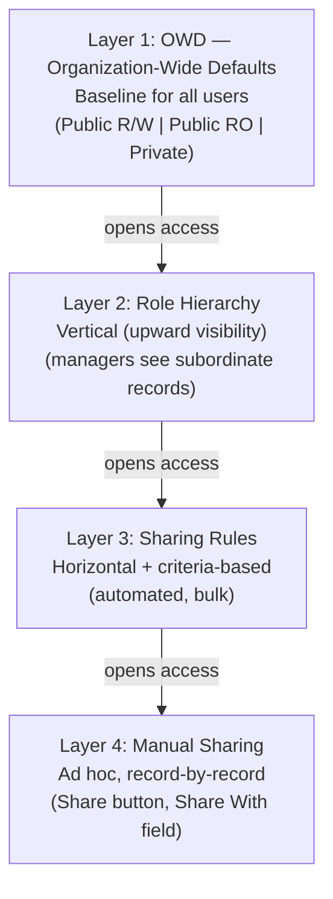

# L03: Salesforce Security Model

## Exam Domain
Salesforce Fundamentals — 23% of exam weight

---

## Core Concepts

### The Four-Layer Model (Additive Access)
The key thing to understand is that Salesforce security is **additive and layered** — you start with a restrictive baseline and open access up, never the reverse. The four layers are: OWD (baseline) → Role Hierarchy (vertical open-up) → Sharing Rules (horizontal open-up) → Manual Sharing (ad hoc open-up). Each layer can only grant access that the layer above it restricted. You cannot use sharing rules to restrict access that OWD already grants.

### OWD — Organization-Wide Defaults
OWD sets the **most restrictive baseline** for each object. Options: Public Read/Write (anyone can see and edit), Public Read Only (anyone can see, only owner/above can edit), Private (only owner and role hierarchy above can see). On exam questions, "set OWD to Private" means "only the owner should have base access." Anything more open has to be granted explicitly by the other layers.

### Role Hierarchy
The role hierarchy automatically gives visibility **upward** — a manager's role sees all records owned by all roles below them. This is automatic and cannot be turned off per object (except for objects where "Grant Access Using Hierarchies" can be disabled). Role hierarchy does not restrict access — it only expands it upward from OWD.

### Sharing Rules
Sharing rules extend access **horizontally** (across roles at the same level) or by criteria (based on field values). Two types: ownership-based (share records owned by Role A with Role B) and criteria-based (share records where Status = Active with all users). Sharing rules can only open access further from OWD — they cannot make access more restrictive.

### Field-Level Security (FLS) and Profiles
FLS controls which users can **see or edit individual fields**, separate from whether they can see the record. A user might have read access to an Account record but be blocked from seeing the Revenue field via FLS. New custom fields are **hidden by default** for all profiles except System Administrator — this is a common exam trap. Profiles define a user's base permissions; Permission Sets add on top.

### Profiles vs. Permission Sets
Profiles are mandatory (every user has exactly one) and define the minimum access level. Permission Sets are optional additions assigned on top of a profile — they can only grant more access, never restrict. Best practice: keep profiles lean with the minimum required access, use Permission Sets for app-specific or role-specific additions.

---

## PTA / SA Relevance

**In architecture reviews:** The most common enterprise security mistake is using OWD = Public Read/Write for everything and then trying to restrict with validation rules. Validation rules are not a security layer — they only fire on save. If OWD is Public Read/Write, any user can view any record. Get the OWD right first.

**For regulated industries:** Healthcare, Financial Services, and government implementations almost always require OWD = Private on core objects, with sharing rules to open access for specific teams. This is the "least privilege" principle. Architect around it from Day 1 — retrofitting Private OWD onto an existing org with Public Read/Write is painful.

**Profiles vs. Permission Sets:** From Spring 2026 onward, Salesforce has been pushing hard toward Profile-light architectures — a single Minimum Access profile for everyone, with all functional access in Permission Sets and Permission Set Groups. Architect with this in mind now.

**Governor limits:** Sharing rules are evaluated at query time. In an org with tens of thousands of sharing rules, SOQL queries take longer. If a customer complains about report performance, the security model is often a contributing factor. Sharing groups and territory management are the enterprise answer to complex sharing at scale.

---

## Architecture / How It Works

Note: Each layer can ONLY grant more access. None can restrict what a lower layer already allows.

**Limitations:**
- Sharing rules cannot restrict access below OWD — OWD is the floor
- Role hierarchy cannot be per-record — it's structural and applies uniformly
- Manual sharing is lost when a record's owner changes (must be re-applied)

| OWD Setting | Who can see/edit this record? |
|---|---|
| Public Read/Write | All users — anyone can see and edit |
| Public Read Only | All users can see; only owner/roles above can edit |
| Private | Only record owner + roles above in hierarchy (+ Sys Admin) |

**Limitations:**
- There is no "Public No Access" OWD — Private is the most restrictive option
- System Administrators always see all records regardless of OWD

| Control Type | What it controls |
|---|---|
| Field-Level Security (FLS) | Whether user can see/edit the field at all — enforced by API, reports, and UI |
| Page Layout | Which fields appear on the edit screen — UI only, does not enforce via API |
| Required (FLS / field definition) | Field must have a value — enforced everywhere including API |
| Required (Layout only) | Field required in the UI only — API can bypass this |

**Limitations:**
- Removing a field from a page layout does NOT hide it from users — FLS must be used for true field hiding
- "Required on layout" can be bypassed by API tools like Data Loader

---

## Key Facts to Memorize
- Security is additive — layers only open access, never restrict below OWD
- OWD options: Public Read/Write | Public Read Only | Private | (Controlled by Parent for MD)
- Role Hierarchy = automatic upward visibility for record ownership
- Sharing Rules: ownership-based OR criteria-based; cannot restrict, only expand
- Manual Sharing: lost when owner changes; requires "Manual Sharing" OWD setting
- New custom fields are **hidden from all profiles** except System Administrator by default
- Every user must have exactly one Profile; Permission Sets are optional and additive
- FLS hides the field entirely; page layout just removes it from the UI form
- "Controlled by Parent" OWD = detail record in Master-Detail inherits parent's sharing

---

## Exam Traps
- **Sharing rules cannot restrict access.** A scenario that says "we want to prevent Sales reps from seeing each other's deals" requires OWD = Private — not a sharing rule. Sharing rules only open access.
- **New custom fields are hidden by default.** If a user cannot see a new field, check FLS before checking the page layout. The field may simply not be visible for their profile.
- **Page layout ≠ security.** Removing a field from a page layout does not prevent API access or report access to that field. FLS is the true security control.
- **Role Hierarchy runs automatically on record ownership.** A manager's role does not need a sharing rule — the hierarchy grants upward visibility automatically.
- **Manual sharing is lost on owner change.** If a record is reassigned to a new owner, any manually shared access with other users is removed.
- **"Controlled by Parent" is only an OWD option for detail objects in Master-Detail relationships.** It means the detail record's sharing follows the master record's OWD settings.

---

## Practice Questions

**Q:** An organization has set Opportunity OWD to Private. A Sales Director says they cannot see Opportunities owned by their reps. What is the most likely explanation?
**A:** The Sales Director's role is not above the reps' roles in the Role Hierarchy. Private OWD grants visibility upward through the hierarchy — if the Director is not in a higher role, they won't see rep-owned records automatically.

**Q:** A new custom field "SSN__c" is created on Contact. A support rep reports they cannot see the new field even though it appears on the page layout. What should be checked first?
**A:** Field-Level Security (FLS). New custom fields are hidden by default for all profiles except System Administrator. The support rep's profile likely has FLS set to "Hidden" for that field.

**Q:** An admin wants to share all Opportunity records where Stage = Prospecting with the Business Development team's role. Which mechanism should be used?
**A:** A criteria-based Sharing Rule — share Opportunity records where Stage = Prospecting with the Business Development role. Sharing rules handle automated, criteria-based access expansion efficiently.
