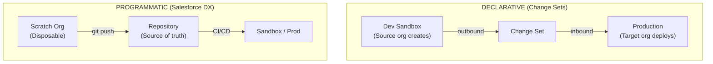
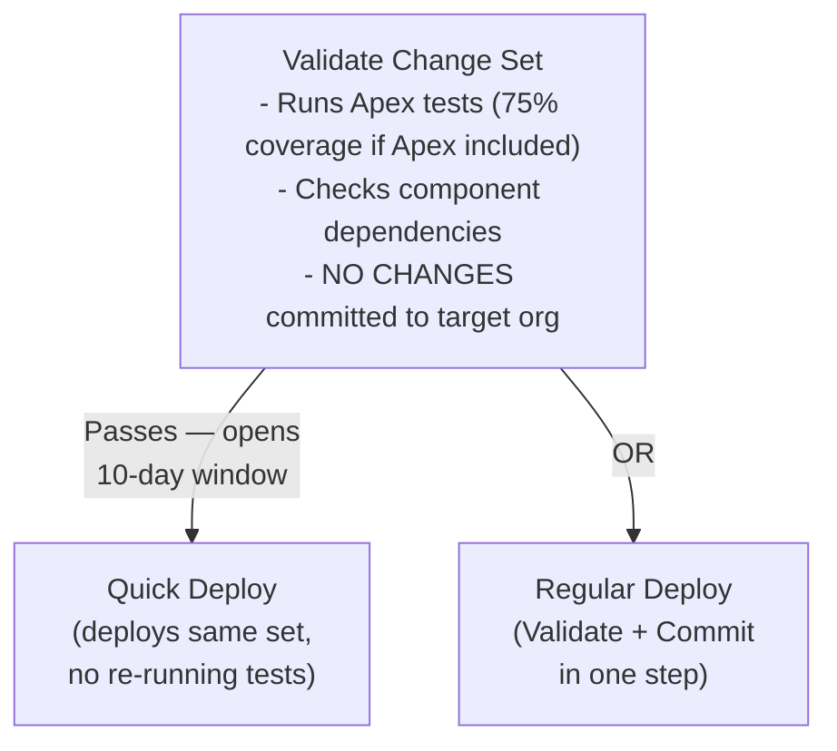

# L04: Environment Strategy

## Exam Domain
App Deployment — 10% of exam weight

---

## Core Concepts

### Sandbox Types
Salesforce provides four sandbox types with different data, storage, and refresh frequency. The key thing to understand is that choosing the wrong sandbox type for a use case is a common mistake — Developer sandboxes have no production data, which makes them useless for testing data-dependent logic. The sandbox type must match the testing purpose.

### Change Sets
A change set is the declarative way to move metadata between related orgs (same Salesforce environment). Outbound change sets are created in the source org; inbound change sets are deployed in the target org. The deployment connection must be authorized in the **target org** — not the source. Change sets are one-directional and cannot be rolled back after deployment.

### The Sandbox-to-Production Pipeline
Every enterprise deployment should follow a path: Developer Sandbox → Partial or Full Sandbox (QA/UAT) → Production. Never build directly in production. Scratch orgs (Salesforce DX) provide an alternative developer-sandbox workflow for teams using CI/CD.

### Validate vs. Deploy vs. Quick Deploy
"Validate" runs all deployment checks (including Apex test execution) without actually committing changes — it's a dry run. If validation passes, you have a 10-day window to use "Quick Deploy" to deploy the same change set without re-running tests. This is valuable for change freeze windows — validate during business hours, quick-deploy during off-hours.

### 75% Apex Test Coverage
Any production deployment that includes Apex code requires at least 75% code coverage across ALL Apex in the org, and every trigger must have at least 1 test. This is a hard platform requirement — not a company policy. Declarative-only change sets (no Apex) do not require test coverage to deploy.

---

## PTA / SA Relevance

**In project scoping:** The first question for any new implementation is "what's the environment strategy?" A solo admin doing lightweight customization might use one Dev sandbox and change sets. An enterprise team with multiple feature tracks needs isolated developer sandboxes per stream, integration testing in a Partial sandbox, UAT in a Full sandbox, and a defined deployment window.

**For DevOps conversations:** Salesforce DX (scratch orgs + unlocked packages + CI/CD) is the modern answer to the change-set limitation of no version control. If a customer asks "how do we get better at deployment," the answer is a DevOps Center or Copado/Gearset, not bigger change sets.

**Change freeze windows:** Production orgs typically have change freeze windows around major Salesforce releases (the 3/week week before a release goes live). Validate your change set before the window opens, then quick-deploy when the window is safe. This is real-world advice that comes up in customer conversations.

**Data migration in sandboxes:** Full sandbox = copy of production data. This is critical for testing ETL jobs, data migrations, or data-dependent flows. Partial sandbox gives a 5GB sample — enough for functional testing but not volume testing.

---

## Architecture / How It Works

| Sandbox Type | Storage | Refresh | Best For |
|---|---|---|---|
| Developer | 200MB (no data) | Daily | Development, unit build — no production data |
| Developer Pro | 1GB (no data) | Daily | Larger dev work, team development |
| Partial Copy | 5GB (sample data) | 5 days | QA, integration testing with representative production data |
| Full | All data (full copy) | 29 days | UAT, performance/load testing, regression |

**Limitations:**
- Full sandbox refresh takes up to 24–48 hours for large orgs
- Sandbox data is a snapshot at refresh time — it doesn't stay in sync with production
- You cannot selectively include specific records in a Developer sandbox (no data at all)
- Sandboxes created from production count against sandbox license limits

Deployment Connection for change sets: MUST be authorized in the TARGET org.

**Limitations:**
- Change sets cannot be rolled back — once deployed, you must manually reverse each change
- Change sets have no version control — you cannot diff two change sets
- Scratch orgs expire (default 7 days, max 30 days) — they are temporary by design
- Not all metadata types are supported by change sets — some require Salesforce CLI

**Limitations:**
- Quick Deploy window is exactly 10 days — if you miss it, re-validate
- Quick Deploy only works if the org hasn't changed since validation (new code/flows may invalidate the window)
- Validation failure does not block the source org — it only reports what would fail

---

## Key Facts to Memorize
- Four sandbox types: Developer (200MB, no data, daily) / Developer Pro (1GB, daily) / Partial (5GB, sample data, 5-day) / Full (all data, 29-day)
- Change sets: Outbound created in source; inbound deployed in target
- Deployment connection must be authorized in the **TARGET** org (not source)
- Validate = dry run, no changes committed; passes unlock 10-day Quick Deploy window
- Quick Deploy = deploy same change set without re-running tests (within 10 days)
- 75% Apex code coverage required for ANY production deployment that includes Apex
- Every Apex trigger must have at least 1 test method
- Declarative-only change sets (no Apex) do NOT need 75% coverage to deploy
- Scratch orgs expire: default 7 days, maximum 30 days

---

## Exam Traps
- **Deployment connection authorized in TARGET.** Questions about change set setup always test where the deployment connection is authorized — it's the target org, not the source. The target decides who can deploy into it.
- **Validate doesn't commit.** If a question asks what happens when you click "Validate" on a change set, the answer is that tests run and results are shown, but NO changes are deployed.
- **75% is an org-level rule.** The 75% Apex coverage is calculated across all Apex in the org, not just the Apex in the change set being deployed. Adding Apex to a change set can fail deployment if other Apex in the org is poorly covered.
- **Full sandbox refresh = 29 days minimum.** You cannot refresh a Full sandbox more frequently than every 29 days. If a scenario says you need daily fresh data, that's not possible with a Full sandbox.
- **Change sets have no rollback.** Deploying a change set is one-way. The only "rollback" is manually reversing each component.

---

## Practice Questions

**Q:** A developer builds a change set in the Dev sandbox and attempts to deploy it to production, but the deployment connection doesn't exist. Where must the connection be authorized?
**A:** In the production org (the target). Deployment connections are authorized in the target org, not the source.

**Q:** An App Builder clicks "Validate" on a change set that includes a Flow and an Apex class. What happens?
**A:** The validation runs all Apex tests (to check the 75% coverage requirement) and verifies that all change set components can be added to the target org, but no changes are actually committed. If validation passes, a 10-day Quick Deploy window opens.

**Q:** A team needs to test a complex Flow with real customer data before deploying to production. Which sandbox type should they use?
**A:** Full sandbox — it contains a full copy of production data including all records. Partial Copy contains sample data and may work, but for testing with real customer data, Full is the correct answer.
