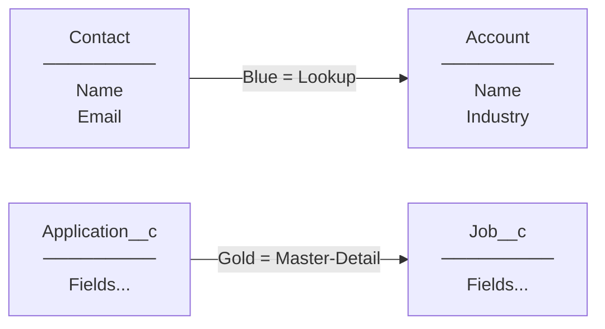

# L07: Schema Builder

## Exam Domain
Data Modeling & Management — 22% of exam weight

---

## Core Concepts

### What Schema Builder Is (and Isn't)
Schema Builder is a visual canvas inside Setup that lets you see your entire data model at once — objects, fields, and relationships displayed as a diagram. The key thing to understand is what Schema Builder **cannot do**: it cannot delete fields or objects, it cannot configure Field-Level Security, and it cannot manage page layouts. It's a visual design and creation tool, not a full administration tool.

### Creating Objects and Fields in Schema Builder
You can drag a new object onto the canvas, name it, and add fields to it — all within Schema Builder. This is faster than the Object Manager for initial data model design because you can see the relationships forming visually as you build. You can also create relationship fields by drawing a line between objects on the canvas.

### Color Coding in Relationships
Schema Builder uses color to distinguish relationship types: **blue lines = Lookup relationships**, **gold/orange lines = Master-Detail relationships**. This is a commonly tested exam fact. Knowing the color at a glance tells you the relationship type without reading labels.

### When to Use Schema Builder
Schema Builder is best for: getting a visual overview of a complex data model, creating multiple related objects at once, and showing stakeholders how objects relate. It's not the right tool for day-to-day field-level administration (use Object Manager for that).

---

## PTA / SA Relevance

**In design workshops:** Schema Builder screenshots make excellent whiteboard artifacts for architecture reviews. You can print or screenshot the canvas to show a customer their current data model before proposing changes.

**Limitation awareness for customers:** Clients often expect Schema Builder to be a full ER diagram tool. It's close, but it doesn't show FLS, page layouts, or validation rules. For a complete data model audit, you'll need a tool like Metazoa or the Object Manager list view.

**Discovery output:** After a data model discovery session, build the proposed model in Schema Builder to validate relationships and spot missing junction objects before you start creating metadata. It's faster to rearrange lines in Schema Builder than to recreate relationships after they're built.

---

## Architecture / How It Works

**Schema Builder key:** Left panel shows the objects list. Canvas displays objects as entity boxes. Blue lines = Lookup relationships. Gold lines = Master-Detail relationships. Click an object to see its fields; draw a line to create a relationship.

**Limitations:**
- Schema Builder does NOT show: FLS settings, validation rules, page layouts, triggers, flows
- Cannot delete objects or fields from Schema Builder (use Object Manager)
- Cannot configure Field-Level Security from Schema Builder
- Large orgs with hundreds of objects can become difficult to navigate on the canvas
- Schema Builder shows a point-in-time snapshot — it does not auto-refresh

| Action | Can Do? | Alternative |
|---|---|---|
| View object relationships | YES | — |
| Create new custom objects | YES | Object Manager |
| Create new fields | YES | Object Manager |
| Create relationship fields | YES | Object Manager |
| Delete fields | NO | Object Manager |
| Delete objects | NO | Object Manager |
| Configure FLS | NO | Profiles / Permission Sets |
| Configure page layouts | NO | Object Manager |
| Edit validation rules | NO | Object Manager |
| View standard objects | YES | — |
| Export/print diagram | NO* | Screenshot tool |

**Limitations:**
- There is no native export-to-image or export-to-PDF feature in Schema Builder
- Schema Builder is browser-based and can be slow with 50+ objects selected

---

## Key Facts to Memorize
- Schema Builder = visual canvas for data model overview and creation
- Blue lines = Lookup relationships; Gold/Orange lines = Master-Detail relationships
- CAN do: view relationships, create objects, create fields, create relationship fields
- CANNOT do: delete objects/fields, configure FLS, manage page layouts, view validation rules
- Found at: Setup → Schema Builder
- Best use: visual data model design and stakeholder demonstrations

---

## Exam Traps
- **Schema Builder cannot delete.** Any question that says "use Schema Builder to delete a field" is wrong. Deletion requires Object Manager.
- **Color coding is testable.** Blue = Lookup, Gold = Master-Detail. Don't confuse the two.
- **Schema Builder doesn't configure FLS.** If a question mentions configuring field visibility or security, the answer is Profiles or Permission Sets — not Schema Builder.
- **You can create objects AND fields in Schema Builder.** Some questions try to trick you into thinking it's view-only. You can create — you just can't delete.

---

## Practice Questions

**Q:** A developer is using Schema Builder and notices that two objects are connected by a gold-colored line. What does this indicate?
**A:** The gold/orange line indicates a Master-Detail relationship between the two objects.

**Q:** An admin tries to use Schema Builder to delete a field that is no longer needed. What will happen?
**A:** Schema Builder does not support deleting fields. The admin must navigate to Setup → Object Manager → the specific object → Fields & Relationships, then delete the field from there.

**Q:** Which of the following tasks can be completed directly within Schema Builder? (A) Create a new custom object, (B) Set field-level security on a field, (C) Delete a custom field, (D) Add a field to a page layout.
**A:** A — Create a new custom object. Schema Builder supports creating objects and fields but cannot configure FLS, delete fields, or manage page layouts.
