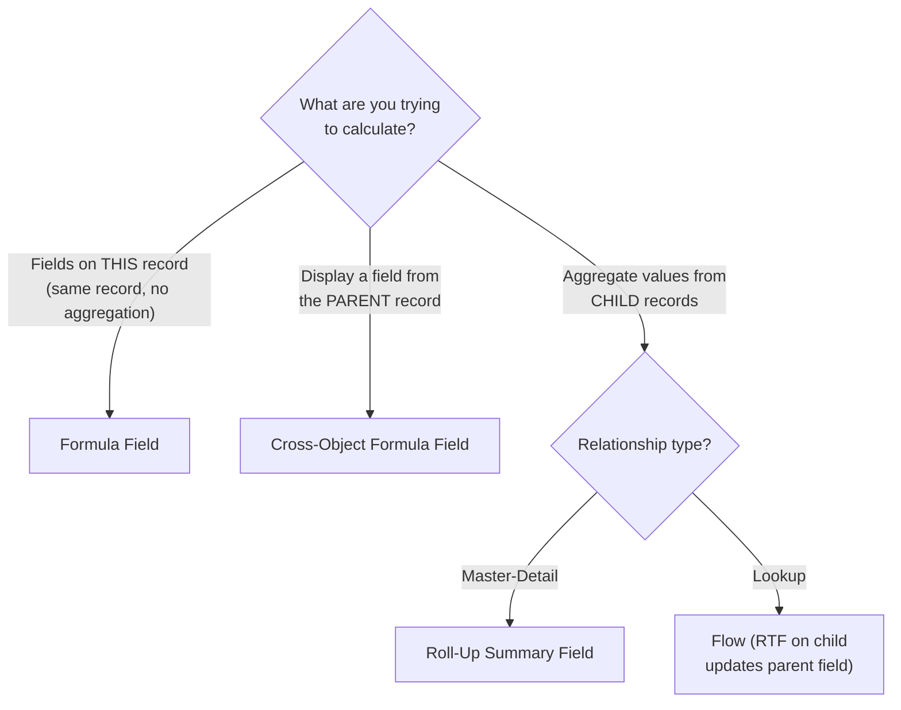
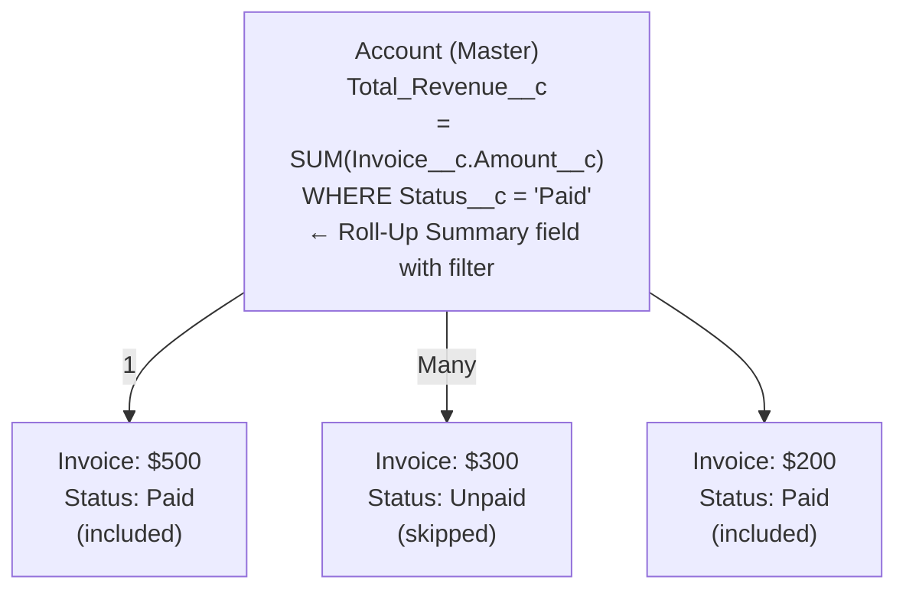

# L09: Formula & Roll-Up Summary Fields

## Exam Domain
Data Modeling & Management — 22% of exam weight

---

## Core Concepts

### Formula Fields — What They Are
Formula fields are **read-only, runtime-calculated** fields. The key thing to understand is that there is no stored value — every time you view a record, the formula re-evaluates from the current state of the source fields. Users cannot edit a formula field. If a requirement says "users should be able to override the calculated value," a formula field is the wrong tool. Use a Flow-populated regular field instead.

### Key Formula Functions
The functions you need to know cold: **IF(condition, true, false)** for conditional logic, **CASE(field, val1, result1, ..., else)** for switch-style matching, **BLANKVALUE(field, default)** as a null safety net, **ISBLANK(field)** for checking if a field is empty (works for all types including text), **ISNULL(field)** for checking null (reliable for numbers/dates, NOT for text fields), **TEXT(value)** to convert non-text to text, **TODAY()** for current date, **NOW()** for current date/time.

### ISBLANK vs. ISNULL — The Exam Distinction
ISBLANK works for all field types including text — use it whenever you're checking if a text field is empty. ISNULL only works reliably for Number, Currency, and Date fields. For text fields, a field can be "empty string" (not null) but ISNULL will return false even though the field appears blank to users. Default to ISBLANK unless you have a specific reason to use ISNULL.

### Cross-Object Formulas
Formula fields can reference fields on parent records using the relationship name with `__r` notation (for custom lookups) or the standard relationship name (for standard lookups). You can traverse up to **5 levels** deep in a single formula. This lets a child record display parent or grandparent data without any automation.

### Roll-Up Summary Fields
Roll-Up Summary fields aggregate values from **detail records** in a Master-Detail relationship up to the master record. The four functions: **COUNT** (count of matching child records), **SUM** (sum of a numeric field), **MIN** (minimum value), **MAX** (maximum value). Optional filter criteria let you aggregate only child records that match specific conditions. Automatic — updates in near-real-time when child records change.

---

## PTA / SA Relevance

**Formula complexity:** Enterprise orgs often have formulas with 50+ nested IFs and 2,000+ characters. These are fragile, slow to load, and almost impossible to maintain. When reviewing a large org, flag these as technical debt and recommend refactoring into a Flow-populated helper field.

**Roll-Up performance at scale:** Roll-Up Summary fields recalculate synchronously when any detail record changes. In high-volume orgs (100,000+ detail records per parent), this can cause "row lock" contention — multiple detail records saving simultaneously compete to update the same parent. If a customer reports slow saves on child records, check whether a Roll-Up Summary on the parent is the bottleneck.

**Formula limitations for integrations:** Formula fields are not populated in the database — they're calculated at runtime. External systems querying Salesforce via API will get formula field values, but they're computed on the fly. This is fine for occasional queries but can be slow for bulk exports of objects with many formula fields.

**Lookup aggregation architecture:** When a customer needs to SUM values from children in a Lookup relationship (no Master-Detail), the declarative solution is a Record-Triggered Flow on the child that updates a counter field on the parent. Be prepared to recommend this pattern as the "no-code" alternative to changing the relationship type.

---

## Architecture / How It Works

**Limitations:**
- Formula fields cannot aggregate across multiple records — no SUM/COUNT in a formula
- Roll-Up Summary requires Master-Detail — cannot be used with Lookup relationships
- Cross-object formulas can only traverse UP (parent direction), never DOWN (child direction)

| Function | Use Case |
|---|---|
| `IF(c, t, f)` | Two-branch conditional logic |
| `CASE(v, v1, r1, else)` | Switch — matches discrete values |
| `BLANKVALUE(f, d)` | Return field or default if blank/null |
| `ISBLANK(f)` | True if field is blank — ALL types (use this) |
| `ISNULL(f)` | True if field is null — numbers/dates only |
| `TEXT(v)` | Convert non-text to text (for concatenation) |
| `VALUE(t)` | Convert text to number |
| `TODAY()` | Returns today as Date |
| `NOW()` | Returns current date+time as DateTime |
| `DATEVALUE(dt)` | Strip time from DateTime to Date |
| `&` | String concatenation operator (NOT `+`) |

**Limitations:**
- `+` operator is for numeric addition — it will NOT concatenate text strings
- `&` is the string concatenation operator in Salesforce formulas
- ISNULL on a text field is unreliable — a field can have an empty string that isn't technically null
- Circular formula references are not allowed and will cause a compile error

Result: $500 + $200 = $700 — only Paid invoices are included in the sum.

**Limitations:**
- Roll-Up Summary with filter criteria only counts/sums records matching the filter — unmatched records are excluded entirely
- You can have multiple Roll-Up Summary fields on the same master looking at the same child object with different filters
- Roll-Up Summary fields cannot reference formula fields on the child object (only stored fields)

---

## Key Facts to Memorize
- Formula fields: read-only, runtime-calculated, no stored value, users cannot edit
- ISBLANK works for all field types; ISNULL only reliable for Number/Currency/Date
- String concatenation uses `&`, not `+`
- Cross-object formula: up to 5 levels deep, uses `__r` notation for custom relationships
- Roll-Up Summary: Master-Detail only, on the master object, functions: COUNT/SUM/MIN/MAX
- Roll-Up Summary with filter criteria: only aggregates child records matching the filter
- Lookup relationship aggregation: use a Record-Triggered Flow, not Roll-Up Summary
- TODAY() returns Date; NOW() returns DateTime; DATEVALUE() converts DateTime to Date

---

## Exam Traps
- **`&` not `+` for string concatenation.** Using `+` with text values causes a type error. The formula editor will validate this but it's a common mistake.
- **Roll-Up Summary = Master-Detail only.** If the scenario describes a Lookup, the answer is NOT a Roll-Up Summary.
- **Formula fields cannot aggregate.** A formula field on the master cannot SUM child records. That's what Roll-Up Summary is for.
- **ISBLANK vs. ISNULL on text fields.** For text fields, always use ISBLANK. ISNULL may return false even when the field appears empty because an empty string is not the same as null.
- **Cross-object formulas are parent-direction only.** You can traverse from a child to a parent to a grandparent. You cannot traverse from a parent to its children in a formula.

---

## Practice Questions

**Q:** An App Builder needs a formula that shows "Overdue" if Due_Date__c is before today, "Due Today" if it equals today, and "On Track" otherwise. What formula structure is best?
**A:** Nested IF functions: `IF(Due_Date__c < TODAY(), "Overdue", IF(Due_Date__c = TODAY(), "Due Today", "On Track"))`. CASE is for matching discrete values, not comparisons. Multiple conditions based on comparisons require nested IFs.

**Q:** A company has Opportunity records with a Lookup to a custom Region__c object. The business wants to show the total Opportunity amount per Region on the Region__c record. What declarative approach should be used?
**A:** A Roll-Up Summary cannot be used because the relationship is a Lookup (not Master-Detail). The solution is a Record-Triggered Flow on the Opportunity object that updates a Total_Amount__c field on the related Region__c record whenever an Opportunity's Amount or Region changes.

**Q:** An App Builder writes a formula: `FirstName + " " + LastName`. Users report a formula error on some records. What is most likely wrong?
**A:** Two issues: (1) `+` should be `&` for string concatenation in Salesforce formulas — `FirstName & " " & LastName` is the correct syntax. (2) If either field could be blank/null, wrapping them in `BLANKVALUE(field, "")` would prevent null-related errors.
