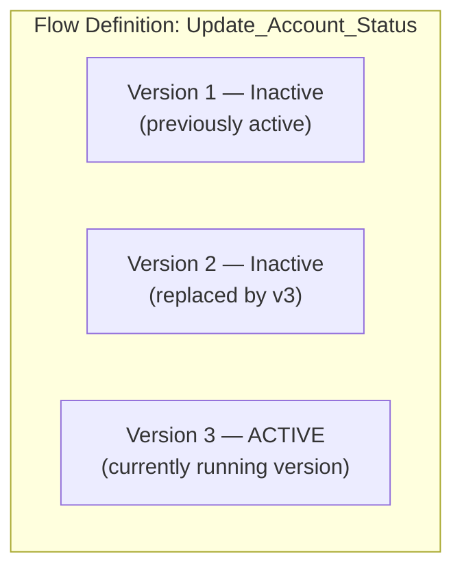

# L11: Flow Builder Fundamentals

## Exam Domain
Business Logic & Process Automation — 28% of exam weight

---

## Core Concepts

### Five Flow Types — Know All of Them
The key thing to understand is that each Flow type has a specific trigger and use case. **Screen Flow** — user-facing wizard with UI; must be launched manually (Quick Action, button, Lightning page). **Record-Triggered Flow** — triggers on record save (insert/update/delete); can run Before-Save or After-Save. **Schedule-Triggered Flow** — runs on a time schedule against a batch of records. **Platform Event-Triggered Flow** — triggers when a Platform Event message is received; integration pattern. **Auto-launched Flow** — no trigger; called by Apex, Processes, or other Flows (also invocable via REST API). Process Builder is **deprecated** — Flows replace it entirely.

### Flow Elements vs. Resources
In Flow Builder, the canvas contains **Elements** (the actions/steps): Screen, Get Records, Create Records, Update Records, Delete Records, Assignment, Decision, Loop, Subflow, etc. **Resources** are the data containers: Variables (store values), Formulas (calculated values), Constants, Text Templates, and Choices (for screen components). Resources live in the sidebar and are referenced by elements.

### Versioning
A Flow can have multiple versions, but **only one version can be active at a time**. When you activate a new version, the previous version becomes inactive. Running flows (currently executing) finish on their version; new starts use the active version. This is important for deploying Flow updates — you activate the new version and the old one is deactivated.

### Fault Paths
Every element that interacts with the database (Get Records, Create Records, Update Records, Delete Records) can have a **Fault Path** — the path the Flow takes if that element fails at runtime. Without a fault path on a DML element, an unhandled error causes the Flow to abort with a generic Salesforce error message visible to the user. Best practice: always add a Fault Path that shows a custom screen or sends a failure notification.

### Debug Mode
Flow Builder has a built-in **Debug** button that lets you run a Flow step-by-step in the Builder without deploying it. For record-triggered flows, you can select an existing record to use as the trigger. Debug shows input/output values at each element. Always debug before activating.

---

## PTA / SA Relevance

**Flow vs. Apex decision:** The declarative-first rule applies here too. If a business requirement can be solved with a Flow, it should be a Flow — not Apex. The key scenarios where Flow genuinely can't solve it: complex dynamic SOQL (variable object names), HTTP callouts in the same transaction as DML, complex conditional branching with 10+ nested conditions. Everything else should be evaluated as a Flow first.

**Flow performance at scale:** Each "Get Records" element inside a Loop generates a SOQL query per iteration — this will hit governor limits fast. Design Flows to collect IDs in a loop and query in bulk outside the loop (using "Get Records" with a collection filter before the loop). This is the most common Flow performance issue in enterprise orgs.

**Process Builder migration:** Salesforce announced Process Builder retirement. All existing Process Builder automation should be migrated to Flows. The migration path: Salesforce provides a Flow Migration Tool in Setup that can convert simple Process Builder processes to Flows automatically. Complex ones require manual rewrite.

**Testing Flows:** Flows have no built-in unit test framework like Apex. For record-triggered flows, create test records in a sandbox to validate behavior. For screen flows, the debug runner in Flow Builder is the primary testing mechanism. Enterprise teams should create formal test scripts with expected outcomes for each Flow.

---

## Architecture / How It Works

| Flow Type | When it runs / Use case |
|---|---|
| Screen Flow | User manually launches; has UI screens → Guided wizards, data entry processes |
| Record-Triggered (Before Save) | Record insert/update/delete → Set field values on triggering record |
| Record-Triggered (After Save) | Record insert/update/delete → Create/update related records, send emails |
| Schedule-Triggered | Runs on a schedule (daily, hourly, etc.) against a batch of records → Nightly batch updates, reminders |
| Platform Event-Triggered | Triggered by receipt of a Platform Event message → Integration event processing |
| Auto-launched Flow | No trigger; called by Apex, other Flows, or REST API → Reusable logic, API-callable processes |

**Limitations:**
- Screen Flows cannot be directly triggered by record changes — only by user action or embedded launch
- Only one Flow version can be active at a time per Flow definition
- Auto-launched Flows cannot contain Screen elements (no UI)
- Schedule-Triggered Flows run in batches of up to 2,000 records per batch (API limit)

**Flow Builder Canvas Elements**

**Data Elements:**
- **Get Records** — Query records (like SOQL SELECT)
- **Create Records** — Insert new records
- **Update Records** — Update existing records
- **Delete Records** — Delete records

**Logic Elements:**
- **Decision** — Branch the flow (like IF/ELSE)
- **Assignment** — Set or modify variable values
- **Loop** — Iterate over a collection

**Screen Elements** (Screen Flows only):
- **Screen** — Display UI to the user

**Call Elements:**
- **Subflow** — Call another Flow
- **Action** — Call an Invocable Action (Apex, email, etc.)

**Limitations:**
- Loops cannot be nested (a Loop inside a Loop) in the same Flow
- Get Records inside a Loop = one SOQL query per iteration → governor limit risk
- Delete Records element cannot be used in Before-Save Record-Triggered Flows

New executions always use the ACTIVE version. Flows in progress when a version changes complete on the version they started on.

**Limitations:**
- You cannot have 2 active versions of the same Flow simultaneously
- Activating a new version immediately deactivates the previous active version
- Inactive versions are kept for reference but cannot be run

---

## Key Facts to Memorize
- Five flow types: Screen / Record-Triggered / Schedule-Triggered / Platform Event-Triggered / Auto-launched
- Process Builder is deprecated — use Record-Triggered Flows instead
- One active Flow version at a time — activating new version deactivates previous
- Fault paths: handle errors from DML elements; without fault paths, unhandled errors show generic messages
- Get Records inside a Loop = SOQL per iteration = governor limit risk
- Auto-launched Flows: no trigger, no Screen elements, callable by Apex/other Flows/API
- Flow debug: available in Flow Builder, step-by-step, works with real record data
- Scheduled-Triggered Flows run in batches of 2,000 records per transaction

---

## Exam Traps
- **Process Builder is deprecated/retired.** Any exam scenario that includes "Process Builder" as an answer option is likely the wrong answer if a Flow option is available.
- **Only one active version.** If a new version is activated, the old active version is deactivated — they cannot both be active.
- **Screen Flows require user action.** A Screen Flow cannot auto-trigger from a record save. It must be launched by a user (button, Quick Action, Lightning page).
- **Auto-launched Flows cannot have Screens.** If you need a Flow callable by Apex with no UI, it's Auto-launched. If it needs screens, it's a Screen Flow — and Screen Flows cannot be called by Apex in the same way.
- **Get Records in a loop = SOQL limit.** This is the most common Flow performance trap on the exam.

---

## Practice Questions

**Q:** A business needs to automatically create a follow-up Task record 7 days after an Opportunity is marked Closed Won. No user interaction is needed. Which Flow type is best?
**A:** Record-Triggered Flow (After-Save). It triggers automatically when the Opportunity is saved with Stage = Closed Won. If the 7-day delay needs to happen from record save, use a Scheduled Path within the Record-Triggered Flow.

**Q:** An App Builder activates Version 3 of a Flow. What happens to Version 2, which was previously active?
**A:** Version 2 is automatically deactivated. Only one version can be active at a time. Any Flow executions that were already in progress on Version 2 will complete on Version 2, but all new executions will use Version 3.

**Q:** A Flow has a "Create Records" element with no Fault Path configured. The element fails at runtime due to a validation rule error. What does the user experience?
**A:** The user sees a generic Salesforce error message and the Flow terminates. To provide a better user experience, a Fault Path should be added to the Create Records element, routing to a Screen element that shows a friendly error message.
