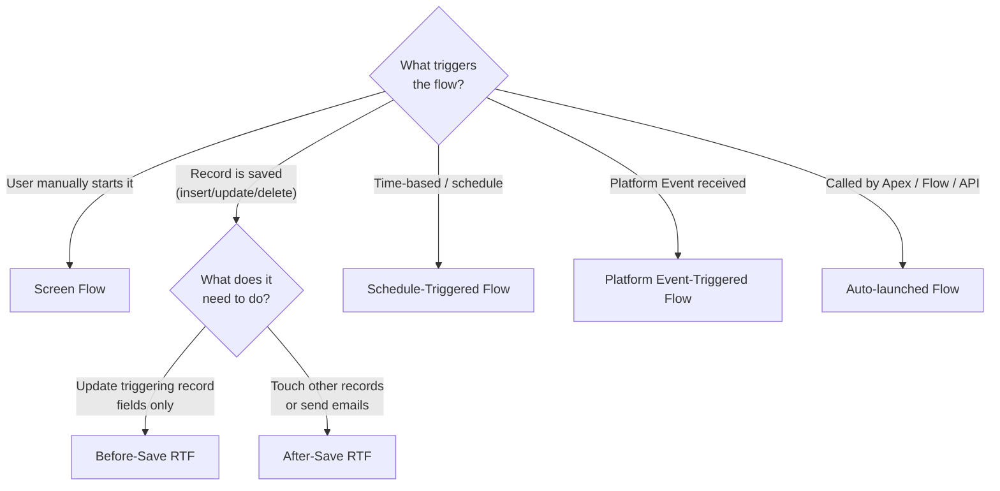

# L15: When to Use Which Automation Tool

## Exam Domain
Business Logic & Process Automation — 28% of exam weight

---

## Core Concepts

### The Declarative-First Hierarchy
The key thing to understand for every automation question: try to solve it at the lowest-complexity level first. The hierarchy is: (1) Formula field or default field value (no automation, just configuration), (2) Validation Rule (prevent bad data entry), (3) Record-Triggered Flow (automated logic on record save), (4) Screen Flow (user-guided process), (5) Approval Process (human review with formal approve/reject), (6) Apex trigger (when declarative tools genuinely can't meet the requirement). If a simpler tool works, use it.

### The 10-Question Decision Framework
Before choosing a tool, answer: (1) Does a human need to interact? (Screen Flow or Approval Process) (2) Is it triggered by a record save? (Record-Triggered Flow) (3) Does it run on a schedule? (Scheduled-Triggered Flow) (4) Does it enforce data quality? (Validation Rule) (5) Does it calculate a displayed value? (Formula Field) (6) Does it need a formal approval? (Approval Process) (7) Does it aggregate child records? (Roll-Up Summary if MD, Flow if Lookup) (8) Does it need complex programmatic logic? (Apex) (9) Is it triggered by an integration event? (Platform Event-Triggered Flow) (10) Can it be called from multiple places? (Auto-launched Flow)

### Why Tool Selection Is on the Exam
Almost every exam scenario question has multiple technically-possible answers but one "best" answer. "Best" usually means: most declarative, most maintainable, most appropriate for the use case. An Apex trigger that could solve a problem is rarely the best answer if a Flow can also solve it — unless the scenario explicitly requires something Flow can't do.

### Process Builder Is Gone
Process Builder and Workflow Rules are both deprecated/legacy. Any exam scenario that could be solved with either of these is now solved with a Record-Triggered Flow. Don't propose Process Builder on the exam — Flow is the answer.

---

## PTA / SA Relevance

**In architecture reviews:** The automation tool selection is one of the most common governance issues in mature Salesforce orgs. Orgs built 5+ years ago often have: Workflow Rules, Process Builders, Triggers, and Flows all doing similar things on the same objects. This creates unpredictable order-of-execution issues. The recommendation is always to consolidate onto a single automation layer per object where possible.

**Apex vs. Flow governance:** One of the biggest architectural debates is "should this be a Flow or Apex?" The rule of thumb: if a Salesforce admin could be expected to maintain it over 5 years without developer support, it should be a Flow. If it requires code review, unit tests, and a developer, it's Apex. The lines are blurring as Flow capabilities expand, but complex multi-object transactions with error handling still benefit from Apex.

**Total automation footprint:** In high-volume orgs, the question isn't just "which tool" but "how many total automations run on this object on every save?" Each automation costs SOQL queries, DML operations, and CPU time. Customers sometimes have 15+ automations firing on a single Opportunity save — this causes performance issues. Architecture reviews must include an automation inventory.

---

## Architecture / How It Works

| Requirement | Best Tool |
|---|---|
| Display calculated value (read-only) | Formula Field |
| Aggregate child records (Master-Detail) | Roll-Up Summary Field |
| Prevent bad data on save | Validation Rule |
| Update field on same record (on save) | Before-Save Record-Triggered Flow |
| Update related record (on save) | After-Save Record-Triggered Flow |
| Create related record (on save) | After-Save Record-Triggered Flow |
| User-guided multi-step wizard | Screen Flow |
| Formal human approval workflow | Approval Process |
| Nightly/scheduled batch processing | Schedule-Triggered Flow |
| Process integration event message | Platform Event-Triggered Flow |
| Reusable logic called from many places | Auto-launched Flow |
| Complex multi-object transaction | Apex |
| HTTP callout (sync, same transaction) | Apex |

**Limitations:**
- This matrix shows "best" tool — multiple tools are often technically possible
- Flows have governor limits too — they're not infinitely scalable
- Apex has a test coverage requirement (75%) that Flows don't — factor in maintenance cost

**Limitations:**
- A Screen Flow cannot be called by a Record-Triggered Flow (they're user-facing)
- A Record-Triggered Flow cannot have Screen elements
- An Auto-launched Flow cannot have Screen elements
- Only Screen Flows can pause

| Scenario | Wrong Answer | Right Answer |
|---|---|---|
| Auto-update related record on save | Workflow Rule | RTF After-Save |
| SUM child records (Lookup relationship) | Roll-Up Summary | Flow / Apex |
| Enforce data quality on save | Flow | Validation Rule |
| Formal approve/reject with record locking | Flow | Approval Process |
| Time-delayed action from record save | Apex | RTF Scheduled Path |
| User fills out form to create record | Validation Rule | Screen Flow |
| Display total of child records (Master-Detail) | Flow | Roll-Up Summary |

---

## Key Facts to Memorize
- Formula field: display/calculate, no trigger, read-only
- Validation Rule: prevent bad data, fires on save, TRUE = error
- Before-Save RTF: update triggering record fields, 0 extra DML, no related records
- After-Save RTF: update/create/delete related records, full DML
- Screen Flow: user-driven wizard, must be manually launched
- Approval Process: human approve/reject, record locking, formal workflow
- Schedule-Triggered Flow: time-based batch processing on a schedule
- Platform Event-Triggered: integration pattern, event-driven
- Auto-launched Flow: reusable, called from Apex/other Flows/API
- Process Builder + Workflow Rules = deprecated/legacy, don't use for new builds

---

## Exam Traps
- **Validation Rules are not for automation.** Validation Rules prevent bad data — they don't create records, send emails, or update related records.
- **Roll-Up Summary is not a Flow.** When a scenario says "aggregate child values" and the relationship is Master-Detail, Roll-Up Summary is the right tool — not a Flow. Flows are for Lookup aggregation.
- **Screen Flows don't auto-trigger.** If a scenario requires something to happen automatically when a record is saved without user interaction, it's NOT a Screen Flow.
- **Apex is a last resort.** The exam strongly favors declarative solutions. Only choose Apex when the scenario describes something that genuinely can't be done declaratively (HTTP callouts, complex multi-object transactions, etc.).
- **Before-Save = field updates only.** Creating a record, sending an email, updating a different object — these all require After-Save.

---

## Practice Questions

**Q:** An App Builder needs to: (1) prevent a Discount field from exceeding 50%, and (2) automatically create a "Discount Request" record when a discount is saved above 30%. Which tools cover each requirement?
**A:** (1) Validation Rule — prevent bad data (discount > 50% should error). Formula: `Discount_Percent__c > 50`. (2) After-Save Record-Triggered Flow — triggered on save, creates a related record. The Flow checks if Discount > 30%, then creates the Discount Request record.

**Q:** A company needs their contracts to be reviewed and formally approved by a Legal Director before they can be countersigned. Contracts should be locked during review. Which tool should be used?
**A:** Approval Process. It provides the formal approve/reject workflow, record locking during review, email notifications to the Legal Director, and final actions to update the contract status on approval.

**Q:** An App Builder is asked to show the total number of active Cases on each Account in the Account's header section. Cases have a standard Lookup relationship to Account. What is the correct declarative approach?
**A:** A Roll-Up Summary field cannot be used because Cases have a Lookup (not Master-Detail) relationship to Account. The solution is an After-Save Record-Triggered Flow on Case that updates a counter field (Number) on the related Account whenever a Case is created, updated (status changes), or deleted.
