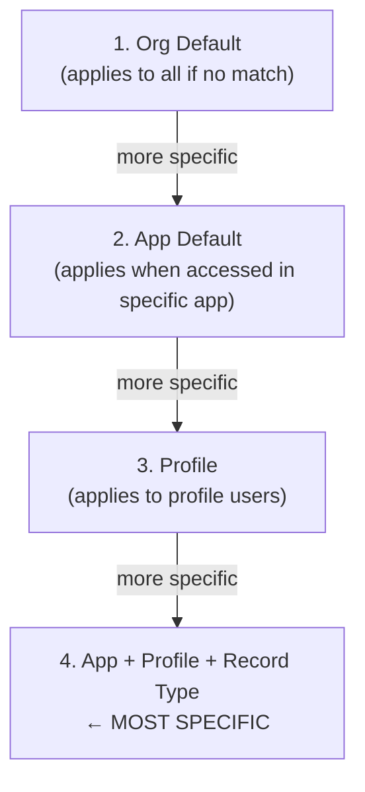

# L16: Lightning App Builder

## Exam Domain
User Interface — 17% of exam weight

---

## Core Concepts

### Three Page Types
Lightning App Builder creates three types of pages: **App Page** (full-screen custom page accessible from the App Launcher or navigation bar), **Record Page** (the detail view for a specific object's records — replaces the standard record detail page), and **Home Page** (the org's or app's home page). Each page type supports different regions and component types. The most complex to configure is the Record Page, which supports Dynamic Forms and Dynamic Actions.

### Page Activation Hierarchy
Record Pages have a four-level activation hierarchy, and the most specific assignment wins: (1) **Org Default** — fallback for all records on this object; (2) **App Default** — applies when a user accesses the record from a specific app; (3) **Profile** — applies to all users with a specific profile; (4) **App + Record Type + Profile** — the most specific combination. When determining which page a user sees, Salesforce picks the most specific matching activation.

### Dynamic Forms
Dynamic Forms move fields off the standard page layout and onto the Lightning Record Page as independent field sections, each with their own visibility rules. The key benefit: instead of maintaining multiple page layouts (one per record type / profile combination), you can have one page with field-group sections that show/hide based on conditions. This simplifies layout management significantly. Available on custom objects and select standard objects.

### Dynamic Actions
Dynamic Actions control the visibility of Action buttons in the Highlights Panel based on conditions (field values, profile, form factor, custom permission). Instead of showing all buttons to all users, buttons appear only when the conditions are right. Example: show "Submit for Approval" button only when Status = Draft.

### Component Visibility Rules
Any component on a Lightning Record Page can have visibility rules that control whether that component shows or hides. Supported conditions: **Field Value** (show when a field equals a specific value), **Profile** (show to users with a specific profile), **Form Factor** (Desktop vs. Mobile), **Custom Permission** (show to users with a specific custom permission). Rules can be combined with AND/OR logic.

---

## PTA / SA Relevance

**Dynamic Forms for complex UIs:** Before Dynamic Forms, managing different field sets per profile and record type required 10+ page layouts. Dynamic Forms with component visibility rules can consolidate all of this into one page. This is a significant architectural simplification for large implementations.

**Activation hierarchy as governance:** The App + Profile + Record Type activation is powerful but needs governance. In large orgs, it's common to find 40+ Lightning page activations on a single object, many of which conflict or are redundant. Page activation should be documented and audited during architecture reviews.

**Mobile considerations:** Lightning Record Pages have separate Mobile layouts. Components visible on desktop can be hidden on mobile. Form Factor visibility rules are the clean way to manage this. Don't design pages purely for desktop without testing the mobile experience.

**Dynamic Actions limitation:** Dynamic Actions are only available for the Highlights Panel on Record Pages. Action buttons in the related list rows or Quick Action panes are not controlled by Dynamic Actions — those still come from the page layout.

---

## Architecture / How It Works

**Three Page Types**

**App Page**
- Full-screen, like a dashboard
- Accessible from App Launcher or navigation tab
- No record context (no single record displayed)
- Uses: landing pages, custom dashboards, utility pages

**Record Page**
- The detail view for a specific object's records
- Has record context (shows fields from the record)
- Supports: Dynamic Forms, Dynamic Actions, Related Lists
- Activated per: App, Profile, Record Type combination

**Home Page**
- The landing page for an app or org
- Can show: Report Charts, Dashboards, Tasks, News
- Activated per: App or Org Default

**Limitations:**
- App Pages do not have record context — components that require a record (like Related Lists) are not available
- Home Pages do not have record context either
- You cannot add custom Lightning Web Components to a page unless they have the correct `targetConfigs` metadata declaring which page types they support

Most specific activation wins. If a user has Profile A, Record Type B, and is in App C, the App + Profile + Record Type activation takes precedence over Org Default.

**Limitations:**
- You cannot assign a Lightning page at the Record Type level alone (must include App and Profile)
- Page activations do not cascade — there's no inheritance from less-specific to more-specific
- Deactivating a page with specific activations does NOT remove the activations — they must be manually removed first

**Dynamic Forms vs. Standard Page Layout Fields**

| Approach | How it works |
|---|---|
| **Standard (old way)** | Multiple page layouts, each assigned to a Profile + Record Type combination. 20 layout combinations = 20 separate layouts to maintain. |
| **Dynamic Forms (new way)** | ONE Lightning Page with field sections. Each section has visibility rules (by profile, field value, form factor, custom permission). All controlled in a single page. |

**Limitations:**
- Dynamic Forms are not yet available for all standard objects (Activity, Knowledge have limitations)
- Dynamic Forms require the page to be a Lightning Record Page (not a standard page layout)
- Field visibility rules in Dynamic Forms don't enforce security — FLS still controls who can see/edit the field regardless of visibility rules

---

## Key Facts to Memorize
- Three page types: App Page / Record Page / Home Page
- Record Page activation hierarchy: Org Default → App → Profile → App+Profile+RecordType (most specific wins)
- Dynamic Forms: fields as independent components with visibility rules; replaces multiple page layouts
- Dynamic Actions: control button visibility in Highlights Panel by conditions
- Component visibility conditions: Field Value / Profile / Form Factor / Custom Permission
- Form Factor: Desktop vs. Mobile — use to show different components on different devices
- Dynamic Forms available on custom objects and select standard objects (not all standard objects yet)

---

## Exam Traps
- **Most specific activation wins.** If a user has both a Profile activation and an App+Profile+RecordType activation, the App+Profile+RecordType wins — not the first one found.
- **Dynamic Forms don't replace FLS.** Hiding a field section via a visibility rule doesn't prevent users from seeing the field via API or reports. FLS is still the security control.
- **App Pages have no record context.** Components that need a record ID (Related List, Record Form) don't work on App Pages. They only work on Record Pages.
- **Dynamic Actions = Highlights Panel only.** Dynamic Actions control the action buttons in the record's top Highlights Panel. Buttons in related lists or other areas are not controlled by Dynamic Actions.
- **Component visibility and security are separate.** Component visibility rules control what appears on the page. FLS and sharing control whether users can actually access the underlying data.

---

## Practice Questions

**Q:** A company wants sales reps to see a "Submit for Approval" button only when an Opportunity's Stage is "Negotiation/Review." What feature controls this?
**A:** Dynamic Actions — configure the "Submit for Approval" button visibility with a condition: StageName = "Negotiation/Review." The button appears in the Highlights Panel only when this condition is true.

**Q:** An App Builder wants to show different fields on a Case record page to Support Reps vs. Support Managers, without creating two separate page layouts. What feature enables this?
**A:** Dynamic Forms — enable Dynamic Forms on the Case record page and add field sections with component visibility rules. Configure field sections: one section showing manager-only fields with a visibility rule "Profile = Support Manager," another with rep fields visible to all.

**Q:** A Lightning Record Page is activated as an "App Default" for the Service Console app, and also as a "Profile" activation for the "Support Specialist" profile. A Support Specialist accesses the Case record from within the Service Console app. Which page activation applies?
**A:** The "Profile" activation (Support Specialist profile) — it is more specific than the "App Default" activation. If there were an "App + Profile" activation, that would be even more specific and win instead.
