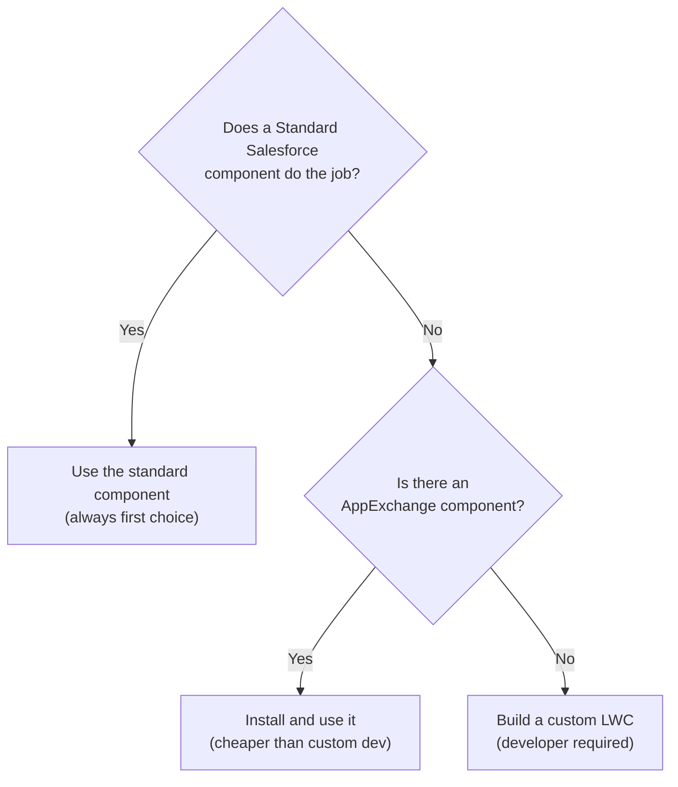

# L17: Lightning Components Overview

## Exam Domain
User Interface — 17% of exam weight

---

## Core Concepts

### Standard Components vs. Custom Components
Lightning App Builder includes a library of **standard components** provided by Salesforce — Chatter Feed, Related List, Report Chart, Knowledge Article, Recent Items, Rich Text, etc. These are always available and require no development. When standard components aren't enough, you add **custom components** (Lightning Web Components or Aura components) built by developers. The decision flow: standard component → AppExchange component → custom LWC (in that order of preference).

### LWC vs. Aura
**Lightning Web Components (LWC)** are the modern standard (introduced 2019, Spring 2024+ = default recommendation). They're based on web standards (HTML, JavaScript, CSS) and perform better than Aura. **Aura components** are the older framework, still supported but no longer the recommended choice for new development. If the exam asks which to use for new custom components, the answer is LWC. Existing Aura components don't need to be rewritten unless there's a compelling reason.

### targetConfigs Metadata
For a custom LWC to appear in Lightning App Builder as a draggable component, the developer must declare `<targetConfigs>` in the component's metadata (`.js-meta.xml` file). This specifies which page types the component supports (Record Page, App Page, Home Page) and what configurable properties it exposes. Without this metadata, the component doesn't show up in the App Builder component palette.

### Page-Type-Specific Standard Components
Some standard components only work on specific page types. For example, **Related List** and **Record Form** components require record context — they only work on Record Pages (not App Pages or Home Pages). **Report Chart** works on Record Pages, App Pages, and Home Pages. Knowing which components are available on which page types is testable.

### AppExchange Components
Beyond standard Salesforce components, partners publish Lightning components on AppExchange. These must pass Salesforce security review. They're installed just like packages and become available in the App Builder component palette after installation.

---

## PTA / SA Relevance

**LWC architecture for App Builder:** When a business requirement goes beyond what standard components offer, the custom LWC is the answer. For App Builder integration, the LWC needs: (1) `@api` properties for values configurable in the properties panel, (2) `targetConfigs` in the metadata declaring which page types to support, (3) `@wire` service decorators to get record data from the platform without explicit SOQL.

**LWC @wire service pattern:** The most common App Builder LWC pattern is using `@wire(getRecord, { recordId: '$recordId', fields: [...] })` to reactively load the current record's data. The `recordId` property comes from the page context automatically when the component is on a Record Page and has `recordId` declared as an `@api` property.

**Aura-to-LWC migration:** If a customer asks about migrating Aura components, the usual answer is "migrate when you rebuild, not as a standalone effort." Aura still works and Salesforce has not announced deprecation. But new components should always be LWC.

**Component properties panel:** Configurable LWC properties (declared with `@api`) appear in the Lightning App Builder properties panel when the component is selected. This allows admins to configure the component without code changes — e.g., set a title string, a record field to display, a filter. Design LWC with admin-configurable `@api` properties whenever possible.

---

## Architecture / How It Works



**Limitations:**
- Standard components cannot be modified — you get what Salesforce provides
- AppExchange components require security review but may have limitations and licensing costs
- Custom LWC requires developer skills and ongoing maintenance — highest cost option

**LWC Component File Structure for App Builder**

```
my-custom-component/
├── myCustomComponent.html          ← Template (UI)
├── myCustomComponent.js            ← Controller/Logic
├── myCustomComponent.css           ← Styles
└── myCustomComponent.js-meta.xml  ← Metadata
     <targets>
       <target>lightning__RecordPage</target>
       <target>lightning__AppPage</target>
     </targets>
     <targetConfigs>
       <targetConfig targets="lightning__RecordPage">
         <property name="myTitle" type="String"/>  ← configurable in App Builder
       </targetConfig>
     </targetConfigs>
```

**Limitations:**
- Components without valid `targetConfigs` metadata don't appear in App Builder's component palette
- `@api recordId` must be declared for the component to receive the current record's ID from the page
- LWC components cannot directly access fields from the record without `@wire` or explicit SOQL via Apex

| Component | App Page | Record Page | Home Page |
|---|---|---|---|
| Chatter Feed | | ✓ | |
| Related List | | ✓ | |
| Related List - Single | | ✓ | |
| Record Form / Details | | ✓ | |
| Report Chart | ✓ | ✓ | ✓ |
| Dashboard | ✓ | ✓ | ✓ |
| Recent Items | ✓ | | ✓ |
| Rich Text | ✓ | ✓ | ✓ |
| Flow (Screen Flow) | ✓ | ✓ | ✓ |
| Highlights Panel | | ✓ | |
| Activity Timeline | | ✓ | |

**Limitations:**
- Record-specific components (Related List, Chatter, Record Form) are NOT available on App Pages or Home Pages — they require record context
- The Flow component on a Home Page or App Page won't automatically receive a record ID (no record context on those page types)

---

## Key Facts to Memorize
- Standard → AppExchange → Custom LWC (decision hierarchy for component selection)
- LWC = modern standard (Spring 2024+); Aura = legacy, still supported, not recommended for new builds
- `targetConfigs` in `.js-meta.xml` = required for LWC to appear in App Builder palette
- Record-specific components (Related List, Record Form, Chatter) only work on Record Pages
- AppExchange components available after installation as draggable App Builder components
- `@api recordId` property needed for LWC to receive the current record's ID from the page context
- `@wire` service: reactive data fetching — component auto-updates when record data changes

---

## Exam Traps
- **Components must declare target page types.** A custom LWC won't appear in App Builder unless its metadata declares which page types it supports (`<target>` in `js-meta.xml`).
- **Aura vs. LWC for new builds.** LWC is the answer for new custom development. Aura is acceptable for maintaining existing code but wrong as a recommendation for new builds.
- **Standard components first.** Any scenario that can be solved with a standard component should use it. Building a custom LWC to do what Related List already does is over-engineering.
- **Related List requires record context.** Adding a Related List to an App Page doesn't work — it needs the record's ID as context.
- **AppExchange components still need installation.** They don't appear in App Builder automatically — they must be installed from AppExchange first.

---

## Practice Questions

**Q:** A developer builds a custom LWC meant to display on Account record pages in Lightning App Builder. After deploying, the admin cannot find the component in the App Builder palette. What is the most likely cause?
**A:** The LWC's `.js-meta.xml` metadata file is missing or incorrect `<target>lightning__RecordPage</target>` in the `<targets>` section, and/or missing `<targetConfigs>`. Without declaring the target page type, the component doesn't appear in the App Builder palette.

**Q:** An admin needs to add a "Report Chart" component to an Account record page. Is this possible, and are there any requirements?
**A:** Yes — Report Chart is a standard component available on Record Pages. The requirement is that a report must exist in Salesforce, the report must be a summary or matrix report (not a tabular report), and the user viewing the page must have access to the report folder.

**Q:** A company needs a custom component that shows recent customer interactions from an external CRM, embedded on the Contact record page. No AppExchange solution exists. What is the recommended approach?
**A:** Build a custom Lightning Web Component that uses a wire adapter or calls an Apex controller to fetch data from the external CRM, then displays it in the component. Deploy the LWC with `<target>lightning__RecordPage</target>` in its metadata, and add it to the Contact record page via Lightning App Builder.
