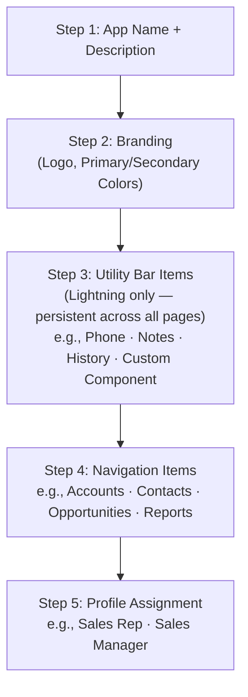

# L20: App Manager & Navigation

## Exam Domain
User Interface — 17% of exam weight

---

## Core Concepts

### Three App Types
Salesforce has three app types: (1) **Classic Apps** — the legacy Salesforce Classic apps; still exist and manageable in App Manager, but users shouldn't be on Classic for new implementations. (2) **Lightning Apps** — the modern app type for Lightning Experience; controlled navigation, custom branding, utility bar support. (3) **Connected Apps** — OAuth-based integrations with external systems (separate concept, usually for developers). The exam focuses on Lightning Apps.

### Lightning App Wizard (5 Steps)
Creating a Lightning App follows a 5-step wizard: (1) Name and description, (2) Branding (logo, colors), (3) Utility Items (utility bar components — Lightning apps only), (4) Navigation Items (tabs to include in the navigation bar), (5) User Profiles (which profiles can see and use this app). All five steps matter for the exam.

### Standard vs. Console Navigation
Lightning Apps support two navigation models: **Standard Navigation** — the default tab-bar at the top; users work in sequential tabs and records open in the same workspace. **Console Navigation** — designed for high-volume users (support agents, sales reps); multiple workspaces and sub-tabs open simultaneously; users can have many records open at once without losing context. Console navigation is what the "Service Console" and "Sales Console" apps use.

### Utility Bar
The Utility Bar is a persistent toolbar at the bottom of the Lightning App that provides quick access to tools like Phone (Open CTI), Notes, History, and custom utilities. **Only available in Lightning Apps** (not Classic apps). Components in the utility bar stay persistent across navigation — they don't reset when you navigate to a new page. This is why it's the right place for a soft phone (CTI).

### Tab Types in Navigation
Apps can include different types of navigation tabs: Object Tabs (e.g., Accounts, Contacts), Web Tabs (URL to an external site), Visualforce Tabs (Visualforce page), Lightning Component Tabs (custom LWC or Aura page), Lightning Page Tabs (a Lightning App Page). All are configured in Setup → Tabs.

---

## PTA / SA Relevance

**App design for different user personas:** A well-designed Salesforce deployment has different apps for different user types: Sales team gets a "Sales App" with Leads, Opportunities, Accounts, Contacts tabs, and perhaps a CTI in the utility bar. Service team gets the Service Console with Case, Knowledge, queue tabs, and a phone utility. Finance gets a Finance App with custom report tabs. Each app is profiled so users only see their relevant app(s).

**Console navigation for high volume:** Service Cloud deployments should almost always use Console Navigation for agents. The ability to have multiple cases open simultaneously with sub-tabs for related Account, Contact, and Knowledge articles matches how agents actually work. Designing on Standard Navigation for a service team is a common mistake.

**Utility bar for persistent tools:** The utility bar is the right place for any tool users need to access continuously regardless of where they are in the app. CTI (softphone), quick note taking, and recent activity are common utility bar items. Don't put these in the navigation tabs — they'd disappear when users navigate away.

**Profile-based app visibility:** Users can be assigned to multiple apps. The default app is the one with the highest priority in the profile's app assignment. In large deployments, manage app visibility carefully — too many apps visible in the App Launcher creates confusion.

---

## Architecture / How It Works

**Limitations:**
- Utility Bar is only available in Lightning Apps — not available in Classic apps
- A Lightning App can contain any combination of tab types
- Apps cannot have custom CSS/themes beyond the branding options in step 2
- Removing a navigation item from an app doesn't delete the object — it just removes the tab

| Standard Navigation | Console Navigation |
|---|---|
| Tabs across the top | App workspaces across top |
| Records open full-page | Records open in sub-tabs |
| Navigate away = leave current page | Multiple records open at once |
| Good for: casual use, admins | Good for: agents, reps |
| Examples: default Lightning app | Examples: Service Console, Sales Console |

**Limitations:**
- Console navigation is a separate app setting — you can't switch a Standard nav app to Console without creating or editing the app
- Console navigation has a learning curve for users unfamiliar with sub-tabs
- Some Lightning components behave differently in Console vs. Standard navigation context

**App Manager** (Setup → App Manager)

- **Classic Apps** — Legacy tabs, Salesforce Classic only
- **Lightning Apps** — Modern Lightning Experience apps (focus for this exam)
- **Connected Apps** — OAuth integrations (API, mobile, external systems)

Create a new app with "New Lightning App." The "New Connected App" button is separate and for developers building integrations.

**Limitations:**
- Classic Apps cannot use utility bars or console navigation
- Classic Apps are visible in Salesforce Classic only (users in Lightning see Lightning Apps)
- Connected Apps are not navigation apps — they provide API access and OAuth tokens for integrations

---

## Key Facts to Memorize
- Three app types: Classic / Lightning / Connected (Lightning is the focus for this exam)
- Lightning App wizard: 5 steps — Name → Branding → Utility Items → Navigation → Profiles
- Utility Bar: Lightning apps only; persistent across pages; ideal for CTI/softphone
- Navigation models: Standard (tabs) vs. Console (multi-workspace, sub-tabs)
- Console navigation: best for high-volume users (service agents, sales reps)
- Tab types: Object, Web, Visualforce, Lightning Component, Lightning Page
- Profile assignment: controls which users see the app in App Launcher
- App Manager: Setup → App Manager (where all apps are created and managed)

---

## Exam Traps
- **Utility Bar is Lightning-only.** Classic apps cannot have a utility bar. Any scenario asking about adding a persistent utility item (like a phone) to an app requires a Lightning App.
- **Console navigation is the right answer for service/support teams.** If a scenario describes support agents who need multiple cases open at once, the answer is Console Navigation, not Standard Navigation.
- **5 steps in the Lightning App wizard.** The wizard order matters: Name → Branding → Utility → Navigation → Profiles. The exam may test the step that controls profile visibility (Step 5).
- **Removing a tab from an app ≠ deleting the object.** Removing Accounts from an app's navigation just hides the tab in that app — the Account object and its records still exist.
- **Connected Apps are not navigation apps.** They're OAuth/API integration configurations, not user-facing navigation apps.

---

## Practice Questions

**Q:** A call center wants their support agents to have a softphone accessible from any page in the Service Console app. Where should the Open CTI component be added?
**A:** The Utility Bar of the Service Console Lightning App. Utility bar components are persistent across all pages in the app — the softphone stays visible regardless of which Case or Contact the agent is viewing.

**Q:** A Lightning App is created but the Sales Manager profile does not see it in their App Launcher. What is the most likely cause?
**A:** Step 5 of the Lightning App wizard (or the App's profile assignment settings) was not configured to include the Sales Manager profile. Navigate to App Manager → find the app → Edit → go to Profile Assignment step → add the Sales Manager profile.

**Q:** A company wants their service agents to work on multiple open Cases simultaneously without losing context when navigating between them. Which navigation model and app type should be used?
**A:** A Lightning App with Console Navigation. Console navigation allows multiple workspace tabs with sub-tabs, so agents can have 5 cases open simultaneously and click between them without losing their work.
