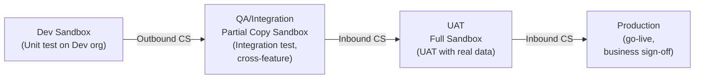
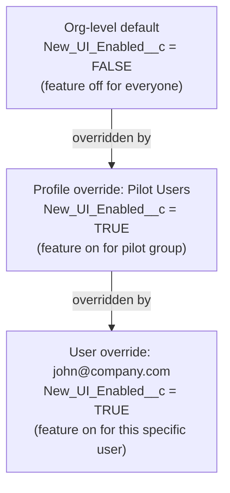

# L23: Release Management

## Exam Domain
App Deployment — 10% of exam weight

---

## Core Concepts

### Three Releases Per Year
Salesforce delivers three major releases per year: **Spring** (January–February), **Summer** (May–June), **Winter** (September–October). These are automatic — your production org is updated on a schedule whether you're ready or not. You cannot opt out, delay, or skip a Salesforce release. Critical Updates (feature changes that may alter existing behavior) are listed in the Salesforce Release Notes and typically have a deadline by which they auto-activate.

### Sandbox Preview
Approximately 4–6 weeks before a production release, sandbox orgs on the preview instance get the upcoming release early. This is your window to test whether the new release breaks any existing configuration, flows, or Apex in your org. Test your org in sandbox before production gets the release. This is especially important for orgs with complex automation.

### Sandbox Types (Full Review)
Four sandbox types, key specs: **Developer** (200MB storage, no production data, daily refresh), **Developer Pro** (1GB, no production data, daily refresh), **Partial Copy** (5GB, sample production data, 5-day refresh minimum), **Full** (full copy of production data, 29-day refresh minimum). Refresh creates a fresh copy from production — all sandbox changes are wiped.

### Release Pipeline
The standard release pipeline: Developer Sandboxes → Integration/QA Sandbox (Partial Copy) → UAT Sandbox (Full) → Production. Each environment gate catches different issue types: Dev sandboxes for unit development, Integration for cross-feature conflicts, UAT for user acceptance testing with realistic data, Production for go-live. Deploying directly from Dev to Production skipping QA/UAT is a governance failure.

### Custom Settings as Feature Flags
**Hierarchy Custom Settings** can act as feature flags for controlling whether features are active. The hierarchy: Org-level → Profile-level → User-level, with the most specific setting winning. An App Builder can create a Custom Setting with a checkbox field, set Org default to false (feature off), and override it to true for specific profiles or users for pilot rollout. This is a powerful pattern for phased releases.

---

## PTA / SA Relevance

**Release freeze windows:** Most enterprises have **change freeze windows** around major releases and key business periods (end of quarter, Black Friday, year-end). During a freeze, no production changes are allowed. Plan your deployment schedule around these windows. Validate change sets before the freeze; quick-deploy when the freeze lifts.

**Critical Updates management:** Every release includes Critical Updates — changes to platform behavior that Salesforce flags as potentially breaking. Review these in Release Notes as soon as they're available (4–6 weeks before production release). Test in sandbox. If a Critical Update will break your org, you have a finite window to fix it before it auto-activates in production.

**Scratch org strategy for developer teams:** Scratch orgs are temporary developer environments (expire in 7–30 days) that are provisioned from a project configuration file in source control. They're the CI/CD equivalent of developer sandboxes. For enterprise teams, scratch orgs enable isolated feature development without sandbox contention — each feature branch gets its own scratch org.

**Org strategy for large enterprises:** Large enterprises sometimes have 50+ sandboxes. The sandbox strategy should be documented: which sandboxes are for which purpose, who can refresh them, and what approval process is needed for production deployments. Without governance, sandbox environments become "production shadow" orgs where no one knows what's deployed where.

---

## Architecture / How It Works

**Salesforce Release Calendar** (3 releases/year — automatic, cannot opt out)

| Release | Timeframe | Sandbox Preview |
|---|---|---|
| Spring | January–February | ~4–6 weeks before production |
| Summer | May–June | ~4–6 weeks before production |
| Winter | September–October | ~4–6 weeks before production |

Each release: Release Notes published in advance, Critical Updates listed with auto-activation dates, sandbox preview instances updated first, production updated on a rolling schedule.

**Limitations:**
- You cannot delay, skip, or opt out of Salesforce releases
- The exact date your production org is updated varies (Salesforce schedules instances in batches)
- Critical Updates that you don't manually activate will auto-activate by a deadline

**Limitations:**
- Skipping stages (deploying from Dev directly to Prod) is a governance risk
- Full sandbox refresh (29-day minimum) means UAT sandbox data can be stale
- Not all orgs have Full sandbox licenses — budget constraints may limit the pipeline

| Type | Storage | Refresh | Data |
|---|---|---|---|
| Developer | 200MB | Daily | No production data |
| Developer Pro | 1GB | Daily | No production data |
| Partial Copy | 5GB | 5 days | Sample of production data |
| Full | Full copy | 29 days | Full copy of production data |

**Limitations:**
- Sandbox refresh wipes all sandbox-specific customizations — coordinate with teams before refreshing
- Partial Copy: you don't choose which records are sampled — Salesforce selects a representative sample
- Sandbox contacts and leads have email addresses obfuscated by default (sandbox email opt-out prevention)

Most specific level wins: User > Profile > Org.

**Limitations:**
- Hierarchy Custom Settings must be read in code/formula at runtime — they don't apply automatically
- There is a limit of 300 Hierarchy Custom Settings definitions per org
- Custom Settings values are metadata and move in change sets — but the actual setting values (Org/Profile/User levels) are data and do NOT move in change sets

---

## Key Facts to Memorize
- Three releases per year: Spring / Summer / Winter — automatic, cannot opt out
- Sandbox preview: ~4–6 weeks before production release (on preview instance)
- Sandbox refresh: creates fresh copy from production, wipes sandbox changes
- Standard pipeline: Dev → Partial Copy (QA) → Full (UAT) → Production
- Custom Settings hierarchy: User > Profile > Org (most specific wins)
- Scratch orgs expire: 7 days default, 30 days maximum
- Critical Updates: must monitor and test before auto-activation deadline
- Apex 75% coverage required for any production deployment that includes Apex

---

## Exam Traps
- **You cannot opt out of Salesforce releases.** The exam sometimes tests whether customers can delay or skip a release — they cannot.
- **Sandbox refresh timing.** Full sandbox = 29-day minimum between refreshes. If a scenario says "refresh the Full sandbox daily," that's not possible.
- **Custom Setting values are data, not metadata.** The hierarchy values (what you set at Org/Profile/User level) are stored as data and don't move in change sets. The Custom Setting definition (the object + fields) IS metadata that moves in change sets.
- **Sandbox preview is opt-in per sandbox.** Not all sandboxes get preview — only those on preview instances. You must use a preview-instance sandbox to test upcoming releases early.
- **Scratch org = temporary.** Scratch orgs expire and are not used for long-term development or QA — they're for CI/CD and isolated feature development.

---

## Practice Questions

**Q:** An organization wants to test an upcoming Salesforce Summer release against their custom Flows before it reaches production. What should they do?
**A:** Use a sandbox that is on a preview instance — these get the Summer release ~4–6 weeks before production. Test all Flows, Apex, and configuration in that sandbox during the preview window and resolve any issues before production is updated.

**Q:** A company wants to roll out a new Lightning page to 20 pilot users without affecting the other 1,000 users. What is the cleanest declarative mechanism?
**A:** Create a **Hierarchy Custom Setting** with an `IsActive__c` checkbox. Set the Org default to FALSE (feature off). Override to TRUE for the pilot users (either via a Profile or User-level setting). Reference the Custom Setting in the Flow or component logic to conditionally show the new page.

**Q:** A company has a Developer sandbox, a Partial Copy sandbox, and a Full sandbox. Which sandbox should be used for User Acceptance Testing (UAT) with realistic production data volume?
**A:** The Full sandbox — it contains a complete copy of production data, making it ideal for UAT where users need to test with real volumes and representative data. The Partial Copy has only a 5GB sample and may not include all the data scenarios users need to test.
