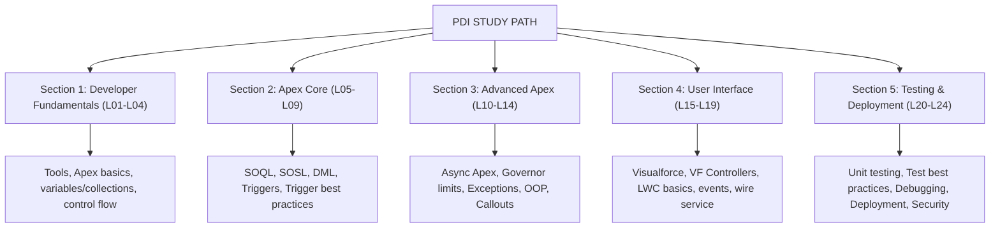

# Platform Developer I (PDI) — Study Guide

## Exam Facts

| Detail | Value |
|--------|-------|
| Exam Code | CRT-450 |
| Questions | 60 |
| Time | 110 minutes |
| Pass Score | 65% (39/60) |
| Cost | $200 |
| Format | Multiple choice + multi-select |

## Exam Weight Breakdown

| Domain | Weight | ~Questions |
|--------|--------|-----------|
| Developer Fundamentals | 23% | ~14 |
| Process Automation & Logic | 30% | ~18 |
| User Interface | 25% | ~15 |
| Testing, Debugging & Deployment | 22% | ~13 |

## PTA / SA Relevance

**Why this certification matters for Partner Technical Architects and Solution Architects:**
- PDI validates the technical depth that separates an SA/PTA from admins and declarative-only architects. You need it to credibly review Apex code, assess technical debt, and advise on build-vs-configure decisions.
- Every customer engagement eventually involves Apex — triggers, integrations, async processing. Understanding it at PDI level lets you read what developers wrote and identify risk in code reviews before it ships.
- CTO and VP of Engineering conversations require knowing the platform's programming model, governor limits, and what "production-ready Apex" looks like — not just high-level concepts.

**Code review patterns this course enables:**
- Identifying non-bulkified triggers before they cause production LimitExceptions
- Spotting missing sharing keywords in custom classes (security risk)
- Recognizing SOQL injection vulnerabilities in dynamic queries
- Evaluating whether async Apex (Batch/Queueable/@future) is being used correctly for the use case
- Assessing test quality: zero-assertion tests, missing bulk coverage, seeAllData=true abuse

**Enterprise architecture decision points covered:**
- When to use Apex vs Flow vs AppExchange — and how to make that recommendation to a customer
- Integration patterns: synchronous callouts vs async @future vs Platform Events
- Deployment strategy: change sets vs Salesforce CLI vs packages — and what each implies for DevOps maturity
- LWC vs Visualforce — architecture direction and migration path

## Architecture / How It Works

**Limitations / Key Governor Limits to Know Cold:**
- SOQL queries per transaction: 100 (sync) / 200 (async)
- DML operations per transaction: 150
- DML rows: 10,000
- Heap size: 6 MB (sync) / 12 MB (async)
- CPU time: 10s (sync) / 60s (async)
- Callouts per transaction: 100, max 120s each
- Future methods per transaction: 50
- Batch jobs concurrent: 5 active at once
- Scheduled jobs: 100 max in org

## 4-Week Study Plan

**Week 1 — Developer Fundamentals + Apex Core (L01–L07)**
- Days 1–2: Set up VS Code, Salesforce CLI, and a Developer Edition org. Work through L01 hands-on.
- Days 3–4: Study L02 (Apex Basics) and L03 (Variables, Types & Collections). Write Apex in Execute Anonymous.
- Days 5–7: Complete L04 (Control Flow), L05 (SOQL Fundamentals), L06 (SOQL Advanced). Practice queries in the Query Editor.

**Week 2 — Apex Core + Advanced Apex (L07–L14)**
- Days 1–2: Study L07 (DML Operations) and L08 (Apex Triggers). Create a trigger on Account in your org.
- Days 3–4: Complete L09 (Trigger Best Practices). Refactor trigger to use handler class pattern.
- Days 5–7: Work through L10–L14: async Apex (Future, Batch, Queueable, Scheduled), exception handling, and integration.

**Week 3 — User Interface (L15–L19)**
- Days 1–3: Study LWC basics, component communication, and lifecycle hooks.
- Days 4–5: Learn Visualforce and controllers for exam context.
- Days 6–7: Study Wire Service and @AuraEnabled patterns.

**Week 4 — Testing, Debugging & Review (L20–L24)**
- Days 1–2: Complete L20–L21 on Apex testing: test classes, @testSetup, assertions, bulk testing.
- Days 3–4: Study deployment: change sets, Salesforce CLI, sandboxes vs scratch orgs.
- Days 5–6: Take 2–3 full practice exams (60 questions, 110 minutes each). Review every wrong answer.
- Day 7: Light review of weak areas only. Rest before exam day.

## Key Facts to Memorize
- Process Automation & Logic = 30% — spend the most time here (triggers, SOQL, DML, async)
- Both Visualforce AND LWC are tested — don't skip either
- 75% code coverage required for production deployment (org-wide aggregate)
- Async limits are double sync: SOQL 200 vs 100, heap 12 MB vs 6 MB
- One trigger per object is best practice — multiple triggers have unpredictable execution order
- `with sharing` enforces record visibility; CRUD/FLS still need explicit checks
- `@wire` requires `@AuraEnabled(cacheable=true)` on the Apex method
- `Test.stopTest()` flushes all async jobs synchronously

## Customer Advisory Tips
- **Apex vs Flow vs AppExchange:** Default to Flow for process automation (no-code, admin maintainable). Use Apex when: complex logic exceeds Flow capabilities, performance matters at scale, cross-object operations need transaction atomicity. AppExchange for commodity functionality (quoting, contracts, eSignature) — don't build what exists.
- **Technical debt assessment:** The two most common sources of Salesforce technical debt are non-bulkified triggers and untestable Apex (seeAllData=true, zero assertions). These are identifiable in code review and quantifiable in terms of deployment risk.
- **Security posture:** Any org exposing `@AuraEnabled` endpoints without `with sharing` and `stripInaccessible()` has a data exposure risk. This is the single most common finding in Salesforce security assessments.

## Practice Questions

**Q:** Which governor limit applies to total SOQL queries in a single synchronous transaction?
**A:** 100 queries. Asynchronous contexts allow 200.

**Q:** A developer needs to process 10 million records overnight. Which Apex feature?
**A:** Batch Apex — designed for large data volumes, each execute() chunk gets its own governor limit context. Can process up to 50 million rows via QueryLocator.

**Q:** Which access modifier makes an Apex class accessible across all namespaces including managed packages?
**A:** `global` — `public` is only within the same namespace/org.

**Q:** A class has no sharing keyword. What does this mean for record access?
**A:** It runs in system context — equivalent to `without sharing`. All records are accessible regardless of the running user's sharing permissions. This is a security risk in user-facing code.
