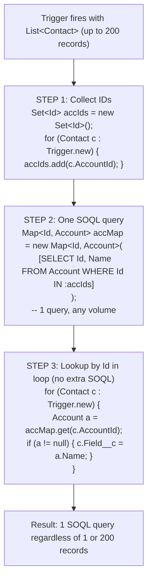

# Apex Variables, Types & Collections

## Exam Domain
Developer Fundamentals — 23% of exam weight

## Core Concepts

### Apex Primitive Types

| Type | Notes |
|------|-------|
| `Integer` | 32-bit signed, −2.1B to 2.1B |
| `Long` | 64-bit signed; `Long l = 9999999999L;` (note L suffix) |
| `Double` | 64-bit floating point — DO NOT use for money |
| `Decimal` | Arbitrary precision — **always use for currency/financial** |
| `String` | Single quotes: `'Hello'`. `==` is case-insensitive |
| `Boolean` | `true` or `false` |
| `Date` / `DateTime` / `Time` | `Date.today()`, `DateTime.now()` |
| `Id` | 15 or 18 char Salesforce record ID; validated at runtime |
| `Blob` | Binary data |

### The Id Type
Holds 15- or 18-character Salesforce record IDs. Essentially a validated String — assigning an invalid ID throws a runtime error. After `insert`, the `Id` field is populated on the sObject in memory automatically.

### sObject Variables
Every Salesforce object is a subtype of `sObject`. Use dot notation for fields: `a.Name = 'Acme';`. Cast from generic sObject: `Account a = (Account) obj;`. Accessing unqueried fields returns `null`.

### Null Handling
All Apex variables default to `null` if not initialized. Calling a method on a null reference throws `NullPointerException` — most common Apex runtime error. Always null-check before dereferencing. Exception: `String.isBlank(s)` (static form) is null-safe.

### List — Ordered, Indexed, Allows Duplicates
```apex
List<String> names = new List<String>{'Alice', 'Bob'};
names.add('Carol');      // index 2
names.get(0);            // 'Alice' — zero-based
names.size();            // 3
names.remove(1);         // removes 'Bob'
```
SOQL always returns `List<sObject>`. A query returning no records returns an **empty List**, not null.

### Set — Unordered, Unique Values, No Index Access
```apex
Set<Id> accountIds = new Set<Id>();
accountIds.add(someId);
accountIds.contains(someId);   // true — O(1) lookup
```
Key use: collect IDs before a SOQL query to avoid N+1 query patterns.

### Map — Key-Value Pairs, Keys Are Unique
```apex
Map<Id, Account> accMap = new Map<Id, Account>(
    [SELECT Id, Name FROM Account WHERE Id IN :idSet]
);
accMap.get(someId);          // Account record
accMap.containsKey(someId);  // Boolean
accMap.keySet();             // Set<Id>
```
Shorthand constructor from SOQL automatically keys by record `Id` — the most common Map pattern in trigger handlers.

### String Methods to Know
- `isBlank(s)` — null-safe static; true if null, empty, or whitespace only
- `isEmpty()` — instance method; true only for zero-length string (throws NPE if null)
- `contains()`, `startsWith()`, `endsWith()`, `indexOf()`
- `toUpperCase()`, `toLowerCase()`, `trim()`, `replace()`
- `split(',')` → `List<String>`

## PTA / SA Relevance

**In partner code reviews, watch for:**
- Using `Double` for currency calculations — floating-point rounding errors will cause incorrect financial totals. This is a data integrity bug, not just style.
- `String.isEmpty()` instead of `String.isBlank()` on user input — spaces pass `isEmpty()` but fail `isBlank()`, causing silent validation bypasses.
- Querying into a single `sObject` variable instead of a List — guaranteed `QueryException` the first time the record doesn't exist.
- Large `List<sObject>` in memory: loading 50,000 records into a List at once can exhaust the 6 MB heap limit. Use SOQL for loops or Batch Apex instead.

**Enterprise-scale considerations:**
- The `Map<Id, sObject>` pattern is the cornerstone of all bulkified Apex. In trigger handlers processing 200 records, you build one Map, then do all lookups from it — zero additional SOQL queries.
- Collection conversion is a daily Apex skill: `new Set<Id>(myList)` deduplicates, `new List<Id>(mySet)` restores order. Understand the performance trade-offs: Set.contains() is O(1); List.contains() is O(n).
- For apex that processes very large Lists, consider memory footprint. Each sObject in memory carries all its queried fields. Only SELECT the fields you need.

**For CTO conversations:**
- Apex collections are the foundation of scalable data processing patterns. The difference between "works with 1 record" and "works with 1 million records" is often just whether the developer used collections correctly.

## Architecture / How It Works



**Limitations:**
- SOQL query returns maximum 50,000 rows per transaction
- Single SOQL query assigned directly to `sObject` variable (not List) throws `QueryException` if 0 or 2+ rows returned
- `Set` has no index access — must iterate with for-each or convert to List first

| Collection | Ordered? | Duplicates? |
|------------|----------|-------------|
| `List` | Yes (indexed) | Yes |
| `Set` | No | No (auto-deduped) |
| `Map` | No (by key) | Keys: No; Values: Yes |

**Conversions:**
- `new Set<Id>(myList)` — deduplicate
- `new List<Id>(mySet)` — convert back (arbitrary order)
- `new Map<Id, Acct>(list)` — key by Id (requires Id field)

**Limitations:**
- Map's `get()` returns `null` for missing keys — always check `containsKey()` before `get()` if null would cause issues
- List index access out of bounds throws `ListException` — check `size()` before accessing by index

## Key Facts to Memorize
- **Always use `Decimal`** for currency — `Double` has floating-point rounding errors
- `String.isBlank()` is null-safe and returns true for null, empty, and whitespace-only
- `String.isEmpty()` returns true only for zero-length string AND throws NPE if called on null instance
- SOQL returns an empty `List`, not null, when no records match — use `isEmpty()` not null check
- `Map<Id, sObject>` shorthand constructor from SOQL automatically keys by record `Id`
- `Set.contains()` is O(1) — use Set for membership checks, not List
- All variables default to `null` if not initialized — always null-check before method calls

## Customer Advisory Tips
- **Data migration scripts:** Use `Decimal` for all financial fields; document explicitly that `Double` is forbidden for money.
- **Bulk processing patterns:** Any team doing integrations or data loads should have the Set-Map-SOQL pattern in their trigger framework template — it's the difference between code that scales and code that crashes on first production load.

## Exam Traps
- `String.isEmpty()` on a null String throws `NullPointerException` — use `String.isBlank(s)` (static call) for null-safe blank check
- A SOQL query with no matching records returns an **empty List**, NOT null
- `Set` cannot be accessed by index — must use for-each or convert to List first
- `Decimal` vs `Double`: Decimal for money, Double for scientific floats
- `new Map<Id, Account>([SELECT Id, Name FROM Account])` — shorthand constructor uses `Id` as the key automatically

## Practice Questions

**Q:** A developer calculates order price by multiplying quantity by unit price. Which Apex type for the result?
**A:** `Decimal` — arbitrary precision, correct for financial calculations. `Double` can produce rounding errors (e.g., 0.1 + 0.2 ≠ 0.3 exactly).

**Q:** A trigger receives 200 Opportunity records and needs parent Account names without SOQL in a loop. What's the correct approach?
**A:** Collect all `AccountId` values into a `Set<Id>`, query `[SELECT Id, Name FROM Account WHERE Id IN :idSet]`, store in `Map<Id, Account>`, then look up in the loop with `accMap.get(opp.AccountId)`.

**Q:** A developer writes `String s = null; Boolean result = s.isBlank();`. What happens?
**A:** In Apex, calling `.isBlank()` as an instance method on a null String actually returns `true` (Salesforce handles this case). However, the safer and exam-correct approach is to use the static form `String.isBlank(s)`.
