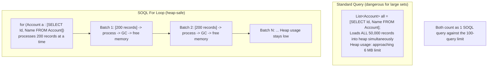

# Control Flow & Loops

## Exam Domain
Developer Fundamentals — 23% of exam weight

## Core Concepts

### if / else — Conditional Branching
Conditions MUST be explicit Boolean expressions — no JavaScript-style implicit truthiness. `if (myString)` is a compile error; write `if (myString != null && !myString.isEmpty())`. Ternary operator works: `String label = (isActive) ? 'Active' : 'Inactive';`. Apex uses standard if/else-if/else chaining.

### switch Statement — Use `when`, Not `case`
Apex uses `when` instead of `case`. No fall-through — no `break` needed. Can switch on Integer, Long, String, Enum, OR sObject type. `when else` is the default branch. Multiple values per `when` clause: `when 'Partner', 'Reseller' { }`.
```apex
switch on accountType {
    when 'Customer'            { discount = 0.10; }
    when 'Partner', 'Reseller' { discount = 0.20; }
    when else                  { discount = 0.0; }
}
```

### for Loops — Three Types
- **Traditional:** `for (Integer i = 0; i < list.size(); i++)` — use when you need the index
- **Enhanced for-each:** `for (Account a : accountList)` — preferred for all other cases; cleaner and compiler-optimized
- **SOQL for loop:** `for (Account a : [SELECT Id FROM Account])` — heap-safe for large result sets; delivers records in chunks of 200

### SOQL for Loop — Prevents Heap Limit Exhaustion
Standard query loads ALL records into heap at once. SOQL for loop delivers chunks of 200, garbage collects each chunk, then loads the next. Use for result sets that could exceed 6 MB heap limit. Still counts as ONE SOQL query.
```apex
for (Account a : [SELECT Id, Name FROM Account WHERE IsActive__c = true]) {
    // Salesforce feeds 200 records at a time — heap stays low
}
```

### while and do-while Loops
`while` checks condition first — may execute zero times. `do-while` always executes at least once. Both count against CPU governor limit. Infinite loop risk — always ensure exit condition can become false.

### break and continue
`continue` skips to next iteration. `break` exits the innermost loop entirely. Neither is needed in `switch` statements (no fall-through in Apex). `break` only exits the innermost loop in nested structures.

## PTA / SA Relevance

**In partner code reviews, watch for:**
- SOQL queries inside any loop — this is the #1 anti-pattern in production Apex. Even a `while` loop or `do-while` is vulnerable.
- DML statements inside for loops — less obvious than SOQL-in-loop but just as fatal.
- `for (sObject obj : [SELECT ... FROM Object])` with DML inside — the SOQL for loop is heap-safe but DML inside it still violates the DML-outside-loop rule. Collect records into a List, DML after the loop.
- Complex nested loops without CPU time consideration — a 1,000-record outer loop × 200-record inner loop with string manipulation can exceed 10s CPU limit.

**Enterprise-scale considerations:**
- The SOQL for loop is useful for moderate volumes; for millions of records, use Batch Apex instead. Know which to recommend at what scale.
- Some enterprise trigger frameworks use static Maps populated lazily inside trigger handlers — the "collect first, execute after" pattern at the framework level.
- CPU time tracking: Salesforce only counts active execution time, NOT time waiting for SOQL queries or HTTP callouts. This means I/O-heavy code can have a lot of actual wall-clock time but stay within the 10s CPU limit.

**For CTO conversations:**
- "Why do our data migrations fail on production but work in our sandbox?" — often because the sandbox has 10 records and production has 50,000. The SOQL-in-loop pattern explodes at 101 records. This is why code review and proper bulk testing matter.

## Architecture / How It Works



**Limitations:**
- SOQL for loop still counts as 1 query against the 100-query limit
- DML inside a SOQL for loop still violates the no-DML-in-loop rule — collect into a List and DML after
- For 50M+ records, use Batch Apex (QueryLocator), not SOQL for loop

**No-SOQL-in-Loops / No-DML-in-Loops Pattern:**

BAD — SOQL in loop (200 contacts = 200 SOQL queries, LimitException at record 101):

```apex
for (Contact c : contacts) {
    Account a = [SELECT Id FROM Account WHERE Id = :c.AccountId]; // SOQL inside loop!
    c.Description = a.Name;
}
```

GOOD — collect then query (1 SOQL regardless of volume):

```apex
Set<Id> accIds = new Set<Id>();
for (Contact c : contacts) { accIds.add(c.AccountId); }
Map<Id,Account> accMap = new Map<Id,Account>(
    [SELECT Id, Name FROM Account WHERE Id IN :accIds]); // 1 query
for (Contact c : contacts) {
    Account a = accMap.get(c.AccountId);
    c.Description = a?.Name;
}
List<Contact> toUpdate = new List<Contact>(contacts);
update toUpdate; // 1 DML statement
```

BAD — DML in loop (200 contacts = 200 DML statements, LimitException at record 151):

```apex
for (Contact c : contacts) {
    c.Title = 'Updated';
    update c; // DML each time
}
```

**Limitations:**
- Synchronous SOQL limit: 100 queries per transaction
- Synchronous DML limit: 150 statements per transaction
- CPU limit: 10,000 ms synchronous — complex loops without SOQL/DML can still hit this
- OFFSET maximum value: 2,000 (pagination has a ceiling)

## Key Facts to Memorize
- Apex `if` conditions must be explicit Booleans — no implicit truthiness (not like JavaScript)
- Apex `switch` uses `when` (not `case`) and has NO fall-through — no `break` needed
- SOQL for loop delivers records in **chunks of 200** — heap-safe for large volumes
- SOQL for loop still counts as **one SOQL query** against the 100-query limit
- `continue` skips to next iteration; `break` exits the innermost loop only
- Never put SOQL or DML inside any loop — collect, then execute in bulk

## Customer Advisory Tips
- **Performance reviews:** When a customer reports slow triggers or limit errors, check for SOQL/DML in loops first — it's the most common cause.
- **Code standards:** For any partner org with 3+ developers, establish a "no SOQL in loop" ESLint-style rule via Apex PMD / Salesforce Code Analyzer in CI/CD. Catch it before it reaches production.

## Exam Traps
- `if (myString)` — compile error in Apex; use `if (myString != null)` or `if (!String.isBlank(myString))`
- Apex `switch` uses `when` — not `case`. No `break` needed. No fall-through.
- SOQL for loop is NOT a replacement for Batch Apex — it still runs in a single transaction context with the same governor limits (just lower heap pressure)
- `break` only exits the **innermost** loop in nested loops
- OFFSET max is **2,000** — cannot paginate beyond that with OFFSET alone

## Practice Questions

**Q:** A trigger on Contact processes 200 records. The developer queries the parent Account inside the loop. What happens?
**A:** LimitException at record 101. The 100 SOQL query limit is exceeded. Fix: collect AccountIds into Set, query with IN before the loop, store in Map, look up inside the loop.

**Q:** A developer writes: `for (Account a : [SELECT Id FROM Account]) { update a; }`. What is wrong?
**A:** DML inside a loop — the DML statement limit (150) is exceeded once more than 150 accounts are processed. Also, `update a` performs individual DML per record. Fix: collect into a List inside the loop, then `update myList` after the loop.

**Q:** What does this print?
```apex
for (Integer i = 0; i < 5; i++) {
    if (i == 2) continue;
    if (i == 4) break;
    System.debug(i);
}
```
**A:** `0`, `1`, `3` — i=2 is skipped by `continue`, i=4 triggers `break` before debug runs.
