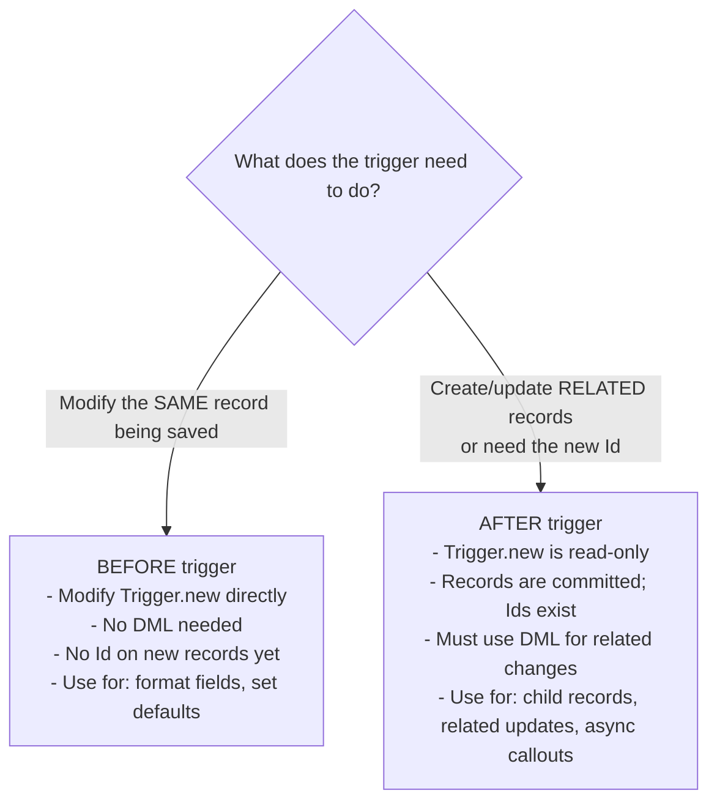
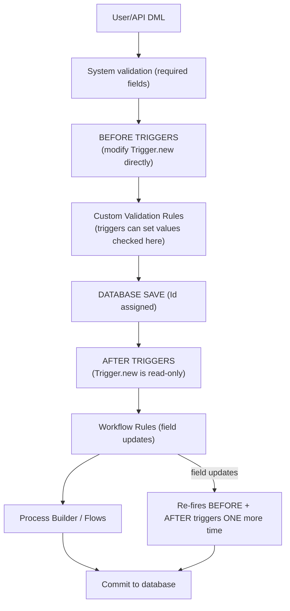

# Apex Triggers

## Exam Domain
Process Automation & Logic — 30% of exam weight

## Core Concepts

### What Is an Apex Trigger?
Code that automatically executes when DML events occur on a Salesforce object. Fires for every DML regardless of source: UI, API, Apex, Data Loader, Flows. Triggers give you custom logic the platform can't express declaratively.

### Trigger Syntax
```apex
trigger AccountTrigger on Account (
    before insert, before update, before delete,
    after insert, after update, after delete, after undelete
) {
    // body
}
```
Convention: `ObjectNameTrigger`. Files: `AccountTrigger.trigger` + `AccountTrigger.trigger-meta.xml`.

### Before Triggers — Modify In-Memory Before Save
Fires before database write. `Trigger.new` records are in-memory (no Id on insert yet). **Modify fields directly — no DML needed.** Changes save automatically with the original DML. Use for: field formatting, setting defaults, custom validation.
```apex
trigger AccountTrigger on Account (before insert) {
    for (Account acc : Trigger.new) {
        if (acc.Phone != null) acc.Phone = acc.Phone.replaceAll('[^0-9]', '');
    }
}
```

### After Triggers — Act on Committed Records
Fires after record is saved. `Trigger.new` is **read-only** — record has Id now. Must use DML to modify related records. Use for: creating child records, updating related objects, sending async callouts.
```apex
trigger ContactTrigger on Contact (after insert) {
    AccountUpdater.updateAccountCount(Trigger.new); // needs new Ids
}
```

### Trigger Context Variables
| Variable | Available In | Description |
|----------|-------------|-------------|
| `Trigger.new` | insert, update, undelete | List of new record versions |
| `Trigger.old` | update, delete | List of old record versions |
| `Trigger.newMap` | after insert, update | Map<Id, sObj> of new versions |
| `Trigger.oldMap` | update, delete | Map<Id, sObj> of old versions |
| `Trigger.isInsert` | all insert events | Boolean flag |
| `Trigger.isUpdate` | all update events | Boolean flag |
| `Trigger.isBefore` | before events | Boolean flag |
| `Trigger.isAfter` | after events | Boolean flag |
| `Trigger.size` | all | Records in current batch |

### Detecting Field Changes in Update Triggers
Compare old vs new values to avoid running expensive logic when irrelevant fields changed:
```apex
trigger OpportunityTrigger on Opportunity (before update) {
    for (Opportunity opp : Trigger.new) {
        Opportunity oldOpp = Trigger.oldMap.get(opp.Id);
        if (opp.StageName != oldOpp.StageName) {
            opp.Stage_Changed_Date__c = Date.today();
        }
    }
}
```

### One Trigger Per Object Pattern
Multiple triggers on same object fire in unpredictable order. Solution: one thin trigger delegating to a handler class.
```apex
trigger AccountTrigger on Account (before insert, before update, after insert) {
    AccountTriggerHandler handler = new AccountTriggerHandler();
    if (Trigger.isBefore && Trigger.isInsert)  handler.onBeforeInsert(Trigger.new);
    if (Trigger.isBefore && Trigger.isUpdate)  handler.onBeforeUpdate(Trigger.new, Trigger.oldMap);
    if (Trigger.isAfter  && Trigger.isInsert)  handler.onAfterInsert(Trigger.new);
}
```

### Order of Execution (simplified)
1. System validation
2. **Before triggers**
3. Custom validation rules
4. Duplicate rules
5. Database save → Id assigned
6. **After triggers**
7. Assignment rules / Auto-response rules
8. **Workflow rules** (field updates re-fire before+after triggers!)
9. Process Builder / Flows
10. Roll-up summaries

## PTA / SA Relevance

**In partner code reviews, watch for:**
- Triggers with logic directly in the trigger body — no handler class, impossible to unit test cleanly
- Triggers without recursion prevention — any after trigger that does DML on the same object type is a potential infinite loop
- No field-change check in update triggers — running full logic on every field save on high-volume objects (Case, Activity, Opportunity) is a CPU time bomb
- Multiple triggers on the same object — always a code smell; indicates lack of governance

**Enterprise-scale considerations:**
- High-volume orgs (financial services, health cloud, manufacturing) can have triggers firing on millions of records per day. CPU time matters. Optimize: only run logic when relevant fields change, use indexed fields in SOQL WHERE clauses, minimize heap footprint.
- Trigger frameworks (Callable interface, metadata-driven, FinancialForce fflib) provide more sophisticated patterns than basic handler class. ISV partners should use a trigger framework; enterprise orgs doing DX should standardize on one.
- Workflow field updates causing a second trigger invocation is a common source of mysterious behavior that's hard to debug. The order of execution and the workflow-fires-trigger-again behavior should be documented in the team's architecture decision record.

**For CTO conversations:**
- "How do we prevent developers from writing bad triggers?" — Standards + Code Analyzer in CI/CD + mandatory code review. Enforce the single-trigger, handler-class, no-SOQL-in-loop patterns at PR review time.

## Architecture / How It Works



**Limitations:**
- In before insert, `Trigger.new` records have no Id — `Trigger.newMap` not available in before insert
- `Trigger.old` / `Trigger.oldMap` NOT available in insert or undelete events
- After trigger cannot directly modify `Trigger.new` — read-only after commit
- Workflow field updates re-fire before+after triggers one additional time

| Event | Trigger.new | Trigger.old | Trigger.newMap | Trigger.oldMap |
|-------|-------------|-------------|----------------|----------------|
| before insert | YES | NO | NO | NO |
| after insert | YES | NO | YES | NO |
| before update | YES | YES | YES* | YES |
| after update | YES | YES | YES | YES |
| before delete | NO | YES | NO | YES |
| after delete | NO | YES | NO | YES |
| after undelete | YES | NO | YES | NO |

*`Trigger.newMap` available in before update (records have Ids since they are existing records).

**Limitations:**
- Max 200 records per trigger batch
- Accessing `Trigger.old` in a before insert trigger throws a NullPointerException — it doesn't exist



**Limitations:**
- Workflow field updates re-fire triggers only ONE additional time (not infinite)
- Apex-initiated DML (from a trigger) CAN cause infinite recursion — static Boolean flag required

## Key Facts to Memorize
- Before trigger: modify `Trigger.new` directly — no DML, no Id on new records
- After trigger: read-only `Trigger.new` — use DML for related records; has Ids
- `Trigger.old` / `Trigger.oldMap` — only available in **update** and **delete**
- `Trigger.newMap` — NOT available in **before insert** (no Ids yet)
- One trigger per object — multiple triggers have unpredictable order
- Workflow field updates re-fire before+after triggers one additional time
- Max **200 records** per trigger batch

## Customer Advisory Tips
- **Should this be a trigger or a Flow?** Flow is first choice for simple field updates, related record creation, and notifications. Use triggers when: bulk volume exceeds Flow's per-record processing, complex cross-object logic, callouts required, programmatic error handling needed.
- **ISV partner apps:** Must use a trigger framework — cannot assume the customer has no other triggers on the same object. Frameworks like fflib or Callable-based dispatch prevent conflicts.

## Exam Traps
- Before insert: `Trigger.new` has NO Id; `Trigger.old` and `Trigger.newMap` do NOT exist
- `Trigger.old` is ONLY available in update and delete — accessing it in insert throws NPE
- After trigger: `Trigger.new` is **read-only** — cannot assign to `Trigger.new[0].Name` in after context
- Workflow field updates fire before+after triggers **once more** — not infinite, but triggers do fire again
- Multiple triggers on same object: execution order is **not guaranteed** — no alphabetical, no creation order

## Practice Questions

**Q:** A developer wants to set `Account.Number_of_Contacts__c` after new Contacts are inserted. Which trigger event and approach?
**A:** `after insert` — because the new Contact Ids are needed and the logic updates a related Account (different object), requiring DML. Before insert lacks Ids; before insert only allows modifying the Contact itself.

**Q:** In a before update trigger, which context variable lets you compare the old field value to the new?
**A:** `Trigger.oldMap.get(record.Id).FieldName` vs `record.FieldName` from `Trigger.new`. `Trigger.oldMap` provides the pre-save version keyed by Id.

**Q:** What context variable is NOT available in a `before insert` trigger?
**A:** `Trigger.old`, `Trigger.oldMap`, and `Trigger.newMap` are all unavailable in before insert. `Trigger.old` doesn't exist (no prior version); `Trigger.newMap` doesn't exist because records have no Id yet.
