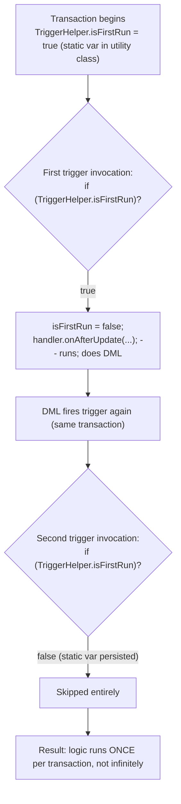

# Trigger Best Practices

## Exam Domain
Process Automation & Logic — 30% of exam weight

## Core Concepts

### Why Best Practices Are Non-Negotiable
Triggers fire once per 200-record batch, not once per record. A trigger that works in dev with 1 record fails in production with 200. Governor limits are per-transaction, not per-record. All best practices exist specifically because of this batch execution model.

### Bulkification — The Core Three-Step Pattern
Collect IDs → one SOQL → Map lookup. Never query or DML inside a loop.
```apex
trigger ContactTrigger on Contact (before insert, before update) {
    // Step 1: Collect parent IDs
    Set<Id> accountIds = new Set<Id>();
    for (Contact c : Trigger.new) {
        if (c.AccountId != null) accountIds.add(c.AccountId);
    }
    // Step 2: One SOQL query for all accounts
    Map<Id, Account> accountMap = new Map<Id, Account>(
        [SELECT Id, Name, Industry FROM Account WHERE Id IN :accountIds]
    );
    // Step 3: Process with Map lookup — zero additional SOQL
    for (Contact c : Trigger.new) {
        Account acc = accountMap.get(c.AccountId);
        if (acc != null) c.Account_Industry__c = acc.Industry;
    }
}
```

### Handler Class Pattern
Trigger is thin — delegates to a handler class. Handler class is regular Apex: fully testable, organized by event, maintainable.
```apex
// AccountTrigger.trigger
trigger AccountTrigger on Account (before insert, before update, after insert) {
    AccountTriggerHandler handler = new AccountTriggerHandler();
    if (Trigger.isBefore && Trigger.isInsert)  handler.onBeforeInsert(Trigger.new);
    if (Trigger.isBefore && Trigger.isUpdate)  handler.onBeforeUpdate(Trigger.new, Trigger.oldMap);
    if (Trigger.isAfter  && Trigger.isInsert)  handler.onAfterInsert(Trigger.new);
}
```
Test the handler class directly — no trigger invocation needed in unit tests for business logic.

### Recursive Trigger Prevention — Static Boolean Flag
An after trigger that does DML on the same object can re-fire the trigger infinitely. Static variable persists for the whole transaction — use a flag in a utility class.
```apex
public class TriggerHelper {
    public static Boolean isFirstRun = true;
}

trigger ContactTrigger on Contact (after update) {
    if (TriggerHelper.isFirstRun) {
        TriggerHelper.isFirstRun = false;
        ContactTriggerHandler.onAfterUpdate(Trigger.new, Trigger.oldMap);
    }
}
```
Flag MUST be `static` and in a **separate class** — instance variable won't work (new instance per invocation).

### Field Change Detection
Only run expensive logic when the relevant field actually changed. Compare `Trigger.new` value to `Trigger.oldMap` value.
```apex
for (Opportunity opp : Trigger.new) {
    Opportunity oldOpp = Trigger.oldMap.get(opp.Id);
    if (opp.StageName != oldOpp.StageName) {
        // Only run logic when Stage actually changed
        opp.Stage_Changed_Date__c = Date.today();
    }
}
```

### Anti-Patterns to Recognize
- SOQL inside loop → LimitException at record 101
- DML inside loop → LimitException at DML statement 151
- Hardcoded IDs → broken in every other org (IDs change between environments)
- Logic in trigger body (not handler) → untestable
- `Trigger.old` access in insert trigger → NullPointerException

### Testing Triggers
Triggers fire automatically when test DML executes. Query after DML to verify trigger-modified values. Test bulk scenario with 200 records. Always assert — coverage alone is meaningless without assertions.
```apex
@isTest
static void testPhoneFormatting() {
    List<Account> accs = new List<Account>();
    for (Integer i = 0; i < 200; i++) {
        accs.add(new Account(Name = 'Test ' + i, Phone = '(415) 555-' + i));
    }
    insert accs;
    accs = [SELECT Phone FROM Account WHERE Id IN :new Map<Id,Account>(accs).keySet()];
    for (Account a : accs) {
        System.assert(!a.Phone.contains('('), 'Phone should be stripped of non-numeric chars');
    }
}
```

## PTA / SA Relevance

**In partner code reviews, watch for:**
- Static Boolean flag in the HANDLER class (wrong) vs in a UTILITY class (correct) — a new handler instance is created each trigger invocation, so instance variables and handler-scoped statics reset
- Missing bulk test: test with 1 record only — will miss bulkification bugs completely
- Field change detection only in after triggers (where it's needed) but missing in before triggers — before update triggers doing expensive SOQL on every save regardless of which field changed
- Using `Database.setSavepoint()` inside triggers for complex multi-step logic — valid but must be matched with `Database.rollback()` carefully

**Enterprise-scale considerations:**
- Enterprise trigger frameworks (Kevin O'Hara's SFDC Trigger Framework, fflib, Apex Enterprise Patterns) add: metadata-driven enable/disable per trigger, bypass flags per user/profile, structured event routing, optional chaining of handlers. These are worth knowing for large org governance.
- Bypass logic for data migrations: some orgs add a `TriggerHelper.isMigrationRun = true` flag to skip non-critical trigger logic during bulk data loads. Requires a custom permission or custom setting check.
- The static Boolean flag is a simple pattern — it allows only the first execution. More sophisticated patterns track which records were processed and allow per-record control.

**For CTO conversations:**
- "Our triggers are slowing down record saves — what do we do?" — Diagnose with debug logs (CPU time, SOQL count per transaction), profile the handler methods, check for N+1 queries and field-change-detection gaps, consider async offloading via Platform Events.

## Architecture / How It Works

**Handler Class Pattern — Full Structure:**

`AccountTrigger.trigger` (thin — routing only):

```apex
trigger AccountTrigger on Account (
    before insert, before update,
    after insert, after update, after delete) {

    AccountTriggerHandler h = new AccountTriggerHandler();

    if (Trigger.isBefore) {
        if (Trigger.isInsert)  h.onBeforeInsert(Trigger.new);
        if (Trigger.isUpdate)  h.onBeforeUpdate(Trigger.new, Trigger.oldMap);
    }
    if (Trigger.isAfter) {
        if (Trigger.isInsert)  h.onAfterInsert(Trigger.new);
        if (Trigger.isUpdate)  h.onAfterUpdate(Trigger.new, Trigger.oldMap);
    }
}
```

`AccountTriggerHandler.cls` (business logic):

```apex
public class AccountTriggerHandler {
    public void onBeforeInsert(List<Account> newAccs) {
        // business logic here
        validateAccountNames(newAccs);
    }
    public void onBeforeUpdate(List<Account> newAccs, Map<Id,Account> oldMap) {
        // field change checks here
    }
    public void onAfterInsert(List<Account> newAccs) {
        // related record creation
    }
}
```

`AccountTriggerHandlerTest.cls` — tests call the handler directly or insert records to fire the trigger.

**Limitations:**
- One handler class per trigger; handler is NOT static (instantiated per trigger call)
- Static Boolean flag must be in a SEPARATE utility class — not in the handler
- Cannot have static methods that maintain state across re-instantiation in handler class (it's a new instance each call)



**Limitations:**
- Static flag approach is "run exactly once per transaction" — appropriate for most cases
- If you need to process DIFFERENT records in the second invocation (not just the same ones), this pattern may be too aggressive — consider tracking processed record Ids instead
- Workflow field updates also cause a second trigger invocation — the static flag prevents double-processing of workflow-triggered re-saves too

**Trigger Code Review Checklist:**

- One trigger per object (handler class pattern)
- No SOQL inside any loop
- No DML inside any loop
- Static Boolean recursion flag in utility class
- Field change detection before expensive logic
- Null checks before Map.get() results
- Test with 200 records (bulk scenario)
- Assert results (not just coverage)
- No hardcoded IDs

**Limitations:**
- 75% code coverage required for deployment to production (org-wide average, not per class)
- Single-record test only = NOT a sufficient bulk test

## Key Facts to Memorize
- Salesforce delivers up to **200 records** per trigger batch
- Bulkification: Set IDs → one SOQL → Map → lookup in loop — always 1 SOQL regardless of batch size
- Recursive prevention: **static Boolean** in a separate utility class (not handler class, not trigger file)
- Field-change detection: compare `Trigger.new[i].Field` vs `Trigger.oldMap.get(id).Field`
- One trigger per object — multiple triggers have **unpredictable execution order**
- Handler class: thin trigger + testable handler class = standard pattern
- 75% org-wide Apex coverage required for production deploy

## Customer Advisory Tips
- **Trigger governance:** For orgs with multiple development teams, mandate: one trigger per object, all triggers in source control, handler pattern, Code Analyzer in CI/CD. This prevents the "who owns this trigger" problems.
- **Data migration support:** Add a custom permission or custom setting `Bypass_Triggers__c` to each trigger handler for admin override during data migrations. Saves enormous time on large data loads.
- **Trigger vs Flow:** Always recommend Flow first (lower cost to maintain, admin-friendly). Escalate to trigger when: bulk volume is >1k records, complex conditions Flow can't express, callouts needed, programmatic rollback needed.

## Exam Traps
- Static Boolean recursion flag must be `static` — `public static Boolean isFirstRun = true` in a separate class
- Flag in the handler class won't work — a new handler instance is created each trigger invocation
- Workflow field updates re-fire triggers **one additional time** — not infinite recursion on their own
- `Trigger.old` in a before insert trigger = **NullPointerException** — doesn't exist on insert
- Test with only 1 record is NOT sufficient — always test bulkification with 200

## Practice Questions

**Q:** A developer has an after-update trigger that updates a related record, which also fires an after-update trigger on the same object type. How do you prevent infinite recursion?
**A:** Add `public static Boolean isFirstRun = true;` to a separate utility class (e.g., `TriggerHelper`). At trigger start, check `if (TriggerHelper.isFirstRun)`, set it to false, then run logic. Second invocation sees `isFirstRun = false` and skips.

**Q:** A trigger imports data for 500 Contacts, processing them in batches of 200. The trigger has a SOQL query inside the loop. What happens?
**A:** On the first batch of 200, the trigger fires once with 200 records. The SOQL-in-loop fires 200 queries. LimitException at query 101 — the entire 200-record batch rolls back.

**Q:** Why must the recursion prevention Boolean flag be declared as `static` in a separate utility class?
**A:** Static variables persist for the entire transaction. A new handler instance is created each time the trigger fires, so instance variables reset. The flag must be static to survive across trigger re-invocations within the same transaction.
