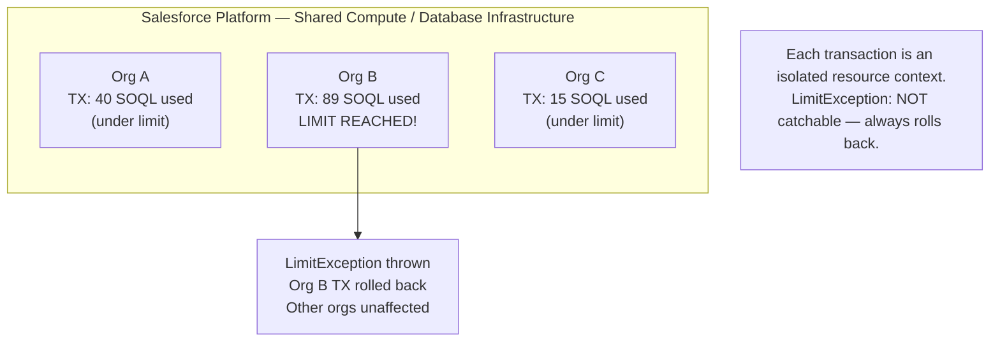
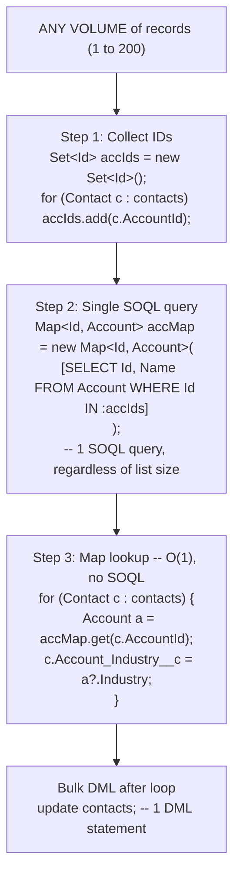

# Apex Governor Limits

## Exam Domain
Process Automation & Logic — 30% of exam weight

## Core Concepts

### What Are Governor Limits?
Salesforce is multi-tenant — thousands of orgs share the same infrastructure. Limits cap each transaction's resource consumption to ensure fair sharing. Exceeding a limit throws `LimitException` — **NOT catchable** — transaction always rolls back entirely.

### The Limits You Must Memorize Cold

| Resource | Synchronous | Asynchronous |
|----------|-------------|--------------|
| SOQL queries | **100** | **200** |
| DML statements | **150** | **150** |
| DML rows | **10,000** | **10,000** |
| CPU time | **10,000 ms** | **60,000 ms** |
| Heap size | **6 MB** | **12 MB** |
| HTTP callouts | **100** | **100** |
| SOSL queries | **20** | **20** |
| @future calls | **50** | — |
| Rows per query | **50,000** | **50,000** |
| QueryLocator (Batch only) | — | **50,000,000** |

### DML Statements vs DML Rows — Two Separate Limits
- 10 records in a single `insert` = **1 DML statement**, **10 DML rows**
- 150 separate `insert` calls of 1 record each = **150 DML statements**, **150 DML rows**
- The row limit (10,000) and statement limit (150) are tracked independently

### The Limits Class — Runtime Introspection
Every governor has a pair of methods: `getX()` = used, `getLimitX()` = ceiling.
```apex
System.debug(Limits.getQueries() + ' of ' + Limits.getLimitQueries());  // e.g., "3 of 100"
System.debug(Limits.getDMLStatements() + ' of ' + Limits.getLimitDMLStatements());
System.debug(Limits.getCpuTime() + ' of ' + Limits.getLimitCpuTime());
System.debug(Limits.getHeapSize() + ' of ' + Limits.getLimitHeapSize());
```

### Bulkification — The Core Defense
**Rule 1: No SOQL in loops** → LimitException at record 101
**Rule 2: No DML in loops** → LimitException at DML statement 151

```apex
// WRONG — 1 SOQL per record; fails at record 101
for (Contact c : contacts) {
    Account a = [SELECT Name FROM Account WHERE Id = :c.AccountId]; // WRONG
}

// RIGHT — 1 SOQL regardless of volume
Set<Id> accIds = new Set<Id>();
for (Contact c : contacts) accIds.add(c.AccountId);
Map<Id, Account> accMap = new Map<Id, Account>(
    [SELECT Id, Name FROM Account WHERE Id IN :accIds]);
for (Contact c : contacts) {
    Account a = accMap.get(c.AccountId);
}
```

### CPU Time — Not Wall-Clock Time
CPU time counts **active execution time only** — time waiting for SOQL or HTTP callouts does NOT count. Complex loops, string manipulation, and heavy computation consume CPU. Async contexts get 60s vs sync 10s.

### Heap Size — Memory for Your Transaction
All sObjects, Strings, and collections in memory count against heap. Loading 50,000 Accounts with many fields will exhaust 6 MB. Use SOQL for loops (chunked 200 at a time) or Batch Apex for large sets.

## PTA / SA Relevance

**In partner code reviews, watch for:**
- SOQL/DML in loops — still the #1 anti-pattern in real Apex codebases
- Trigger handlers that do per-record SOQL lookups without checking if they've already queried that data in the same transaction (accumulation problem in complex trigger chains)
- Heap exhaustion in batch execute() methods that build large collections without clearing them — between chunks, heap from the previous chunk should be garbage collected, but if you hold references, it won't be
- `Limits.getQueries()` checks missing in utility methods that might be called multiple times per transaction — library methods should be limit-aware

**Enterprise-scale considerations:**
- In complex orgs with many automation layers (triggers + flows + workflows all firing together), governor limits accumulate. A single "record save" can consume 30-40 SOQL queries just from platform automations before your trigger code even runs.
- Monitor limit consumption via debug logs during performance testing. Enable APEX_CODE FINEST and look for the Execution Log entries showing query/DML counts.
- For integrations sending large payloads, heap is often the first limit hit. JSON.deserialize() of a large payload can consume several MB. Consider streaming or paginated API calls instead of one large payload.

**For CTO conversations:**
- "Why does my simple save take 5 seconds?" — Often it's accumulated governor limit pressure from many automations. Use Salesforce's Apex CPU Limit tracing to identify the expensive operations. Sometimes the fix is eliminating redundant automation, not optimizing Apex.
- Governor limits are a feature, not a bug — they force good architectural decisions. A system that consistently bumps against limits needs architectural re-evaluation (batch processing, async offloading, data model optimization).

## Architecture / How It Works



**Limitations:**
- LimitException cannot be caught with try/catch — the ONLY defense is designing to stay under limits
- Limits are per-transaction, not per-class or per-method

| Resource | Synchronous | Asynchronous |
|----------|-------------|--------------|
| SOQL queries | 100 | 200 |
| DML statements | 150 | 150 |
| DML rows | 10,000 | 10,000 |
| CPU time | 10,000 ms | 60,000 ms |
| Heap size | 6 MB | 12 MB |
| HTTP callouts | 100 | 100 |
| SOSL queries | 20 | 20 |
| @future calls | 50 | N/A |
| Rows per SOQL | 50,000 | 50,000 |

QueryLocator (Batch Apex `start()` only): 50,000,000 rows.

**Limitations:**
- DML statements AND DML rows are tracked independently — you can hit either one
- Async contexts get 2× SOQL (200), 6× CPU (60s), 2× heap (12MB) — main reason to move work async
- Callout limit (100) is the same in both sync and async



**Limitations:**
- The Map approach is only efficient because `Map.get()` is O(1) — `List.contains()` is O(n)
- A null-safe map lookup `a?.Industry` prevents NPE when the Map doesn't have the key

## Key Facts to Memorize
- SOQL: **100 sync / 200 async**
- DML statements: **150** (same in both contexts)
- DML rows: **10,000** (same in both)
- CPU: **10s sync / 60s async**
- Heap: **6MB sync / 12MB async**
- Callouts: **100** (same in both)
- `LimitException` = **NOT catchable** — always rolls back
- `Limits.getX()` = used so far; `Limits.getLimitX()` = ceiling
- SOQL rows per query: **50,000** max; Batch QueryLocator: **50,000,000** max

## Customer Advisory Tips
- **Performance assessment:** Include a governor limit analysis in every technical health check. Export debug logs, parse SOQL/DML counts per transaction. Even 60% of a limit consumed in normal operation is a risk — data growth will push you over.
- **Bulk data operations:** Always use Batch Apex or Data Loader, never Apex in loops. Document this in the customer's developer standards.

## Exam Traps
- `LimitException` is the ONE exception that CANNOT be caught — do not put it in a try/catch answer option
- DML statements (150) and DML rows (10,000) are separate limits — inserting 10,001 records in a single DML call exceeds the row limit, not the statement limit
- Async gets higher SOQL (200) and CPU (60s) and heap (12MB) — DML limits stay the SAME (150 statements, 10,000 rows)
- `Limits.getQueries()` returns count of SOQL queries so far — NOT the remaining queries
- Batch Apex QueryLocator: **50 million** — this is NOT the same as the 50,000 row limit for regular SOQL

## Practice Questions

**Q:** A trigger with SOQL in a loop processes 150 records. What happens?
**A:** LimitException at query 101. 150 iterations × 1 SOQL per iteration = 150 queries. The synchronous limit is 100 — exceeded at record 101. The entire transaction rolls back.

**Q:** A developer calls `Limits.getDMLStatements()` and gets 45. What does this mean?
**A:** 45 DML statements have been used so far in this transaction. The limit is 150 (`Limits.getLimitDMLStatements()` = 150). 105 statements remain.

**Q:** A developer inserts one List of 10,000 Accounts and one List of 5,000 Contacts. How many DML statements and rows are consumed?
**A:** 2 DML statements (one per List). 15,000 DML rows — which EXCEEDS the 10,000-row limit. LimitException on the second insert.
